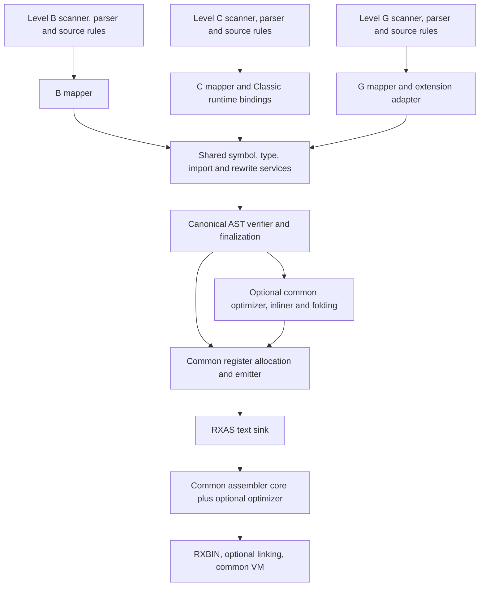

# Separate language compilers with one common backend

Status: architecture proposal for Adrian's review; not an implemented or fully
qualified architecture. Reviewed 2026-10-08 against `develop`
`36bced2418092029f76a06aa2acdadcdaf8a87c7`.

The authoritative implementation plan is
[COMP-PIPE-01](../../docs/ROADMAP.md#compiler-profiles-and-low-latency-compilation--comp-pipe-01).
Its `CP-AC-01–08` and `CP-STEP-01–08` remain the delivery criteria and steps.
This document supplies the architectural argument, capability decisions,
physical decomposition and experiments needed to discharge those criteria.
The [Level C worklist](../../docs/planning/release-1/levelc-compatibility-worklist.md)
continues to own Classic compatibility, including `LC-87-01–05` for INTERPRET.
No product code, grammar, runtime ABI or release commitment changes here.

## 1. Recommendation and intended outcome

Build three language compilers, provisionally `rxc-b`, `rxc-c` and `rxc-g`.
Each owns its scanner, parser, source rules and mapper. All use the same
canonical compiler AST, semantic services, optimizer, inliner, constant
evaluation machinery, register allocator and emitter. Preserve the existing
RXAS/RXBIN/VM contracts and a small `rxc` compatibility driver.

The useful boundary is **validated meaning**, not the parser's initial tree.
Today the parser, imports, exits, type inference and lowering cooperate in a
fixed-point loop. A mapper therefore needs shared symbol/type services and
several ordered passes. It cannot simply hand a raw tree to today's optimizer
and declare the front end finished.

Separate three choices:

1. **Language:** B for bootstrap and infrastructure, C for Classic compatibility,
   G for general-purpose applications and continuing language development.
2. **Compilation policy:** optimized or fast compilation, with identical
   language semantics and potentially different generated performance.
3. **Physical product:** full or lite binaries. Lite actually excludes optional
   optimizer code and tooling dependencies; running the full binary with `-n`
   is not a lite build.

Use the same C compiler as a reusable runtime compilation service for
INTERPRET. A separate Classic activation bridge must preserve the running
program's variables, calls, conditions and transfers. This is a substantial
runtime contract, not an invocation of the compiler followed by `loadmodule()`.

For the 24-bit target, compile, assemble and execute as separate standalone
stages. Their peak address-space requirements are assessed separately. The
proposal does not require all three to coexist in the 24-bit VM process.

### Confirmed scope and decisions

| ID | Adrian's instruction or clarification | Consequence |
| --- | --- | --- |
| D-01 | A compiler/front end/mapper per B, C and G, sharing the backend | Separate products must have genuinely separate linked front-end closures. |
| D-02 | B is the bootstrap and platform/OS bridge; G is the evolving general-purpose language | New convenience syntax normally belongs to G; B evolves only for a demonstrated infrastructure need. |
| D-03 | Require explicit mappings for all B classes | Every stored B attribute needs a mapping. This supersedes the earlier infrastructure-only answer in this review. Methods and computed accessors without storage need no register slot. |
| D-04 | G class layout is automatic; authored assembly belongs to B | G can consume B classes through imported metadata without admitting B layout/assembly syntax. The existing keyword is `ASSEMBLER`; no rename to `ASSEMBLE` is proposed. |
| D-05 | G has compiler exits and language conveniences; B is light | Distinguish using user-defined syntax extensions from implementing an exit as ordinary B code. Preserve necessary built-in statements through compiler-owned lowering. |
| D-06 | INTERPRET starts with C, using a reusable service | No new B/G INTERPRET syntax is proposed. |
| D-07 | The 24-bit objective is a small standalone compiler; stages run separately | Embedded compilation has a separate host/profile contract. No 24-bit INTERPRET claim follows from standalone qualification. |
| D-08 | A G exit may be written in B but must emit G source | Every returned replacement and helper fragment is parsed and checked as G. Implementation language grants no extra source privileges to the generated program. |

The precise B/G convenience boundary, exit migration, executable names, API
details and implementation sequencing below are recommendations awaiting
approval. The scope decisions above do not automatically approve every detail.

### Review method and completion conditions

The outcome of this review is a concrete architecture that can be evaluated
and then experimentally qualified before a broad migration.

| Review criterion | Observable evidence | Status |
| --- | --- | --- |
| REV-AC-01 | Trace entry, parsing, mapping, validation, optimization, emission, imports and exit dependencies to current source | Complete, §§2, 5–7, 12. |
| REV-AC-02 | State B/C/G principles and a capability-by-capability target, separating current behaviour and proposed restrictions | Complete as a proposal, §§3–4; language acceptance remains CP-AC-01. |
| REV-AC-03 | Specify canonical AST invariants and current-file-to-target-module ownership, including hidden parser dependencies | Complete as a design, §§5–6; executable separation remains CP-AC-02. |
| REV-AC-04 | Explain INTERPRET, fast/lite compilation, standalone 24-bit budgets, imports and bootstrap lifecycle without assuming unavailable APIs | Complete as a design, §§7–10; runtime/target proof remains open. |
| REV-AC-05 | Review failure cases and give checkable experiments, adoption gates and limits on claims | Complete, §§11–13; future experiment results are explicitly unverified. |

1. **REV-STEP-01 (REV-AC-01):** read repository guidance, the existing CP plan,
   current architecture and Level C worklist; pin the inspected source. Complete.
2. **REV-STEP-02 (REV-AC-01/02/03; depends on 01):** trace physical dependencies
   and reconcile the language inventory against source. Complete.
3. **REV-STEP-03 (REV-AC-02/03/04; depends on 02):** develop the target contracts
   and incorporate Adrian's clarifications. Complete as proposal.
4. **REV-STEP-04 (REV-AC-05; depends on 03):** challenge the design against
   imports, extension recursion, no-opt semantics, runtime transfers and
   constrained memory; record experiments and unresolved gates. Complete.
5. **REV-STEP-05 (all; depends on 04):** present for Adrian's architectural
   decisions. Proposal delivered for review; architectural acceptance remains
   pending. Product implementation remains unstarted.

## 2. What exists now

### 2.1 Actual pipeline

```text
source / optional external RXPP expansion
  -> options/source-extension selection
  -> B/G/L scanner + parser OR C scanner + parser
  -> authored SourceNode snapshot and mutable working AST
  -> C-only lowering, when selected
  -> shared import/exit/symbol/type/rewrite fixed point
  -> mandatory explicit-constant propagation and semantic checks
  -> optional AST optimization, inlining and partial evaluation
  -> SELECT dispatch lowering and flow analysis
  -> register assignment and common emission
  -> output-fragment flattening and compiler template combinations
  -> RXAS text -> assembler -> RXBIN -> optional linker -> VM
```

The current compile closure is one static `rxclib`, containing both parsers,
Level C lowering, task lowering, validation, imports, exits, optimization and
emission. It links `rxaslib`, `rxbvml` and `rxbin`.
[Source: compiler CMake](../CMakeLists.txt).

The architectural opening is real: Level C already lowers source-specific
nodes into the common compiler tree. B/G/L instead share `rexbpars()` and
the same generated grammar. `rxcpmain.c` then drives the common stages.
[Source: main pipeline](../rxcpmain.c),
[parsing anatomy](parsing_pipeline_anatomy.md).

### 2.2 Findings that determine the decomposition

| ID | Source-supported finding | Architectural consequence |
| --- | --- | --- |
| F-01 | B and G share `rxcpbgmr.y`/`rxcpbscn.re`; several language gates occur later in validation/type checking | Separate wrappers alone do not separate languages or shrink their dependency closure. |
| F-02 | `propagate_explicit_constants()` and `mark_const_args()` are in `rxcp_opt.c`, but are called outside `context->optimise` | Extract mandatory services before making the optimizer optional. Preserve writable by-value argument isolation. |
| F-03 | `rxcp_flow_analyze(context, 0)` still creates CFG, liveness, definite-assignment and reaching-definition data | Current no-opt memory/time is not a minimum semantic baseline. Audit consumers before reducing this work. |
| F-04 | `print_output()` unconditionally calls `rxcp_combine_superinstructions()` after flattening output | `-n` does not mean every compiler optimization is absent. Lite needs an unfused, semantically equivalent emitter route and must avoid whole-output duplicate buffers where possible. |
| F-05 | Binary imports reconstruct declarations as synthetic B source; source imports and some generated helpers call `rexbpars()` | A C-only or G-only executable still needs B unless declarations and compiler-owned fragments stop depending on the B parser. |
| F-06 | `rxcp_init_exits()` creates/discovers an embedded VM bridge; certified statements and custom exits share it | B/C cannot simply disable the bridge without replacing affected built-in lowering and preserving diagnostics. |
| F-07 | C scanner/glue, common utilities and inliner include the generated `rxcpbgmr.h` token header | Separate stable common token/source categories from parser-private terminal IDs. Do not make C depend on generating the B parser. |
| F-08 | `ASTNode`/`NodeType` currently include source-only C and G forms, source/token pointers, semantic state and emission state | One C struct is not yet an enforced canonical interface. Introduce phase validation first; physical AST slimming can follow measurement. |
| F-09 | CLI, imports, exit handling and convergence failures have process-exit paths; import registration and diagnostic configuration have mutable process globals | `rxcmain()` is not a safe per-request runtime compiler. A library API needs explicit state, error and ownership boundaries. |
| F-10 | RXAS has bounded-buffer input, but its context initialization allocates an optimizer queue even for no-opt use; `rxaslib` contains the optimization closure | Reuse the existing parser/builder first, but separate required assembly from optional passes and allocations. |
| F-11 | `rxvml` exposes file/buffer module loading and context destruction, not a public per-module unload API | Repeated distinct INTERPRET texts cannot be claimed bounded merely by limiting a compiler cache. |
| F-12 | The single-thread port deliberately retains the compiler languages and exit VM and removes selected runtime host services | It is a useful portability foundation, not evidence of a physically split lite compiler or a 24-bit fit. |
| F-13 | Inline payloads serialize numeric NodeType/ValueType values and reconstruct nodes from them | Do not renumber enums while splitting headers/front ends without a compatible decoder or explicit payload-version migration. Ordinary call fallback must remain correct. |

Source anchors for these findings are collected in §12. These are dependency
and contract findings, not new claims of optimizer unsoundness. The accepted
[optimization-boundary decisions](../../docs/planning/release-1/optimization-boundary-audit-2026-09-18.md)
remain intact: imported inline templates are RXC-owned; RXAS reconstructs its
own proofs; structured AST rewriting remains the implementation foundation.

### 2.3 Level C progress and remaining scope

The current worklist records closure of 24 admitted whole-instruction reviews:
SAY, DROP, assignment, NOP, OPTIONS, IF, SELECT, DO, LEAVE, ITERATE, ARG,
PROCEDURE, CALL, RETURN, EXIT, PULL, PUSH, QUEUE, PARSE, ADDRESS, implicit
command, NUMERIC, SIGNAL and TRACE. INTERPRET is parsed but rejected by lowering.

The architecture is more substantial than a syntax front end: `rxfnsc` owns
RexxValue, stems, variable pools, BIF contexts and Classic activation state.
The compiler uses one-body frame labels/branches/handlers for Classic local
calls and SIGNAL. Source-specific lowering builds common typed operations and
runtime calls; the backend does not need a second Classic code generator.

There are audit rows for 70 Classic BIF names and direct entries for 62.
CHARIN, CHAROUT, CHARS, LINEIN, LINEOUT, LINES, QUALIFY and STREAM remain
deferred. Source/diagnostic equivalence, physical source NUL handling,
expression-family proof, host interfaces, real HALT, lifecycle and full
cross-consumer compatibility remain open. The documented DATE/TIME clause
clock-refresh defect also remains relevant to runtime activation design.
Unicode/I/O changes remain subject to Adrian's existing deferred scope;
this compiler split does not silently change that contract.

Retained `LC-STEP-90F` evidence reports 3296/3296 normal Debug checks, 3113
unique normal Release checks using documented reuse, 19 installed BIF cases
and an installed host fixture on its recorded `d7b58e17…` code/test inputs.
Those are existing receipts, not tests rerun by this review and not full Level C
conformance. Another active worklist entry now covers rebuild/publication QA;
its unfinished results are not imported into this report as passes.

The existing lowered-tree verifier rejects residual C-only nodes, bad parent
links and sibling cycles. Its permanent `test_levelc_tree_boundary` test is
a useful beginning; it does not establish all typing, association, provenance
or runtime-control invariants needed at a shared backend boundary.
[Current C architecture](levelc_working_architecture.md),
[detailed compatibility map](levelc_compatibility_layer.md).

## 3. Language principles

**B is a deliberately explicit implementation language.** Retain what is
needed to construct runtime services, libraries, compiler extensions and the
platform bridge: typed values, procedures, objects/interfaces, explicit
storage, references, binary operations, native bindings and host interaction.
Bootstrap capability is an actual build-dependency property, not a promise
that every application should be written in B or that the C compiler itself is
already self-hosted.

**G is the public application language.** It shares B's useful typed foundation
but owns automatic layout, extensible syntax, task/parallel syntax and future
conveniences. A G construct lowers to existing canonical operations or library
calls wherever possible. A new backend primitive needs an independent
semantic justification; it is not added merely because the surface grammar
has a new keyword.

**C owns Classic source semantics.** Dynamic pools, compound variables, numeric
context, ARG presence, PROCEDURE, labels, condition traps and INTERPRET belong
to its mapper and runtime adapter. Their meaning must survive canonicalization;
turning a pool read into an ordinary statically bound local is not equivalent.

**The levels are siblings over a common machine model.** G is not a strict
source superset of B: B assembly/layout declarations are intentionally excluded
from authored G. C is not syntactic sugar over the B variable model. Compiled
library interoperability is a separate contract from accepting another level's
source or its complete calling semantics.

**Library availability is separate from language syntax.** A B routine may
implement a G library. An ordinary typed caller may use a compatible library
without acquiring that library author's syntax privileges. Host facilities
such as workers, sockets and streams have their own availability contract;
optimization settings do not change that contract.

**Keep B small by controlling new mechanisms and dependencies.** Moving an
operation to a library call is valuable when it removes parser, expansion or
compile-time execution machinery. Deleting useful syntax without reducing
those dependencies is not itself a meaningful size reduction. Maintain a
closed B capability inventory, with new entries reviewed against an
infrastructure use case and bootstrap closure.

## 4. Capability-by-capability target

This is the proposed steady-state source contract, not a description of what
today's parser already rejects. `Core` means built-in language behaviour;
`API` means an explicit library/runtime call; `No` means absent from authored
source. C entries describe the target within its own worklist, not conformance
closure. Existing B convenience removals need the migration gate in §7.

### 4.1 Values, storage and object model

| ID / capability | B target | C target | G target | Current state / transition |
| --- | --- | --- | --- | --- |
| CAP-01 Typed scalar values, decimal, strings and binary | Core | Classic values via runtime; no typed declarations | Core | Retain shared representation/conversion machinery. No integer-width or string-model change. |
| CAP-02 Static type inference and checked conversions | Core, explicit boundaries | C mapper supplies typed runtime operations | Core; future inference conveniences G-owned | Do not equate G with a newly invented dynamic type system. |
| CAP-03 Named compile-time constants | Core | Classic constant-symbol semantics, not B declarations | Core | Required evaluation remains in fast/lite builds. |
| CAP-04 Typed arrays, indexing and basic mutation | Core | Classic stems/compound names through pool | Core | Typed array indexing differs from arbitrary object-indexer sugar below. |
| CAP-05 Classes, interfaces, factories, methods and provider matching | Core | No authored B/G class declarations; consume admitted runtime bridges | Core | Preserve common dispatch, signatures and metadata. |
| CAP-06 Explicit stored-attribute register mappings, including typed/flag views | Required for all stored attributes | No | No | Today B/G can use automatic layout and share mapping syntax. New B requirement and G rejection need tests/migration. |
| CAP-07 Automatic stored-attribute layout | No | Mapper-created runtime objects only | Required | Shared layout allocator remains available to the G mapper, not selected by backend language tests. |
| CAP-08 Imported fixed-layout classes | Checked imported contracts | Internal runtime and admitted signed calls | Checked imported contracts | G must accept B-produced layout metadata; source restriction does not reject imported ABI. |
| CAP-09 Explicit references, dereference, snapshot, validity and identity | Core | Pool/exposure model; no typed reference syntax | Core | Keep escape/lifetime/copyback semantics in common typed IR services. |
| CAP-10 Byte buffers, checked encoded fields and packed native views | Core | No raw-memory source extension in this proposal | Core where explicit and checked; owner-class APIs encouraged | Do not confuse checked data access with VM register-layout control. |
| CAP-11 Ordinary direct attribute access inside class implementation | Core | No | Core | Separate from external property/indexer rewriting. |
| CAP-12 External property and general object-indexer convenience rewriting | API via explicit methods | No | Core | Proposed B simplification; currently common lowering. Preserve evaluation order/copyback while migrating B users. |
| CAP-13 Object equivalence operator `<eq>` | API (`equivalent`) | No | Core | G-only compiler gate already exists; class contracts remain usable by B. |
| CAP-14 Automatic object-to-string convenience | Explicit conversion/API | Classic value formatting | G-owned design | Do not infer a new conversion contract from the existing rewrite helper. |
| CAP-15 Future class inheritance, generic or automatic packing conveniences | No automatic admission | Outside Classic scope | G design work | This allocates ownership, not approval or a claim that these features exist. |

### 4.2 Control, calls, host integration and extension

| ID / capability | B target | C target | G target | Current state / transition |
| --- | --- | --- | --- | --- |
| CAP-16 Assignment, IF, SELECT, DO, LEAVE, ITERATE, NOP | Core | Classic rules | Core | Front ends define evaluation/scoping; common IR expresses them. |
| CAP-17 Expression blocks and `LEAVE WITH` | Retain core | Generated internal use, not new Classic syntax | Core | Keep this useful bootstrap building block; do not remove canonical BLOCK_EXPR support. |
| CAP-18 Procedures, typed optional/varargs, methods and argument exposure | Core | Classic ARG/CALL presence and invocation rules | Core | Shared machine call ABI does not erase Classic omitted/empty distinctions. |
| CAP-19 Namespace/import, module globals and initializers | Core | Existing Classic provider boundary | Core | Initializer ordering and once-only behaviour stay mandatory. |
| CAP-20 RETURN and program EXIT | Core | Classic activation/invocation completion | Core | EXIT instruction is unrelated to compiler exits. |
| CAP-21 NUMERIC controls and arithmetic policy | Core | Classic state/configuration | Core | Required constant evaluation and runtime operations must agree in every profile. |
| CAP-22 Authored `ASSEMBLER` | Core | No | No | Already restricted to authored B; retain validation against the instruction database. |
| CAP-23 Native providers/RXPA and low-level runtime construction | Primary implementation language | Admitted host/BIF bridge | Consume typed APIs; native adapters authored in B/C host code | Continue C RXPA factories/method bindings and checked SETOBJECTTYPE; do not recreate shims. |
| CAP-24 Explicit ADDRESS and host-variable anchors | Core bridge | Classic ADDRESS | Core | B/G anchors retain their existing compiler auto-expose meaning. Environment handlers own command meaning. |
| CAP-25 Implicit unrecognized command shorthand | Prefer explicit ADDRESS/API | Classic core | Core | Proposed B removal simplifies extension ambiguity; migration and language approval required. Known G-only forms must not silently become B host commands. |
| CAP-26 SAY, PARSE, PULL, PUSH and QUEUE | Retain defined built-ins with static lowering | Classic instructions | Retain built-ins | Currently several B/G forms use certified exits. Removing the VM bridge must preserve admitted semantics. |
| CAP-27 Runtime signal objects and structured handler blocks | Core infrastructure contract | Classic traps via C mapper | Core | Preserve B's ability to implement runtime services and their cleanup. |
| CAP-28 Classic local labels, SIGNAL target/VALUE, CALL ON and SIGNAL ON | No Classic surface | Core | No automatic admission | FRAME_* nodes remain common backend operations. |
| CAP-29 TRACE | Existing typed tracing contract | Classic contract and recorded exceptions | Typed tracing plus future conveniences | Diagnostic/trace observations cannot be discarded as optimization-only data. |
| CAP-30 User-defined compiler-exit invocation | No | No | Yes | Currently custom and certified exits share discovery. Per D-08, every G replacement/helper must obey G source rules; no OPTIONS LEVELB escape. |
| CAP-31 Implementing a compiler exit as ordinary code | Yes, explicit-layout B | No | Yes | An exit written in B does not require B to allow custom syntax while compiling it. |
| CAP-32 Certified built-in expansion | Compiler-owned mapper | C mapper | Compiler-owned mapper | Certified provenance is a compiler responsibility, not a privilege requested by arbitrary exit output. |
| CAP-33 FSAY/MSAY, SORT/query/DSL-style extension syntax | API equivalents | No new non-Classic syntax | Exit/extension packages | Existing B clients require migration; retain underlying formatting/sorting libraries. |
| CAP-34 Task declarations, task targets and parallel blocks | Explicit concurrency APIs | No | Core G lowering | Current G-only gates already exist; B runtime concurrency classes remain usable. |
| CAP-35 Future iteration, reference or application conveniences | Explicit APIs | Classic only | G-owned design | No unlisted feature becomes B merely because its lowering uses B libraries. |
| CAP-36 INTERPRET | No source addition | Runtime compilation, future implementation | Reusable service available for later language design | C-only initial scope; implementation currently parked. |

### 4.3 Tools and libraries

| ID / capability | Ownership and proposed availability |
| --- | --- |
| CAP-37 Core runtime, class library, native adapters | Mostly B implementation; callable from compatible compiled clients. Build dependencies must not require G syntax or user exits to bootstrap B. |
| CAP-38 `rxfnsc` / RexxScript | Shared value/pool/BIF implementations where already applicable; independent C compiler semantics and RexxScript sandbox. No delegation of INTERPRET to RexxScript. |
| CAP-39 `rxfnsg`, application frameworks, explicit Unicode services | G-facing API policy; implementations can use B. Existing Unicode/I/O assessment remains open across levels. |
| CAP-40 RXPP | Separate optional preprocessing stage, preserving source maps; it is not automatically part of the runtime INTERPRET language. |
| CAP-41 DSLSH/editor parsing | Separate tooling adapter for each front end; preserve authored structure, error codes, spans and completion behaviour. Can be omitted from a lite executable without altering compilation semantics. |
| CAP-42 Optimization / inlining / optional folding | Shared backend available to all levels in full products; absent from lite, bypassed under fast policy as specified in §8. |
| CAP-43 RXAS, RXBIN, linking, runtime engine choice | Common toolchain contracts. No level-specific bytecode format or emitter fork. |
| CAP-44 Level L and historical/editor-only levels | Preserve current routing until explicitly migrated. This proposal does not silently remove L or promise new A/D/E/N compilers. |

### Mapping policy for B classes

Require an explicit `with register.N[.view]` on each stored attribute, using
the existing syntax and typed/flag-view checks. Do not silently allocate a
missing B slot. Validate collisions according to today's legitimate overlapping
typed-view rules: multiple typed views of one slot and `register.0` are not
automatically errors. Preserve writable/read-only flag partitions.

For G, reject authored mappings and assign storage in the G mapper. After this
step, both produce the same checked layout description. Imported layouts and
compiler-created runtime objects are already resolved contracts, so the backend
does not ask which language chose their slot numbers.

Convert existing B classes by recording the layout actually assigned today
and adding equivalent mappings. Do not assign slots by a naive textual counter:
existing explicit slots, overlapping views and declaration ordering matter.
Compare emitted class/member metadata and native-provider fixtures before and
after. Preserve source documentation tags during every migration.

## 5. The canonical compiler boundary

### 5.1 Logical architecture



This reuses the existing AST and rewrite framework. Initially introduce phase
tags and validators rather than replacing it with a new universal IR or
serializing trees between every pass. Separate source node enums/storage only
when that helps dependency control or measured memory.
Preserve serialized node/type IDs during this first extraction: the existing
inline payload writer/reader transports numeric enum values. Header cleanup
must not silently reinterpret old payloads. A later representation change
needs versioned decoding or deliberate ordinary-call fallback, without
reopening the accepted inline-template trust policy.

There are three contracts:

1. **Authored tree:** language-specific nodes and diagnostics; immutable
   SourceNode view for source identity/editor use. Invalid programs can retain
   partial trees. Such trees never enter emission.
2. **Mapped work tree:** the selected mapper constructs common operations but
   may still await imports, type inference or resolved calls. It uses shared
   services and repeats affected lowering until stable. Language-specific
   extension callbacks are explicit inputs to this phase, not backend globals.
3. **Sealed canonical tree:** imports, types, layouts, calls, semantics and
   control ownership are resolved. No parser callback, dialect gate or
   user-defined exit is needed by the backend. Every subsequent transformation
   preserves the invariant or revalidates its changed region.

The mapper therefore includes source validation and semantic desugaring;
common validation is not duplicated in three compilers. Type-dependent
rewrites remain after the type facts they need. Avoid moving the whole current
fixed-point loop behind an allegedly dialect-free API unchanged.

### 5.2 Required canonical invariants

| Invariant | Required representation / check |
| --- | --- |
| IR-01 Ownership | Acyclic parent/child/sibling tree; stable node ownership; associations identify valid live nodes in the owning unit. Imported clones rebind symbols/scopes. |
| IR-02 Phase legality | No LEVELC_* instructions, unexpanded custom exits, unresolved TASK/PARALLEL forms, raw template syntax or parser-error nodes at seal. Validate a positive node-family inventory, not only a blacklist. |
| IR-03 Types and conversions | Value/target types, dimensions, class/reference contracts and conversion order are explicit. No unresolved type used for emission. Preserve runtime-failing conversion boundaries. |
| IR-04 Symbols and calls | Stable definitions, exact signatures/default/presence information, argument mode, receiver ownership, aliases and copyback. Symbol IDs are not AST pointer addresses in persisted contracts. |
| IR-05 Layout and ABI | Resolved class slots/views/flags, argument/result convention, globals, factories, interfaces and ordered initializers. Imported metadata undergoes the same checks. |
| IR-06 Evaluation order | Side effects and evaluate-once captures are represented in ordered statements/BLOCK_EXPR operations. Preserve eager Classic logical operations versus typed short-circuit semantics. |
| IR-07 Control | Loop/block associations, frame labels, branch destinations, handler ownership, unwind/cleanup and nonlocal completion are explicit. No parser labels interpreted by the emitter. |
| IR-08 Numeric/text semantics | Numeric context and exact literal/value representations travel with operations; dynamic Classic state remains an explicit runtime dependency. No new normalization/encoding behaviour is inferred from the originating level. |
| IR-09 Provenance | Source unit, exact byte spans plus display coordinates, authored node ownership and generated-origin chain survive mapping, inlining and emission. Fragment diagnostics identify both generated text and its INTERPRET site. |
| IR-10 Observable effects | Calls, aliasing, host interaction, condition/TRACE events and unknown native effects constrain optimization. The existing flow/opcode effect model remains authoritative where applicable. |
| IR-11 Mandatory constants | Explicit language constants are evaluated or diagnosed before seal in all profiles; optional folding cannot be needed to make a valid program compilable. |
| IR-12 Deterministic failure | Unsupported or invalid mapped forms yield structured diagnostics and no successful artifact; verification failure cannot fall through into emission. |

Frontend identity may remain as provenance or diagnostic context. It must not
decide code generation semantics after sealing. Encode those semantics in
operations, types, runtime calls or capability descriptors, then audit remaining
`context->level` checks below the boundary.

### 5.3 Canonical operation families and mapper examples

| Common family | Existing basis | Front-end responsibility |
| --- | --- | --- |
| Units, declarations and scopes | REXX_UNIVERSE, PROGRAM_FILE, PROCEDURE, METHOD, FACTORY, CLASS, symbol/scope tables | Build legal source scopes and finalized contracts. |
| Values and storage | Typed literals/constants, ASSIGN, references, arrays, binary operations and resolved class views | Resolve source types, Classic pool accesses and automatic/explicit layout policy. |
| Sequencing and expression results | INSTRUCTIONS, BLOCK_EXPR, LEAVE_WITH | Preserve capture order and result conversions; generated blocks need not be legal surface syntax in every language. |
| Branching and loops | IF, DO, SELECT/dispatch, LEAVE, ITERATE and associations | Map each source loop/condition semantics into checked common control. |
| Calls and completion | FUNCTION/CALL, member/factory calls, RETURN, runtime helpers | Resolve omitted arguments, receivers, Classic activation rules and library boundaries. |
| Frame control and observation | FRAME_LABEL/BRANCH/HANDLER_ON/OFF, TRACE_CLAUSE, signal structures | Validate frame ownership and record cleanup/observation behaviour. C has already established this shared route. |
| Machine-level operations | Validated ASSEMBLER/intrinsic operations and opcode metadata | B can author assembly; other mappers may produce compiler-owned operations. Provenance is not an excuse to skip operand/type checks. |

For example, B physical attribute reads and G automatically placed attribute
reads become the same resolved storage access. G `<eq>` becomes a checked
method call. A C variable read becomes a pool operation with current Classic
state; it must not become the same storage access as a B local merely because
both have the source spelling `x`. C arithmetic can remain calls on RexxValue
with explicit numeric context, giving the common backend ordinary typed calls
without duplicating Classic algorithms.

### 5.4 Why this boundary is sufficient, and what is not yet proved

The architectural argument is compositional. For each accepted source program,
its mapper must produce a canonical tree with the same observable meaning,
including errors, evaluation order, source observations and lifecycle effects.
The common backend then needs only that tree's explicit contract. A semantics-
preserving optimizer can be inserted or omitted without changing the language;
the common emitter and assembler preserve the canonical operations through the
existing machine contract. This gives three mapper obligations and one shared
backend obligation, rather than three complete compiler correctness programmes.

The current C lowering and shared downstream pipeline demonstrate that this
shape is viable for admitted static programs. The dependency audit establishes
which seams must be extracted to make it physical. It does not establish
complete mapper equivalence, correctness of every existing optimization, a
24-bit memory bound, or the new dynamic activation bridge. Those remain the
specific experimental obligations in §11, not assumptions hidden in the diagram.

## 6. Physical modules and dependency rules

Proposed target names describe ownership; final names can be selected later.
Build common source once per compatible target/profile configuration and link
it into the products that need it. Do not copy the optimizer/emitter into
per-language directories.

| Proposed module | Current source to retain/extract | Required split |
| --- | --- | --- |
| `rxc_source` | `rxcp_source_tree.*`, `rxcp_srcmap.*`, diagnostics, token/source ownership | Keep diagnostic/provenance core; move parser-terminal rendering and DSLSH presentation out. Source services must not depend on a language grammar. |
| `rxc_ir` | `rxcp_ast_core/walk/val`, `rxcp_ast_rewrite`, `rxcp_remap`, `rxcp_remap_build`, AST/symbol/type headers | Common allocation/build/rewrite/verification. Source-only node knowledge belongs to the owning mapper; debug printing can be a separate tool module. |
| `rxc_semantics` | Common portions of `rxcpsymb`, `rxcp_val_sym/type/check/trans/orch`, `rxcp_fixup` | Type/signature/ownership services and convergence engine. Extract B/G/C source policies and type-dependent mapper callbacks. |
| `rxc_consteval` | Required portions of `rxcp_opt`, `rxcp_constant`, literal handling and numeric services | Mandatory named constants, literal encoding/decoding and semantic helpers; shared by full/lite. No dependency back to optional inlining or flow transforms. |
| `rxc_contracts` | `rxcpfunc`, import publish/report/project-dependency code, metadata/signature readers | Direct declaration construction; split discovery, contract reading, native registration and optional inline payload reading. Remove generated B-source reparsing. |
| `rxc_front_b` | B-selected scanner/grammar/glue and B portions of validators | Own B capability checks, explicit class layout and authored assembly. No C or G parser/lowering dependency. |
| `rxc_front_c` | `rxcpcscn`, `rxcpcpar`, `rxcpcgmr`, `rxcpcdiag/sym/val`, `rxcp_levelc_lower` | Own Classic syntax, source diagnostics and activation/runtime mapping. Split lowerer by responsibility without duplicating instruction semantics. |
| `rxc_front_g` | G-selected scanner/grammar/glue, G sugar, task code extracted from `rxcp_val_orch`, `rxcp_task_lower` | Own automatic class layout, task/parallel/equivalence and extension dispatch. No requirement to link the B parser for imports or certified expansions. |
| `rxc_builtin_lower` | Compiler-owned parts currently in `rxcp_exit`, `rxcp_val_plugin`, certified `compiler/exits/*` | Shared B/G built-in mappers implemented through checked IR builders/runtime calls; keep language policy in front ends. Port one built-in at a time with equivalence tests. |
| `rxc_g_extensions` | Custom exit discovery/marshalling/protocol execution, applicable `rxcp_exit`/`rxcp_util` code | G-only optional dependency of compiler products that support source extensions. Its compile-time VM is counted in that compiler's footprint. |
| `rxc_optimizer` | Optional `rxcp_opt` transformations, `rxcp_inline*`, `rxcp_partial_call` | One optimizer for all levels. Imported template read/write is optional and versioned; lite imports ordinary callable metadata without expanding templates. |
| `rxc_flow_opt` | `rxcp_flow` and optimization-only dispatch analysis | Separate required control validation/SELECT lowering from optional optimization facts and transforms. Do not delete analysis just because its filename says flow. |
| `rxc_emit` | `rxcpemit`, `rxcp_emit_core/reg/expr/flow/proc/meta`, instruction formatting | Same register allocator/emitter for every level; bounded output sink. Preserve essential metadata and conservative argument/alias handling. |
| `rxc_emit_opt` | `rxcp_emit_super` and optional emission choices | Explicit optional pass; canonical unfused sequences remain valid. Low-cost instruction selection may remain in core when it does not require optimizer machinery. |
| `rxc_compile_service` | Non-CLI orchestration extracted from `rxcpmain` | Explicit request/result, selected front-end handle, options, imports, diagnostics, cancellation/limits and cleanup. No unconditional process exit or ambient CWD/environment dependence. |
| `rxc_driver` | CLI portions of `rxcpmain`, `rxc_main`, option/source-extension selection | Preserve `rxc` CLI routing; launch/select language compiler without linking all parsers into each small product. |
| `rxc_editor` | `rxcp_highlight_controller`, `rxcp_dsl`, DSLSH integration | Desktop aggregate service or level-specific adapters; caches remain tooling-owned. Not linked into standalone lite compilers. |
| `rxas_core` | scanner/parser/builders, `rxaslib`, `rxasassm`, constants, metadata, backpatching, RXBIN writer | Standalone required assembly, with file/buffer adapters. Extract optional queues/label optimization; retain all validation and resolution. |
| `rxas_optimizer` | `rxas_opt`, `rxas_flow*` | Optional assembler closure; no compiler inline-proof dependency. |
| Shared platform/runtime data | `platform`, `utf8`, `rxbin`, opcode/signature tables, numeric provider | Narrow dependency ownership, same data/ABI contracts. Runtime services are not duplicated for each compiler. |
| Classic runtime compilation adapter | New service adapter beside C activation/runtime ownership | INTERPRET orchestration, binding/continuation contract, generated-module lifetime. Does not live in generic AST optimization. |

The inliner implementation currently includes several `.c` parts from
`rxcp_inline.c`; CMake marks those parts `HEADER_FILE_ONLY`. Preserve their
single-definition build semantics during extraction rather than accidentally
compiling them twice.

### Enforced dependency direction

```text
front_b / front_c / front_g --> common semantics + contracts + IR + source
optimizer -----------------> common semantics + contracts + IR
emitter -------------------> common IR + resolved ABI + opcode data
compiler CLI --------------> compile service + selected front end + backend
compile-to-RXBIN adapter ---> compile service + RXAS core
G extension host ----------> VM embedding API (separate optional dependency)
```

No common backend library links a front end. No C/B compiler links the G exit
bridge. The ordinary standalone compiler emits RXAS and should not require
the assembler parser/optimizer merely to validate B instructions: shared opcode
data is a narrower dependency. An embedded compile-to-RXBIN product deliberately
links the assembler core, under a different footprint budget.
Preserve `--import-rxas` through an explicit assembler adapter or a separately
scheduled preassembly stage in the driver; removing an unconditional library
dependency must not silently remove that import capability.

Share B/G lexical and grammar source fragments where their rules are identical,
but generate distinct tables/entry points with explicit capabilities. Prefer
simple build-time composition with reproducible generated input over a new
grammar meta-language. C keeps its separate contextual-keyword grammar. A
temporary shared B/G parser is an extraction milestone, not completion of the
physical split criterion.

Static archives give one source owner while allowing each executable to include
its selected object closure. Three static executables may increase total package
size even while each process gets smaller. A desktop shared library can reduce
installed duplication, but must not force all front ends/optimizers resident in
a constrained product. Decide with link maps and target measurements.

## 7. Imports, bootstrap, exits and compatibility

### Direct import contracts are a prerequisite

Today `rxcpfunc.c` formats synthetic `options levelb` declarations and calls
`parseRexx()`. Replace that with common builders for complete callable,
class/interface, layout, provider, global and initializer contracts. Preserve
default values, optional/vararg/reference modes, numeric context, task markers,
provenance and source-versus-binary precedence. Missing metadata must retain a
documented diagnostic/fallback; it must not invent a different signature.

Inline payloads remain optional compiler metadata under the accepted current
trust boundary. Full products validate/use supported templates and otherwise
retain ordinary calls. Lite skips template body reconstruction but still reads
the ordinary declarations needed for correct calls and linking. Do not promise
that a lite-produced library will carry full-product inline opportunities.

Source imports need a route too. Recommend a driver/build-service broker that
asks the source's owning front end for a checked interface and, when needed,
an implementation artifact. A language compiler does not link every other
parser just to import a signature. Persisted interface records, if introduced,
are versioned compiler-private cache artifacts keyed by source/dependencies,
options and compiler identity; they are not an unapproved new RXBIN format.
Circular contracts, shadowing and source changes need explicit invalidation
and cycle handling. Never silently substitute a stale binary for a preferred
source provider.

On the 24-bit profile the stage controller must not keep a compiler resident
while launching another memory-heavy compiler. Prepare interfaces/artifacts in
separate invocations; diagnose unsupported unresolved cycles until the approved
contract resolver handles them. This is an implementation proof requirement,
not permission to drop existing source-import capability.

### Bootstrap graph

```text
C host toolchain + parser generators
    -> shared core + B compiler + assembler/linker/VM tools
    -> B runtime libraries, RXPA contracts and compiler support
    -> B-built G extension implementations and application libraries
    -> C/G compiler runtime packages and tooling
```

The native C/G compiler executables can be built alongside B; the dependency
graph above describes generated runtime/package prerequisites. Bootstrap B
must not need G syntax, G-defined source macros or a previously installed
`rxcexits.rxbin` to compile its own required library closure. Current exit
component builds already use `RXCP_DISABLE_EXIT=1`; retain that clean-bootstrap
property while changing their implementation and explicit layouts.

### Exit transition

Keep compiler-owned ADDRESS, PARSE, queue, signal and TRACE behaviour by moving
their lowering to native checked mappers. Share runtime algorithms such as the
parse-template engine rather than rewriting them in the compiler. The migration
is not a second implementation allowed to drift: each converted certified exit
gets identical source/diagnostic/runtime fixtures before the old route is retired.

G retains a supported user-exit protocol. Adrian's proposed simplification is
adopted as a firm target rule: an exit implementation can be B, but every source
fragment it emits is G. Replacement source and helper definitions are parsed
and validated as G; neither can smuggle B syntax via an OPTIONS clause.
Only compiler-owned mapper code creates privileged machine operations, which
still pass canonical validation. Existing exits that emit B-only helper source
need migration or an explicitly versioned compatibility adapter; do not leave
the complete B parser permanently hidden in every G compiler under that name.

The implementation-language/source-language separation also removes a needless
build dependency: the G compiler consumes the compiled exit's normal callable
contract and bytecode, not its B source. The exit can use B's explicit storage
or assembly internally while the generated program remains entirely within G.
An exit can call precompiled B infrastructure from its generated G through
ordinary typed APIs, just like hand-authored G. It cannot obtain a raw AST
injection or certified-operation privilege by declaring itself trusted.

Keep extension output language fixed by the invoking compiler/protocol, never
selected by an untrusted field in the exit result. Reject contradictory source
headers, preserve the expansion-origin chain, validate helper signatures and
imports, and bound recursive expansion/convergence. Test B-authored providers
that emit valid G, invalid G, B-only assembly, B-only register mappings and
helpers containing a level switch. Accept/reject behaviour must be the same
as the corresponding authored G, apart from deliberate generated names and
reported expansion provenance. The existing V2 protocol can retain text results
where compatible; version a migration only if its contract actually changes.

B can still implement an exit class or a formatting/sorting function. B clients
of custom syntax call the underlying API explicitly or migrate to G. Do not
move B infrastructure to G merely to avoid adding explicit layouts.

### Compatibility surface to preserve

Keep `rxc`, `crexx`, CMake build helpers, `-n`, import roots, dependency reporting,
diagnostic modes, `--levelc-routine`, RXPP maps and parser-mode invocations through
the driver. A direct level executable rejects a contradictory explicit level
instead of silently switching parser. The compatibility driver continues to
honour explicit OPTIONS, CLI defaults and source-extension rules in their
current order. `--level` is currently a default, not a forced override.

Do not replace defaults using stale prose: current source policy selects C for
`.rexx` and G for `.crexx`/`.crx`; extensionless CLI normalization is described
in [parsing anatomy](parsing_pipeline_anatomy.md). Preserve current Level L
routing while its eventual product placement remains separately owned.

Before enforcing B restrictions, produce a parsed inventory of all affected
repository and maintained downstream B sources. For each class record its
current assigned layout; for each property/indexer/extension/implicit-command
use record an equivalent B API rewrite or approved migration to G. A regex
count is not a complete migration proof. Preserve docs and generated-artifact
dependencies, and retain a reproducible way to compare pre/post-migration
metadata and execution.

## 8. Full, fast and lite builds

| Profile | Optional optimizer code linked? | Executed passes | Intended result |
| --- | --- | --- | --- |
| Full optimized | Yes | Mandatory semantics plus AST/inline/flow/emission/RXAS optimizations selected by policy | Ordinary optimized product. |
| Full fast | Yes | Mandatory semantics; optional expensive passes bypassed in compiler and assembler | Lower compile latency, potentially slower/larger generated code. Keeps full binary size. |
| Lite standalone | No optional optimizer closure | Same mandatory semantics and common unfused/conservative emitter; separate lite assembler invocation | Smaller resident compiler/assembler. Target size and speed remain to be measured. |
| C runtime compile service | Chosen by host; fast/lite backend preferred | Same C semantics, fragment mode and required assembly | Supports future INTERPRET on qualified hosts; not the 24-bit standalone claim. |

Mandatory work includes lexing/parsing, exact source handling, semantic and
type checks, library contract resolution, class layout validation, required
desugaring, explicit constant evaluation, control/handler validation, register
assignment, argument ownership/cleanup, metadata, source/TRACE obligations and
assembly resolution/backpatching. Disabling optimization must not accept invalid
code, lose required diagnostics or remove a language feature.

Optional work includes profitability-driven inlining, general constant folding
and propagation beyond language requirements, partial call evaluation, dead-code
and redundant-value transformations, general ladder discovery, extensive flow
optimization, compiler template fusion and RXAS peephole/SSA transforms.
The current files mix these responsibilities; the linkable units must change.

For `mark_const_args`, either retain a small verified effect service or take
the ordinary defensive-copy path. Writable by-value formals must remain
isolated. For flow, prove whether each analysis result serves diagnostics,
semantics or optional transformations; preserve essential checks in a smaller
control validator. For explicit SELECT, retain correct dispatch construction
or an equivalent simple branch expansion. For output fusion, bypass the
combiner with valid unfused instructions and exact observation/cleanup parity.

A lite profile must not be a scattering of empty stubs for optimizer functions
that callers still depend on. Link a small semantic core with an explicit
pass-selection table. Give full and lite consistent IR headers and ABI within
a process; never mix objects built with incompatible struct layouts.

G custom exits create a specific footprint risk: they need a compile-time
execution host under the current protocol. Removing optimization must not
quietly remove exits from the G language. Measure that closure separately. If
G plus its extension host cannot fit the agreed 24-bit workload, report that
criterion as unmet and present a concrete service/packaging alternative for
approval. Do not rename a feature-reduced G as a successful G-lite.

### 24-bit memory acceptance

The address range is at most 16 MiB, with less available to an application
after platform reservations and its runtime. Fix the actual target/loader,
available budget, source workload and required headroom before qualification.
No target-specific budget has yet been agreed in this review.

For each standalone stage account for:

```text
peak = resident code/read-only data + static writable state + C/runtime/stack
     + live input, tokens, authored tree, work AST and symbols
     + imports/constants/metadata + emission or assembly buffers
     + allocator overhead + required safety headroom
```

The formula's terms differ by stage. The standalone compiler should not pay
for a linked assembler or VM except an explicitly required G extension host.
The assembler owns its own constants/instruction/backpatch buffers; execution
owns loaded modules and VM frames. Linking, when used, is another separately
budgeted stage. Do not sum all stages as if they coexist, or count only code
size and ignore AST/import/output peaks.

Use the existing file-based RXAS boundary here. Release temporary compiler
state as soon as its provenance/contract consumers finish, and write output
incrementally where the emitter permits it. Preserve source ownership long
enough for diagnostics; dropping DSLSH does not permit dangling source pointers.
Measure the current full-output fragment/flatten/copy peak before claiming
streaming savings. Any arena or AST sidecar redesign is a later measured change.

Measure real 24-bit target images and worst supported representative inputs,
including runtime-library compilation, many declarations/imports, large
constants and error cleanup. Include allocation failure and arithmetic-overflow
handling. Native macOS file sizes or a single hello-world compile cannot close
this criterion. The existing single-thread leaf's unavailable host services
remain explicit capability limits, not side effects of no-opt compilation.

## 9. Reusable compilation service and INTERPRET

### 9.1 Compilation API boundary

Extract a callable service rather than calling `rxcmain()` from the VM.
Conceptual request/result fields, not an approved C ABI:

| Input | Contract |
| --- | --- |
| Language and mode | C/B/G selector; normal module, contract-only request or C interpreted-group mode. INTERPRET always selects C. |
| Source | Pointer plus exact length, owned source identity and origin chain; no `strlen()` truncation. Apply the approved source-validity policy explicitly. |
| Semantic options | Numeric/text/source settings and fragment binding schema; fast/optimized policy independent of language. |
| Services | Explicit import resolver, diagnostic sink, output sink, allocator/limits and cancellation. No implicit use of host process CWD or arbitrary environment. |
| Result | Success artifact or structured diagnostics/status; caller-defined lifetime; no partial successful RXBIN after a failed stage. |

Compilation contexts own mutable state. Shared immutable opcode tables and
read-only catalogs may be cached, but mutable import registration, diagnostics,
numeric providers and exit state must be request-owned or safely synchronized.
Audit recursive entry as well as multiple threads. A lock around the present
CLI is insufficient if a nested INTERPRET or extension reenters it.

Keep the file sink for ordinary/24-bit tools. For a desktop/runtime adapter,
first emit to an owned RXAS text buffer and feed `rxasinbf()`/the assembler core.
This removes intermediate file I/O while preserving the grammar. It still
formats and parses text and can increase peak memory. Use a typed emitter-to-
assembler interface only after the CP-AC-04 measurement and interface gate;
no duplicate assembler validation or new RXBIN contract is justified yet.

A child-process adapter can isolate the current compiler during an early
desktop experiment, using argument-vector execution and isolated files. It
does not satisfy the eventual in-process service contract, eliminate process
overhead or prove 24-bit deployment. Embedded source compilation must return
failures instead of executing current CLI `exit()`/panic paths; recoverable
allocation/cancellation limits need deliberate implementation, not an assumed
property of linking `rxclib`.

### 9.2 The Classic activation bridge

INTERPRET executes generated clauses in the current Classic invocation.
Complete nested groups are required, and outer loops are inactive for its
LEAVE/ITERATE. CALL condition handling can suspend and resume interpreted
execution. These rules are supported by the existing LC-87 study and IBM's
[INTERPRET reference](https://www.ibm.com/docs/en/cics-ts/6.x?topic=instructions-interpret),
[condition-trap reference](https://www.ibm.com/docs/en/cics-ts/6.x?topic=reference-conditions-condition-traps)
and [LEAVE reference](https://www.ibm.com/docs/en/zos/2.5.0?topic=instructions-leave).

The reusable compiler produces code; the C activation adapter supplies meaning:

| Required binding | Why an ordinary new procedure call is insufficient |
| --- | --- |
| Visible variable-pool reference and exposure chain | PROCEDURE inside interpreted code can replace the active pool. Sharing only the old pool object loses that change. |
| Arguments, presence, RESULT and invocation identity | Generated clauses observe the caller's Classic activation, not a fresh empty argument frame. |
| NUMERIC, ADDRESS, TRACE, queue/host state and condition policy | Inheritance and updates follow Classic activation rules; restoration is not arbitrary call-local state. |
| Caller label/routine directory and return route | Local labels currently live as FRAME_* destinations in the caller body; a late-loaded module cannot branch to them directly. |
| Source/clause origin, SIGL and diagnostics | Compile errors must reach the caller's applicable SYNTAX handling; generated text and authored INTERPRET source both need identity. |
| Pending completion and resumable continuation | RETURN/EXIT/SIGNAL escape according to Classic rules, while CALL ON can resume generated execution. |

Propose an explicit internal completion protocol: normal completion, Classic
RETURN with value-presence, invocation EXIT, SIGNAL to a caller target,
local-call request, condition event, and compilation failure. These are
runtime adapter outcomes, not new source keywords or a second statement
interpreter. The caller dispatcher applies them under the existing activation
rules and performs every crossed cleanup exactly once.

A simple result enum is insufficient for resumable cases. A local CALL in the
middle of an expression, or a CALL ON handler during interpreted execution,
must retain a continuation with the generated program counter, live temporaries,
partial results, active generated blocks and source state. Bindings to the
caller are activation-specific even when compiled code is cached.

Two physical continuation strategies need a bounded comparison before choosing
an implementation:

1. **Compiler-generated continuation/dispatcher:** lower resumable fragment
   boundaries into ordinary canonical procedures/branches with durable
   continuation storage. The caller runs its local-label/handler route and
   resumes the fragment. This reuses backend/VM execution but may add substantial
   lowering/state machinery. It must preserve every live value and evaluate-once
   effect; a wrapper around existing module entry is not enough.
2. **Narrow VM activation support:** allow a fragment/caller bridge to suspend,
   resume and transfer safely with explicit frame ownership. This may avoid
   excessive generated state but changes the VM contract and requires Adrian's
   specific approval. No raw jump into another module's frame is acceptable.

The recommendation is to make the activation/continuation contract explicit
first and prove the smallest representative transfers before committing to
either mechanism. Current source establishes the need; it does not prove that
the first strategy can handle every trap/HALT/lifetime case without VM work.
No linker change is selected by this proposal.

The C interpreted-group parser uses the ordinary Classic grammar in a specific
entry mode: complete instruction groups, appropriate label restrictions,
implied final delimiter and exact source validity. Runtime pool values and
mutable numeric state must not be compiled as constants. Nested INTERPRET uses
the same service and activation model. It must not route through the separate
RexxScript evaluator or synthesize a partial substitute language.

### 9.3 Generated-code ownership and cache

Cache immutable compiled artifacts using exact source bytes/length, compiler
and IR/bytecode/runtime versions, semantic options, import fingerprints and
the caller binding/label-contract identity where code depends on it. Runtime
pool addresses, argument objects and activation state are not cache keys or
captured permanent bindings. Reuse code with a fresh activation binding.

Maintain separate ownership for source/AST scratch memory, compiled RXBIN,
loaded execution images, and active continuations. Free compilation scratch
before execution where possible. Loaded images remain pinned while any
frame, continuation, handler or exported object can refer to them. Cache
eviction is legal only after those references end, and must remove stale
provider/dispatch/initializer/debug references too.

The current loader lacks public per-module unload. An LRU of source-to-RXBIN
buffers therefore does not bound VM residency. Neither recompiling each text
nor caching forever satisfies LC-87-05. A reviewed ephemeral-image/module
lifecycle mechanism, or an equally demonstrated reclaimable execution scheme,
is a prerequisite for complete INTERPRET. Destroying the whole VM between
fragments would discard the caller and is not an equivalent solution.

Resource limits are useful explicit failure contracts, but a hard cache limit
that eventually refuses every new distinct text is not proof of successful
bounded reuse. Test eviction with live continuations, nested handlers, failures
and repeated distinct source texts. Keep the existing source-NUL and clock
refresh findings with their current worklist owners; do not multiply issues
merely because INTERPRET also depends on them.

## 10. Implementation order after approval

These packages refine, rather than replace, the numbered CP steps. Dependencies
avoid changing language policy, importing and runtime lifecycle simultaneously.

| Package | CP criteria / steps | Checkable end state and gate |
| --- | --- | --- |
| P0 Contract and migration inventory | AC-01/02; STEP-01/06 | Adrian accepts capability deltas; every B class/extension client has an owned migration; CLI/import/editor baselines pinned. |
| P1 Semantic and physical seams | AC-02/03/08; STEP-02/03/08 | Mandatory constants separated; direct import declarations; canonical verifier; native certified-lowering seams; no behaviour change. |
| P2 Language products | AC-01/02/06; STEP-02 | Separate generated front ends and wrappers, driver parity, B explicit layouts/G restrictions, bootstrap and dependency-direction checks. |
| P3 Fast/lite products | AC-03/05/06/08; STEP-03/05/08 | Compiler and assembler physically omit optional passes; conservative output works; actual size/latency/24-bit results meet agreed budgets. |
| P4 Runtime compiler API | AC-04/05/07; STEP-04/07 | Request-owned service, buffer handoff, recoverable failures, recursive entry and installed dependencies; no CLI process exits inside host. |
| P5 INTERPRET design proof and implementation | AC-07; STEP-07 + LC-87 | Select continuation and loaded-image lifetime mechanisms from bounded proof; then complete all LC-87 semantic/lifecycle criteria. |

P4 API design can be reviewed alongside P1; a small P5 control-flow experiment
can expose a fatal assumption before a large migration. Neither should silently
turn this documentation task into product implementation. Each production
performance edit follows the first ordinary Release verdict in
`performance/AGENTS.md` before broad closeout. Use focused/normal correctness
gates for ordinary development; do not dispatch overnight matrices just for
this architecture proposal. Actual sanitizer findings retain SAN ownership and
closure rules.

## 11. Proof obligations and adversarial review

### Experiments required before calling the new architecture proven

All experiments below are **not run for the proposed architecture**. Source
inspection and earlier receipts support the design, but cannot establish a
future executable's size, speed, equivalence or lifetime safety.

| Proof | Criteria | Small decisive experiment / pass condition |
| --- | --- | --- |
| PROOF-01 Language boundary | CP-AC-01 | Same feature cases in B/G: missing B mappings fail; automatic G layout passes; G authored mappings/assembly fail; custom extensions fail in B and work in G; imported B layouts remain callable. Include compiler-generated privileged operations and malicious/accidental OPTIONS switches in exit fragments. |
| PROOF-02 Canonical boundary | CP-AC-02 | Lower representative B/G/C programs through each mapper; verify IR-01–12; deliberately malformed nodes/types/scopes/associations/provenance fail before emission. Compare normalized canonical shapes only for genuinely equivalent semantics. |
| PROOF-03 Physical closure | CP-AC-02/08 | Link maps and symbol/dependency inspection show only the selected parser/lowerer; C/G import B-produced binary contracts without B parsing; lite excludes optimizer/inline payload reconstruction/editor/assembler execution closure as specified. |
| PROOF-04 Semantic no-opt parity | CP-AC-03/06/08 | Optimized/full-fast/lite compile same inputs with exact result/error comparisons: named constants, invalid casts, writable by-value args, references, alias/copyback, numeric contexts, signals, loops, source/TRACE, initializers and large binary constants. Compare each compiler with optimized and no-opt assembler paths. |
| PROOF-05 Bootstrap and migration | CP-AC-01/02 | Clean build from pinned source without installed exit bundles/libraries; explicit B layouts match prior ABI metadata; B-built C runtime/G extensions work. Preserve RexxDoc tags and native-provider contracts. |
| PROOF-06 Import/driver/editor parity | CP-AC-02 | Binary and source imports, cycles, shadowing, contract defaults, stale dependencies and cross-language providers; identical CLI selection/diagnostic behavior and authored DSLSH projection. No silent stale-binary fallback. |
| PROOF-07 Assembly handoff | CP-AC-03/04 | File and buffer routes generate equivalent validated RXBIN/execution, including errors/backpatching/metadata; interrupted/OOM/failing output leaves no successful artifact. Typed API remains unselected absent measured benefit. |
| PROOF-08 Compilation service lifecycle | CP-AC-05/07 | Repeated/nested/parallel requests, failing imports/exits, bad source, cancellation and allocator failure return to host; no process termination, shared mutable-state corruption, leaked diagnostics or cross-request options. |
| PROOF-09 Classic transfer nucleus | CP-AC-07, LC-87-03/04 | INTERPRET replaces pool via PROCEDURE, reads ARG, calls a local routine within an expression, returns from caller, exits invocation, signals outer label, and suspends/resumes through CALL ON with exact expected effects and cleanup. This selects or rejects the continuation strategy. |
| PROOF-10 Complete INTERPRET | CP-AC-07, LC-87-01–05 | Complete/malformed generated groups, labels, outer-loop protection, exact Unicode/NUL/source handling, nested INTERPRET, SIGL/RC/RESULT, host traps and installed/linked execution all meet the existing LC criteria. No constant-only substitute. |
| PROOF-11 Generated-image lifecycle | CP-AC-07 | Many distinct texts reach a stable memory envelope through actual image reclamation; active frames/continuations stay valid; failures, concurrency and host callbacks leave no stale provider/function/source references. |
| PROOF-12 24-bit and latency verdict | CP-AC-05/06/08 | Each standalone stage fits target budget/headroom on agreed source/import/constant workloads. Measure cold/repeated compile latency, first-result time, peak memory, executable/package/output size and slower generated execution against a pinned baseline. No assumed speedup from splitting alone. |

Use both VM engines where relevant and the supported platform matrix at the
appropriate delivery gate. Retain exact source/build/test input identities.
Reuse unchanged valid evidence; a documentation-only commit does not require
another full suite. New aggregate tests need isolated Debug/sanitizer timing
and explicit scheduling before registration, as AGENTS.md requires.

### Failure-oriented design review

| Challenge | Required disposition |
| --- | --- |
| A G source imports a B class with explicit register slots | Accept validated imported layout; reject only authored G mapping syntax. |
| A C source needs a B runtime declaration | Read common metadata directly; do not pull in B parsing. |
| A fast compile contains a named constant or needs numeric literal decoding | Use mandatory consteval; do not link the whole optimizer accidentally. |
| A G exit creates syntax that needs another type-resolution iteration | Run the mapper/service fixed point with bounded progress; never execute exits after canonical seal. |
| An optimizer introduces fresh blocks/scopes or moves a numeric-context operation | Preserve/revalidate IR ownership, conversion/context and provenance. Canonical seal is not a one-time exemption. |
| A lite call mutates a by-value object argument | Preserve existing ownership/copyback contract; missing optimization proofs select ordinary safe calling mechanics. |
| Runtime compiler raises a syntax error or reaches its convergence limit | Return a structured failure to the host/Classic adapter; never terminate the embedding process. |
| INTERPRET invokes a local call midway through an expression | Preserve the rest of that expression and its evaluated operands in a resumable continuation. |
| A nested INTERPRET SIGNAL abandons its generated blocks | Unwind each crossed continuation and release pins once; no branch into freed image storage. |
| The artifact cache evicts while a CALL ON handler is active | Execution image stays pinned until the suspended fragment can no longer resume. |
| A 24-bit tool runs out of memory on a large library | Controlled failure with no corrupt artifact; criterion remains unmet for that workload. Do not remove language features silently. |
| Three binaries increase total installed size | Report per-process and package costs separately; common source ownership does not imply zero binary duplication. |

## 12. Evidence and limitations of this review

The source audit used the checked-out implementation and fetched remote
`develop`; at review start it was 222 commits ahead and zero behind. Existing
untracked `output/` was preserved. A separate ongoing task added
`LC-QA-PUB` to the Level C worklist during this review; this task did not edit
that worklist or run competing builds/tests. The source revision above is the
review baseline, not a claim about future concurrent changes or release status.

| Finding / contract | Primary owning source inspected |
| --- | --- |
| Pipeline selection, optimization calls, CLI exits | [`rxcpmain.c`](../rxcpmain.c), [`rxcp_source_ext.c`](../rxcp_source_ext.c) |
| Build closure | [`compiler/CMakeLists.txt`](../CMakeLists.txt), [`assembler/CMakeLists.txt`](../../assembler/CMakeLists.txt), [`single-thread compiler closure`](../../ports/single-threaded/compiler.cmake) |
| B/G gates and automatic layout | [`rxcp_val_check.c`](../rxcp_val_check.c), [`rxcp_val_type.c`](../rxcp_val_type.c), [`rxcp_val_sym.c`](../rxcp_val_sym.c), [`rxcpbgmr.y`](../rxcpbgmr.y) |
| Mixed semantic/mapper loop | [`rxcp_val_orch.c`](../rxcp_val_orch.c), [`rxcp_task_lower.c`](../rxcp_task_lower.c) |
| C canonicalization and verifier | [`rxcp_levelc_lower.c`](../rxcp_levelc_lower.c), [`boundary test`](../tests/src/test_levelc_tree_boundary.c), [`remap builders`](../rxcp_remap_build.c) |
| Mandatory/optional optimization coupling | [`rxcp_opt.c`](../rxcp_opt.c), [`rxcp_flow.c`](../rxcp_flow.c), [`rxcp_emit_core.c`](../rxcp_emit_core.c), [`rxcp_emit_super.c`](../rxcp_emit_super.c) |
| Import declarations and mutable registration | [`rxcpfunc.c`](../rxcpfunc.c), [`inline payload reader`](../rxcp_inline_payload.c), [`rxcp_diag.c`](../rxcp_diag.c) |
| Exit VM, certified allowlist, fragment parsing and bootstrap | [`rxcp_exit.c`](../rxcp_exit.c), [`rxcp_util.c`](../rxcp_util.c), [`exit build`](../exits/CMakeLists.txt), [bridge guide](exit_bridge_guide.md) |
| Current AST representation | [`rxcp_ast.h`](../rxcp_ast.h), [`rxcp_types.h`](../rxcp_types.h), [`rxcp_ast_val.c`](../rxcp_ast_val.c) |
| Assembler buffer and required backpatching | [`rxaslib.c`](../../assembler/rxaslib.c), [`rxasassm.c`](../../assembler/rxasassm.c), [assembler architecture](../../docs/ai-context/RXAS_ASSEMBLER.md) |
| Loader/VM constraints | [`rxvml.h`](../../interpreter/rxvml.h), [VM architecture](../../docs/ai-context/RXVM_INTERPRETER.md), [single-thread port](../../ports/single-threaded/README.md) |
| Current language contracts | [classes](../../docs/books/crexx_language_reference/classes_and_interfaces.md), [types](../../docs/books/crexx_language_reference/data_types.md), [statements](../../docs/books/crexx_language_reference/statements.md), [concurrency](../../docs/books/crexx_language_reference/concurrency.md), [B authoring](../../docs/ai-context/CREXX_LEVELB_AUTHORING.md) |

Documentation is not uniformly current. The language-level chapter still has
older headerless-B wording, while the implementation and parsing anatomy give
extension-based C/G selection. The operators chapter's implicit NFC statement
conflicts with the current architecture/type contract's explicit normalization
boundary. The older compiler-debt note's resolved module grouping does not mean
front-end dependencies are separated. Use the owning current source and recent
architecture records for this proposal; reconcile these older guides when
adopting the approved language contract. Do not use the conflicts to change
Unicode behaviour in this task.

The IBM pages were checked through available indexed primary-source results;
direct page retrieval returned HTTP 403. Detailed existing LC-87 reference
probes are retained evidence, not newly repeated experiments.

No compiler/assembler/runtime code or tests were changed, no product build or
broad test suite was run, and no memory/latency result for the proposed split
is claimed. Document links, source anchors and the changed-document diff were
checked. The next phase must supply the experimental evidence in §11.

## 13. Decisions for adoption and handoff

Confirmed: separate B/C/G compilers with common backend; all stored B attributes
explicitly mapped; G automatic source layout; B authored assembly; G extension
direction; C-first reusable INTERPRET service; standalone sequential 24-bit
stages; G exits can be implemented in B but all generated source is G. The
earlier infrastructure-only B mapping answer is superseded.

Before product implementation, Adrian should decide:

1. **B convenience baseline:** accept CAP-12/25/30/33 as the target removals
   (external property/indexer sugar, implicit command shorthand and user
   extension invocation), while retaining the listed foundational statements,
   expression blocks and explicit APIs; or retain specified conveniences with
   their measured dependency cost. No removal is implemented by this report.
2. **Physical direction:** accept direct import contracts, native compiler-owned
   built-in mapping, distinct front-end tables and the shared semantic/IR
   boundary as prerequisites for claiming a real split.
3. **Proof phase:** authorize bounded implementation experiments under the CP/LC
   plans. INTERPRET continuation strategy and any VM image-lifecycle change
   remain separate concrete decision gates after the transfer/lifetime proof.

The exact 24-bit target, representative maximum workload, available memory and
headroom, and acceptable latency/generated-code tradeoff must be fixed before
performance/fit acceptance. Provisional executable names and source-contract
cache representation also need selection before exposing them publicly.

Handoff: read AGENTS.md, COMP-PIPE-01 and this document before implementation.
All CP product acceptance criteria remain open; REV review completion is not
product completion. Start with P0's parsed migration inventory and P1's import,
constant-evaluation and canonical-boundary seams after approval. Preserve the
Level C worklist's open compatibility criteria and concurrent QA work.
