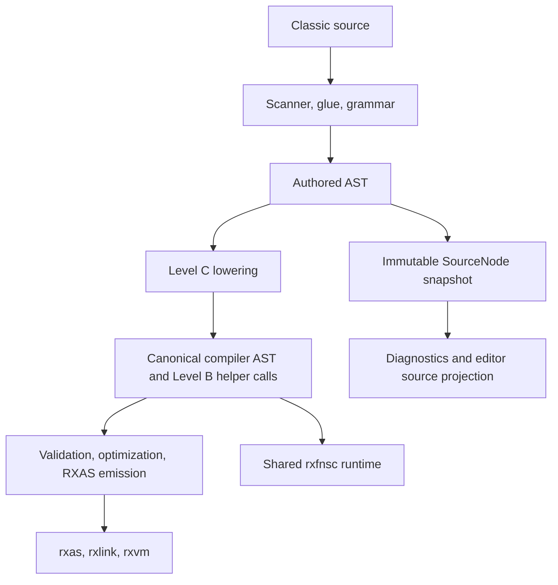

# Level C compatibility layer

Status: detailed documentation review complete; independent summary and section-by-section language reviews passed. Product conformance limits remain open.
Review source snapshot: `c1d971502f5f0ee4804192918e77efb5f7e5d0be` (2026-10-08).

The [existing worklist](../../docs/planning/release-1/levelc-compatibility-worklist.md#level-c-documentation-review-programme-2026-10-08) owns this review plan.

**2026-10-08 implementation update.** The agreed LC-CLOSE phase repairs the
Latin/ordinary Classic expression, DATE/TIME and source-diagnostic paths.
Its authoritative plan and final qualification are in the Level C worklist.
Unicode principles/infrastructure, source conversion semantics, host APIs,
streams and INTERPRET remain deferred. Source is Unicode across B/C/G/L;
non-Latin Level C code has undefined behavior pending the Unicode design.
Dated documentation-investigation and older QA receipts below remain history.

## 1 Scope and reading guide

### 1.1 Review snapshot and authority

This review describes the source at `c1d971502f5f0ee4804192918e77efb5f7e5d0be`, checked on 8 October 2026. It explains how Classic Rexx becomes a running cREXX program and where that implementation stops. The review changes documentation only. It does not repair the issues it records, approve a language rule or qualify another platform.

The [Level C worklist](../../docs/planning/release-1/levelc-compatibility-worklist.md) owns accepted decisions, acceptance criteria, instruction closure and retained execution receipts. The [reference obligations](../../docs/planning/release-1/levelc-reference-obligations.md) identify unfinished cross-cutting contracts. The [compliance reference](levelc_compliance_reference.md) and [BIF reference](levelc_classic_bifs.md) describe the intended Classic rules. This document connects those records to current code and tests; it is not a competing delivery plan.

Use this reading map to find the relevant level of detail:

- [Chapter 2](#2-compatibility-summary): the compatibility summary.
- [Chapters 3–6](#3-compatibility-principles): common rules, compiler/runtime infrastructure and platform boundaries.
- [Chapter 7](#7-instruction-mapping-and-conformance) and [chapter 8](#8-bif-mapping-and-conformance): individual instructions and BIFs.
- [Chapter 9](#9-test-coverage-and-conformance-evidence) and [chapter 10](#10-known-issues-and-pending-decisions): retained test evidence, limitations and pending decisions.
- [Chapter 11](#11-validation-and-language-review-record) and [chapter 12](#12-sources-and-document-map): review records and source references.

The chapter 2 summary draws on the detailed sections; chapter 11 records its independent validation.

### 1.2 Evidence and conformance terms

The following terms separate implementation from qualification:

| Term | Meaning in this review |
| --- | --- |
| Recognized | The scanner/grammar or name inventory accepts a form. It may still be rejected by lowering. |
| Implemented | A current compiler or runtime path exists. Its complete contract may still need qualification. |
| Instruction review closed | The worklist records acceptance for the instruction's agreed scope. Its separately owned host, source, Unicode or platform obligations may remain open. |
| Admitted BIF baseline audited | The arguments, implementation and maintained behavioral fixtures for the admitted baseline have been reviewed. Exhaustive Classic conformance remains unproved. |
| Qualified evidence | A named test panel passed on recorded code/test/build inputs and a named host. Untested configurations are not included. |
| Approved departure | Adrian accepted a specific difference from the reference, with its observable boundary documented. |
| Deferred or undefined | Work or behavior has explicitly been left pending; passing adjacent cases does not resolve it. |
| Inspection observation | Source inspection suggests a limitation or inconsistency; this review has not reproduced the behavior. |

Test names in the detailed sections refer to maintained fixtures and their registration, not to tests newly executed for this documentation review. A broad green suite does not prove cases absent from those fixtures. Historical proofs remain useful only for unchanged inputs and their original scope.

## 2 Compatibility summary

### 2.1 Agreed direction

Level C accepts Classic source through its own scanner, contextual parser glue and grammar, retains an authored source tree, and lowers execution into the ordinary Level B compiler AST and shared libraries. Canonical frame nodes support labels and control transfer; the downstream assembler, linker and VM remain the existing product toolchain. Chapters 3–6 explain the boundaries, and every instruction/BIF in chapters 7–8 names its actual path.

The agreed scalar representation uses valid Unicode text, codepoint operations and a fixed Latin-1 ordinal bridge for byte-valued Classic conversions. RexxScript retains separate binary-capable values and its sandbox/evaluator. Adrian's later direction defers changes to Unicode/I/O compatibility across B/C/G: Unicode-caused signals or logic errors are currently undefined in this work. Existing explicit typed Unicode/codec mechanisms are described as infrastructure, not silently imported into Level C.

ABS, MAX, MIN, SIGN, TRUNC and FORMAT use the selected ANSI/Classic rule: round numeric operands initially under caller DIGITS. This rule applies in C and the existing B/G decimal APIs. Positional/count WHOLE arguments have the approved signed64 implementation limit; WHOLENUM radix operands remain arbitrary precision. External CALL uses the approved static fixed signature. Arbitrary external function expressions and Classic late routine lookup remain unsupported.

### 2.2 Implemented and qualified baseline

The worklist records 24 accepted whole-instruction reviews, including assignment and implicit command; INTERPRET is the 25th review unit and is parked, not implemented. The direct BIF table contains 62 of the 70 Classic names plus LOWER/UPPER extensions. Every catalogued name has a separate section describing its mapping, coverage and status. A direct table entry alone does not establish conformance.

Implemented infrastructure includes shared value, stem and pool objects; activation arguments and results; numeric, TRACE, ADDRESS and condition state; the selected execution-local queue; ordinary retained source lines; and the generated English message catalog. CONDITION has admitted C/D/E/I/S and producer evidence; real host HALT remains open. SAY, queue/default input, PARSE LINEIN and ADDRESS use their existing services; they do not provide the missing Classic stream BIFs.

The retained macOS product checkpoint passed core Debug/Release builds, full normal Debug 3296/3296, 3113 unique Release correctness checks, 19 installed BIF cases and one native callback fixture, with focused maintained ASan overlays. The exact inputs, six repaired Release build-input failures, evidence reuse and unrun gates are in chapter 9 and the worklist. These are recorded test passes, not an assertion of full Classic, platform or Release 1 qualification.

The documentation investigation reproduced the earlier DATE/TIME clause-clock defect. LC-CLOSE now gives each invocation a lazy frozen sample, with a program-wide elapsed/reset origin shared by internal calls; direct injectable pool harnesses remain supported. The compiled clock contract covers freshness, same-clause/nested-call consistency, private PROCEDURE pools, reset and empty-loop conditions. The worklist retains the qualified phase matrix and remaining platform-clock limits.

### 2.3 Outstanding assessment and delivery

Eight recognized BIFs remain without compiled Classic entries: CHARIN, CHAROUT, CHARS, LINEIN, LINEOUT, LINES, QUALIFY and STREAM. Their complete behavioral matrices—including positions, encoding, EOF, state, errors and cleanup—are deferred pending Adrian's architecture and compatibility assessment. No stream provider is approved by this review.

LC-CLOSE repairs physical source NUL truncation and the agreed expression/source diagnostics. Other outstanding obligations include full mapped-source inventory and deferred configuration/Unicode parity, real HALT and wider host invocation/pool APIs, resource/error limits, complete AST/shared-consumer closure and platform qualification. The approved practical TRACE divergences and external CALL departure are documented explicitly, including the static fixed signature. Existing PARSE representation and ADDRESS snapshot bounds are stated; the review does not invent unlimited allocation or arbitrary-size behavior.

Configured BIN/HEX validator/consumer parity is a source-inspection concern, not a reproduced default-ASCII failure. SUBWORD's named unit exercises a different path from its compiled standalone entry; TRACE's pool-state unit is also distinct from its compiled activation-frame path. The evidence is attributed accordingly. Stale source comments mentioning compiler name dispatch are recorded for later cleanup; source is unchanged.

INTERPRET, the B/G split and fast-pipeline proposals, and the other existing gap decisions remain pending. Linux/Windows gates, full macOS sanitizer assurance, supported-platform LSan, hosted/deep/release gates and remaining Release measurements are unrun for this checkpoint. This review documents those boundaries and known issues; it fixes no code and makes no new language, ABI, VM/linker or architectural decision.

## 3 Compatibility principles

### 3.1 Reference rules and approved departures

Level C is the compiled Classic Rexx compatibility layer. Its implementation direction is to express Classic policy in the front end and shared Level B runtime, then use the ordinary compiler, assembler, linker and VM. Classic names and strings are handled through explicit runtime objects rather than by imposing Classic variable rules on ordinary typed B/G code.

The worklist records several decisions that affect a comparison with another Rexx implementation: Unicode scalar/codepoint text and the fixed Latin-1 ordinal bridge; Regina-style skipping of invalid words in indirect DROP lists; the default versus STRICTC timing of invalid LEAVE/ITERATE targets; an external CALL boundary with a static fixed signature; practical TRACE departures; and the existing ADDRESS command-NUL failure boundary. These decisions must be named when claiming parity. They are not a general exemption from Classic argument, result, error or lifecycle rules.

Regina probes are comparison evidence. Where Regina 3.9.7 differs from the approved ANSI/Classic numeric rule, cREXX follows Adrian's selected rule. Unfinished behavior is kept under its worklist owner rather than described as an approved exception.

### 3.2 Classic scalar values and the current Unicode boundary

The approved compiled scalar representation is Unicode text in Level B `.string`, with ordinary character positions counted in codepoints. The VM stores UTF-8 bytes and tracks byte length separately from character count. This does not give Classic programs implicit normalization, grapheme indexing or raw-byte strings. The implementation sources are [RexxValue](../../lib/rxfnsc/RexxValue.crexx), the [Classic configuration](../../lib/rxfnsc/RexxClassicConfig.crexx), and the [VM string architecture](../../docs/ai-context/CREXX_ARCHITECTURE.md#text-utf-8-and-binary-data).

Adrian's later scope direction preserves that existing infrastructure and defers changes to Unicode/I/O compatibility until architectural assessment. Unicode characters causing signals or other logic errors are currently undefined for this compatibility work in B/C/G. The review therefore describes existing conversion rules and retained Unicode tests, but does not turn every non-ASCII failure into a promised repair or claim comprehensive Unicode compatibility.

The existing typed `.string`/`.binary` boundaries and explicit Level G Unicode APIs still explain how the product works. Their presence does not silently add those APIs to Classic Level C or settle the deferred compatibility assessment.

### 3.3 Latin-1 ordinals and binary-capable RexxScript

Classic byte-valued conversions use an ordinal bridge: byte `00` through `FF` corresponds to scalar `U+0000` through `U+00FF`. An ordinal is not the bytes of that scalar's UTF-8 encoding. For example, X2C('FF') produces the text scalar U+00FF; C2X reverses it to FF. Writing the text can emit an encoded multibyte sequence. Operations requiring this bridge use [RexxClassicEncoding](../../lib/rxfnsc/RexxClassicEncoding.crexx); unmappable scalars use the existing Classic error route.

The shared value class retains binary storage and numeric caches. RexxScript has a separate evaluator, string-oriented public result model and sandbox intrinsic allow-list. Sharing RexxValue, a pool class or selected BIF bodies does not convert RexxScript into a Level C compiler, pass it a host pool implicitly, or remove its binary capabilities. BYTE/UTF8 profile helpers remain in shared/direct-client infrastructure; compiled Level C does not expose them as an implicit runtime mode switch.

All-256 ordinal round-trip fixtures support the bridge already implemented. They do not establish raw-byte I/O, arbitrary binary Classic scalars, every encoding or every host error path.

### 3.4 Numeric context and implementation limits

Classic values start as strings; RexxValue owns their numeric materialization. DIGITS, FORM and FUZZ belong to the current activation. NUMERIC updates those settings at execution time; generated calls save, apply and restore the context through the activation/frame machinery. The [numeric instruction section](#722-numeric-lc-i-22) and [numeric BIF sections](#8-bif-mapping-and-conformance) describe the separate instruction and operand-normalization contracts.

Adrian approved ANSI/Classic initial caller-DIGITS rounding for ABS, MAX, MIN, SIGN, TRUNC and FORMAT, including the existing typed B/G decimal implementations. This preserves B/G parameter/result types and signal interfaces; it does not change independent integer or float families. NUM normalization uses the existing +0 decimal route under caller DIGITS/FORM rather than preserving an unrounded operand as Regina does in the reduced-DIGITS probe.

Positional/count WHOLE BIF operands accept exact decimal/exponent spellings within the inclusive signed 64-bit range. Values outside that range report source-anchored 40.12 before VM integer conversion. WHOLENUM radix operands remain arbitrary precision. An in-range count is not an allocation guarantee. Complete resource exhaustion, maximum text/source sizes and platform minimum-limit proof remain LC-REF-025/LC-GAP-06; this review introduces no further numeric limit.

### 3.5 Invocation, activation and variable visibility

A Classic program uses one generated body containing its labels, with explicit activation data for internal calls. A label is not automatically a typed Level B procedure or a new Classic variable pool. Without PROCEDURE, an internal routine sees the caller's visible pool; PROCEDURE creates a private pool and ordered EXPOSE aliases. Compound substitution and stem/default/tombstone behavior belong to [RexxVariablePool](../../lib/rxfnsc/RexxVariablePool.crexx) and [RexxStem](../../lib/rxfnsc/RexxStem.crexx).

[RexxActivationArguments](../../lib/rxfnsc/RexxActivationArguments.crexx) carries argument presence, return presence, first-instruction PROCEDURE eligibility, numeric/TRACE/ADDRESS and condition state, and program-root exit state. Omitted arguments differ from present empty strings. Internal function returns require a result; CALL uses optional RESULT/.RESULT updates. These are Classic frame semantics over existing compiler/VM operations, not a dynamic linker protocol.

External CALL is admitted only through the approved fixed signature and static provider availability. In expression position, the compiler resolves local labels and direct BIFs; it rejects other function targets. General Classic/non-Classic interoperation and wider host invocation/access-window contracts remain outside the completed CALL review.

### 3.6 Conditions, messages and error identity

The condition state has C/D/E/I/S fields and seven admitted identities: SYNTAX, HALT, ERROR, FAILURE, NOTREADY, NOVALUE and LOSTDIGITS. SIGNAL policy performs immediate transfer; CALL policy delivers the agreed delayed conditions. [RexxClassicConditionEvent](../../lib/rxfnsc/RexxClassicConditionEvent.crexx) and the activation object preserve identity, description, extra data and instruction/state, while compiler-generated dispatch retains the source location that caused the event and the agreed SIGL/RC behavior.

BIF validation records a Classic error in RexxBifCallContext. Compiled lowering checks that result and raises CLASSIC_SYNTAX at the authored clause. The [message catalogs](../../messages/diagnostics.en_GB.msg), compiler [diagnostic API](../rxcp_diag.c) and generated runtime catalog share stable RXC-LC-n.s identities. Compiler rendering supports localized catalogs and raw diagnostics; ERRORTEXT returns unexpanded templates and currently uses English fallback for N. Runtime CONDITION descriptions and full localized host reporting have their own limits.

Live SYNTAX/NOVALUE, numeric LOSTDIGITS and ADDRESS ERROR/FAILURE/NOTREADY have maintained field evidence. Controlled HALT events prove delivery/state, not a real host interruption producer. Initialization, finalization, resource failures, complete message insertions and full traceback equivalence remain separate obligations.

### 3.7 I/O and host ownership

SAY uses the existing length-aware output route. PULL obtains one item from the execution-local selected queue or falls back to default input; PUSH/QUEUE add to that repository. PARSE LINEIN bypasses queued entries and uses the existing default-line reader. These narrow instruction services do not supply the full Classic character/line stream BIF contract.

ADDRESS uses the existing environment object/function protocol and redirect endpoints. Host behavior belongs to the selected environment, with command status reflected through the Classic adapter. The approved embedded-NUL command failure boundary remains LC-HOST-ADDRESS-NUL. Files, subprocesses, encodings and endpoint finalization must be attributed to their actual owning service, not inferred from a passing SAY or ADDRESS example.

CHARIN, CHAROUT, CHARS, LINEIN, LINEOUT, LINES, QUALIFY and STREAM are recognized but lack direct compiled Classic implementations. Adrian deferred new stream/Unicode infrastructure. The proposed RXPA stream provider is not approved. Existing FOPEN/FREADLINE/FREADCDPT/FWRITE and file-cache services are not proof of seeking, independent positions, availability and state, closing and errors, or context isolation.

### 3.8 Decisions that remain pending

The remaining-gap register preserves LC-GAP-01 and LC-GAP-03–10. INTERPRET is parked and unimplemented. Stream architecture, host invocation and variable-pool APIs, real HALT production, full source identity, arithmetic/expression equivalence, resource limits and broader AST/shared-consumer closure remain pending. PARSE EXTERNAL/NUMERIC are outside the initial agreed Level C sources, with their final Release 1 disposition still separately owned.

Neither the B/G compiler split nor fast-pipeline proposals are approved by this review. Existing static CALL, linker and VM behavior remain the current boundary. New Unicode/I/O compatibility rules or host infrastructure require that assessment; this documentation exercise supplies no approval for them.

## 4 Source, AST and lowering

### 4.1 Source selection, clauses and scanner

[rxcpmain](../rxcpmain.c) determines defaults from [source extensions](../rxcp_source_ext.c), CLI options and the leading OPTIONS pre-scan. Headerless `.rexx` selects Level C; `.crexx`/`.crx` select the ordinary typed Level G default. Explicit Level B headers select the system-programming surface. Extensionless CLI input is normalized by rxc to its `.crexx` default; helper fallback rules are described in the parsing guide. Explicit source-level options take precedence over the default. Compiler/self-build callers can disable exits and the executable import root with documented switches rather than accidentally loading an older packaged runtime.

Classic input goes through [rxcpcscn.re](../rxcpcscn.re), [rxcpcpar.c](../rxcpcpar.c) and [rxcpcgmr.y](../rxcpcgmr.y). The scanner creates tokens; glue supplies contextual words, continuation and clause endings; Lemon reductions create AST nodes. Instruction words are contextual rather than globally reserved. Source characters, nested comments, alternative negators, continuation and invalid-source identity still have open full-reference obligations despite focused parser fixtures.

### 4.2 Grammar, structural words, labels and null clauses

END closes DO/SELECT and can carry the checked control name. THEN/ELSE belong to IF; WHEN/OTHERWISE belong to SELECT. They are structural grammar roles, not independent executable instructions. Their errors and nesting are covered with the containing instruction. The grammar keeps clause/label structure distinct from later runtime dispatch.

Labels retain their source spelling/anchor and receive frame-local bindings during lowering. The canonical body uses FRAME_LABEL, FRAME_BRANCH and FRAME_HANDLER_ON/OFF nodes with explicit target metadata; jumping cannot fabricate a caller frame. Null clauses contribute source structure without an executable action. First-instruction PROCEDURE eligibility is handled by the activation, so merely encountering a label does not create a fresh private scope.

Structural fixtures check the source and canonical trees; the detailed IF, SELECT, DO and SIGNAL sections identify their maintained evidence. Complete source/reference edge cases, END-name restrictions and label/source lifecycle still belong to LC-REF-026–036/042 and LC-GAP-06/09.

### 4.3 Expressions and operators

Classic literals become RexxValue factories with the original text; variable reads become visible-pool operations. FUNCTION carries an argument sibling list with NOVAL omissions. Unary and binary operator nodes are converted by `levelc_lower_expr`, `levelc_lower_unary_method` and `levelc_lower_binary_method` into RexxValue methods and explicit temporaries where evaluation order requires them. See [the lowerer](../rxcp_levelc_lower.c).

The grammar uses left-recursive power productions. Arithmetic, integer division/remainder, strict/normal comparisons, explicit concatenation and inferred blank/abuttal concatenation have their own operator nodes. Classic AND/OR are lowered through the eager logical path, evaluating both operands in source order instead of inheriting ordinary typed short-circuit behavior. Exact logical-value checks use contextual Classic errors.

`AST_SEMANTIC_CONTEXT_CLASSIC_*` records retain the Classic operation's identity around generated calls for source/TRACE reporting. The grammar and selected operator regressions cover part of the reference matrix. The LC-CLOSE expression contract covers values, source-order effects, numeric contexts, Classic errors and four execution modes. Numeric/normal-comparison/logical operators now use a lean RexxBifCallContext.expression factory and shared rexxclassic_expression_binary/unary adapters; they record errors through the existing BIF transport and raise CLASSIC_SYNTAX at the authored operator. Integer divide/remainder use shared VM guard digits, working precision and DIGITS-width checks; whole powers have bounded validation and large-exponent binary reduction. Deferred configuration/Unicode/resource/platform obligations retain LC-GAP-07/LC-REF-043–046 ownership. External function-expression support is also narrower than the CALL statement boundary.

### 4.4 Source AST to canonical Level B AST

`rxcp_levelc_prepare_source_ast` performs source shaping/diagnostics and snapshots the user-facing SourceNode tree. `rxcp_levelc_lower_to_canonical` then rewrites the mutable AST before ordinary validation. Successful lowering sets `levelc_lowered` and changes the working context to `LEVELB` for shared validation. Lowering constructs compiler nodes and Level B helper calls directly; it does not emit a `.crexx` source file for reparsing. [SourceNode](../rxcp_source_tree.h) and [ASTNode](../rxcp_ast.h) have different responsibilities.



[rxcp_remap_build](../rxcp_remap_build.c) provides neutral AST builders; Classic policy belongs in the lowerer and runtime. Generated factories, member calls, assignments, loops, blocks and specialized canonical frame-control nodes use the ordinary downstream compiler. `rxcp_levelc_verify_lowered_tree` checks parent/sibling ownership, cycles and absence of source-only Level C nodes. It is a structural gate, not a proof of every semantic shape.

### 4.5 Tree ownership, provenance and diagnostics

The immutable source snapshot retains authored layout, spans, diagnostics and semantic sidecars. The working AST can be replaced, cloned, imported or optimized. [ast_copy_source_anchor](../rxcp_ast_core.c) and source-provenance flags relate generated nodes to the authored operation; helper operands remain synthetic while an outer operation can retain a reporting anchor.

The BIF checkpoint repaired the indexed/stem setter rewrite to retain authored assignment source on its outer call. Focused TRACE, source/provider and assembly-golden checks qualified that repair. It did not establish universal optimized traceback equivalence: selected negative no-opt fixtures assert authored source, while their optimized goldens still reflect the existing panic-only output.

RXPP source-map input can retain original locations for diagnostics without supplying SOURCELINE with an original physical-line inventory. Those are separate source services. Physical NUL now survives scanning, literals/comments, imported source and retained source lines; invalid lexical positions receive explicit diagnostics. Source-map owned text has an explicit length, metadata spans require a backing buffer, and panic output renders NUL as \0 while retaining the suffix. Full mapped-source identity and broader generated/helper traceback remain LC-GAP-06.

### 4.6 Validation, optimization and emission

After lowering, [validate_ast](../rxcp_val_orch.c) runs shared validation of structure, symbols, types, imports and exits, together with the rewrite machinery. [AST validation](../rxcp_ast_val.c) checks ownership invariants, and fixed-point passes stabilize generated scopes and symbols. The compiler's existing inliner/optimizer handles representable canonical shapes; unsupported forms retain a diagnostic or ordinary call according to their existing contract.

[Flow emission](../rxcp_emit_flow.c), [procedure emission](../rxcp_emit_proc.c) and [expression emission](../rxcp_emit_expr.c) translate that AST into RXAS. Classic frame control uses existing canonical support; it is inaccurate to describe every resulting node as source-level Level B syntax. Direct and linked execution are distinct: linking packages statically available modules, while the VM still loads and resolves the resulting image.

Normal optimized/no-opt, AST, source and linked tests are retained evidence. Compiler/B/G split and fast-pipeline ideas remain pending. This documentation review neither measures nor changes the optimizer, loader, VM paths or performance policy.

### 4.7 Syntax highlighting and tooling

Parser mode dispatches the Classic scanner/glue/grammar and SourceNode projection through [rxcp_highlight_controller](../rxcp_highlight_controller.c). It reports source-level syntax/semantic annotations without claiming that every recognized form executes. The [syntax-highlighting record](levelc_syntax_highlighting.md) retains the early milestone as history, including forms whose execution was then unavailable.

The final product checkpoint ran maintained parser fixtures in owned per-case directories. In the earlier shared working directory, module discovery found unrelated generated and linked modules and reached parser_tester's fallback cutoff. Isolation restored complete semantic trees without a resolver or parser-deadline change. The existing parser resource lock and serialized scheduling were retained. Wider import discovery/scalability is a separate unqualified design issue; a passing editor projection is not instruction conformance.

## 5 Runtime and Level B/G integration

### 5.1 Shared Classic value and pool libraries

[RexxValue](../../lib/rxfnsc/RexxValue.crexx) owns string, binary and numeric materialization and Classic operators. [RexxStem](../../lib/rxfnsc/RexxStem.crexx) owns default values, explicit tails and dropped-tail tombstones. [RexxVariablePool](../../lib/rxfnsc/RexxVariablePool.crexx) owns case handling, compound substitution, visible bindings and exposure. Assignments evaluate the right-hand value before resolving the destination compound tail.

The compiler calls shared pool operations such as `symbolValue`, `setSymbolValue`, `dropSymbol`, `dropIndirectList` and `exposeSymbol` rather than building another dictionary per instruction. Exact compound aliases remain fixed to the resolved caller name; whole-stem aliases and defaults have their own propagation rules. Library ownership expires with the relevant activation/VM module instance, not by changing a global host pool.

These are Level B implementations packaged in `rxfnsc.rxbin`. Typed B/G source keeps its own variables and class/type rules. Sharing runtime objects does not grant a general cross-dialect pool API. Maintained value/stem/pool/activation fixtures and RexxScript isolation checks support the agreed paths; externally visible pool access and lifetime remain open.

### 5.2 Arguments, frames, labels and results

The generated Classic body receives a visible pool, configuration reference, activation and entry selection. Internal CALL/function sites capture arguments once in source order, preserving omitted positions. Canonical FRAME_LABEL/FRAME_BRANCH nodes and generated call/return nodes select labels and return across active frames; the activation handles PROCEDURE eligibility and return presence. Detailed contracts are in ARG, PROCEDURE, CALL, RETURN, EXIT and SIGNAL below.

A separately compiled Classic routine uses `--levelc-routine`; an external Level B/G provider must expose the approved `.void` entry with a by-value `.RexxActivationArguments`. The provider must be visible during caller compilation and included in the execution image. Missing compile-time targets and missing linked providers have distinct existing error timing. No late routine lookup or new linker/VM ABI is implied.

[RXVML](../../interpreter/rxvml.h) provides host loading/run/result services, including the existing length-aware run entry. C-string argv cannot represent embedded NUL. Neither API presence nor a callback smoke proves all Classic COMMAND/FUNCTION/SUBROUTINE modes, trap overrides, pool windows or completion classes.

### 5.3 Numeric configuration and typed B/G BIFs

The activation stores `numericDigits`, `numericFuzz` and `numericForm`, validates setters, and inherits and restores those values across Classic calls. The lowerer applies the stored context around arithmetic, BIFs and frame transitions. [RexxDoState](../../lib/rxfnsc/RexxDoState.crexx) shares numeric loop setup/advance rules without imposing the earlier 32-bit count slice as the final language boundary.

The common BIF validator normalizes NUM once. The ABS, MAX, MIN and SIGN wrappers reuse their common bodies. TRUNC truncates the initially rounded value, and FORMAT preserves its required output scale. Existing [rxfnsb](../../lib/rxfnsb/rexx) decimal BIFs follow the approved initial-rounding rule with inherited typed numeric context. Maintained `levelb_bif_numeric_context`, `levelc_bif_numeric_context` and `levelg_bif_numeric_context` cover reduced/high DIGITS, FORM, restoration and all four execution modes.

This establishes the selected numeric BIF change; arithmetic edge cases and resource limits still have open obligations. RexxScript's public adapter and configuration remain separate from the B/G typed API.

DATE/TIME contexts bind to the current activation. beginClauseTime invalidates its sample lazily at executed clauses and repeated condition checkpoints; ensureClauseTime samples only when a clock BIF needs it. Nested invocations retain separate samples and use the program root's elapsed origin. Direct contexts without a compiled activation retain the existing injectable pool clock. Historical diagnosis and remaining timezone/platform limits are in 8.24/8.56 and 10.2.

### 5.4 Conditions, SIGNAL, delayed CALL and TRACE

The activation holds immediate SIGNAL and delayed CALL policies, current and dispatched condition data, and pending delivery. Generated clause boundaries and canonical label control deliver the agreed events. A handler can query CONDITION without importing an ambient host state. Child frames inherit and restore policy according to the agreed lifecycle; real producer availability must still be distinguished from controlled event injection.

TRACE uses the existing activation-local state and source/provenance reporting. The practical scope includes correct supported source/value records, options, command inhibition and source-anchored errors. Interactive prompting, numeric skip/suppress, SCAN and incomplete event coverage are recorded Classic departures under LC-AC-77. B/G/RexxScript keep their existing tracing paths; the earlier TRACE class-import repair restored the proper rexxvalue namespace without adding a new trace engine.

See the SIGNAL, CALL, TRACE and CONDITION sections for concrete maintained fixtures. Full host HALT, every cross-service producer and full optimized traceback remain open.

### 5.5 Queue and input/output services

RexxClassicConfig forwards `pullText`, `pushText`, `queueText` and `queuedCount` to the existing [rxqueue library](../../lib/rxfnsb/rexx/rxqueue.crexx). That library owns an execution-local named repository and selected active queue. PUSH inserts at the front, QUEUE at the tail, PULL consumes or uses default input, and QUEUED observes without consuming. Internal routines share the selected repository. Independent VM contexts and their mutable module instances have separate queue state; repeating a run in one retained context does not imply queue reinitialization.

The existing Level B QUERY/SET interface can select a named queue. A complete Level C/C host selection adapter is a wider host criterion, not delivered by QUEUED. [fileio](../../lib/rxfnsb/rexx/fileio.crexx) owns the current line-reader and file-cache services. PARSE LINEIN calls that default-line path, which does not make the absent LINEIN Classic BIF implemented.

Retained tests cover ordering/count, named selection through the existing B API, NUL on admitted queue paths, EOF/default-input behavior and execution isolation. They do not establish the deferred stream positioning/encoding/resource matrix.

### 5.6 ADDRESS environments and native interfaces

[RexxClassicAddress](../../lib/rxfnsc/RexxClassicAddress.crexx) adapts Classic environment/connection state and status to the existing [_address protocol](../../lib/rxfnsb/rexx/_address.crexx). Environment objects implement the existing interfaces; native hosts register through `rxvml_address_register_callback_environment(ctx, name, id, command_cb, function_cb, userdata)`. The retired command-only registration form is not the current ABI.

Native callbacks use the request/response helpers and helpers that emit output or errors. Existing reference-counted redirect endpoints govern ownership. Input endpoints snapshot input; output completion is copied back after the owning worker joins; finalizers close handles and discard unconsumed completion. This is existing host infrastructure, not a new Classic stream service. [The VM guide](../../docs/ai-context/RXVM_INTERPRETER.md#address-environment-objects-and-functions) documents these lifetimes.

The installed callback fixture passed twelve callbacks and file cleanup, including Classic condition-field assertions. RXPA factory/method/object-type services are approved infrastructure for existing providers. The proposed narrow stream provider is still unapproved; documentation of the RXPA interface is not permission to create it.

### 5.7 Source lines and message catalog

SOURCELINE retains ordinary physical source in the unit's configuration only when that BIF is used. `levelc_append_source_lines` walks the existing compiler buffer, handles CRLF/CR/LF and final lines, and calls `appendSourceLine`. Local routines share those lines; separately compiled providers retain their own unit. It does not reopen the source file at runtime.

A source-mapped generated buffer has no retained original inventory and reports count zero. LC-CLOSE makes scanning and retained source lengths explicit: physical NUL in literals/comments and later clauses is preserved across B/C/G/L, including imported source; invalid lexical positions receive a diagnostic. PARSE SOURCE derives system/mode/name from source metadata and program-root mode; it is not a substitute for a complete line inventory.

ERRORTEXT uses the generated English diagnostic template service and converts its braces to Classic place-markers. Compiler localization/raw rendering and runtime CONDITION expansion are distinct consumers of the catalog. N currently falls back to English. Full mapped source, locale selection, all message insertion producers and full error traceback remain LC-GAP-06/LC-REF-072.

### 5.8 RexxScript isolation and packaging

[RexxScriptEvaluator](../../rexxscript/RexxScriptEvaluator.crexx) uses its own parser/evaluator state, sandbox pool and explicit intrinsic allow-list. It materializes shared RexxValue arguments and adapts results to its public string model. Availability of rxfnsc does not grant it Classic ADDRESS, ambient stream access, external CALL or unrestricted host-pool access. Its DATE/TIME adapters call the typed Level B routines; the compiled Classic TIME cache defect is not a reproduced RexxScript DATE/TIME failure.

[CMake runtime packaging](../../lib/rxfnsc/CMakeLists.txt) compiles the shared classes and standalone BIF modules into rxfnsc.rxbin. Namespace imports determine which bodies the compiler can call. Direct named entries remain the compiled route; the retained legacy dispatcher is a compatibility-test surface. Source/binary certification fixtures check provider identity, including deliberate spoof providers kept apart from ordinary consumers.

The installed smoke uses the installed compiler, assembler, linker, VM and runtime images; the native fixture links installed archives. This proves the current desktop package paths used by those checks. It does not qualify every packaging platform or the separate RexxScript feature set.

## 6 OS and platform boundaries

### 6.1 Platform services and default command environment

The shipped default command environment is CREXX, implemented in [rxcrexxcmd](../../interpreter/rxcrexxcmd.c). It has a cREXX-defined command set and worker-local logical directory/environment state. It does not interpret shell operators as a shell would. SYSTEM/COMMAND/CMD invoke the platform command processor; PATH dispatches an executable; SHELL uses the configured shell route. These differences affect Classic command portability.

On POSIX the current SYSTEM route uses standard `sh -c` rather than the user's login SHELL. Windows uses COMSPEC/cmd and CreateProcessW, with UTF-8 internal text converted to UTF-16 at the Win32 boundary. Child standard streams are byte streams; a host provider must select a converter when their encoding differs. These are described in the [ADDRESS protocol](../../docs/ai-context/RXVM_INTERPRETER.md#address-environment-objects-and-functions) and implemented by [rxspawn](../../interpreter/rxspawn.c).

[Platform text codecs](../../platform/text_codec.h) and the existing [CMS/TSO text adapter](../../ports/single-threaded/CMS-TEXT.md) handle explicitly selected external text pages. RXBIN remains binary. The presence of a mainframe adapter is not full Level C qualification on CMS/TSO or an approved change to Classic streams.

### 6.2 Streams, line endings, encoding and NUL

There are several distinct text boundaries: compiler source decoding, source-line retention, VM string values, default terminal I/O, native callbacks, files and subprocess pipes. A codepoint count inside a string is not a file offset, byte length or host encoding declaration. The current platform codec converts selected external text before scanning/emission; internal UTF-8 and fixed ordinal semantics remain separate.

SOURCELINE strips recognized physical line endings from retained lines. SAY preserves the length-aware value and writes its newline through the current output path. Default line input follows fileio/VM behavior. ADDRESS redirection owns its existing stream handles and completion cells, while Classic stream BIFs remain absent. Passing CRLF or NUL in one of these paths proves only that path.

The C-string host run entry cannot carry embedded-NUL arguments; the length-aware entry can carry a length span subject to its existing text validation. ADDRESS command NUL follows its approved failure boundary. Physical source NUL/mapping is open. There is no approved raw-byte Level C stream or automatic encoding inference.

### 6.3 Native host lifetime and interruption

The current [RXVML header](../../interpreter/rxvml.h) defines ABI version 8 and exposes interfaces for creation, loading, execution, results, destruction and callbacks. [rxvml.c](../../interpreter/rxvml.c) owns host-context setup and validation; [rxvml/rxvm_run.c](../../interpreter/rxvml/rxvm_run.c) handles the run boundary. VM/RXPA objects, module instances, redirect workers and native payloads have existing ownership rules; Classic helpers use those rules rather than introducing a second host lifetime.

Controlled typed events exercise SIGNAL/CALL HALT handling. They do not qualify a real external host interruption at the required Classic clause boundary. Invocation modes, completion classes, trap overrides and pool-access windows remain LC-GAP-04. General VM interrupt facilities are infrastructure, not proof that this Classic host contract has been wired and tested.

The focused native callback and maintained sanitizer receipts qualify the changed first-party paths on macOS. They do not instrument upstream Llama or supply Apple LeakSanitizer.

### 6.4 Assembler, linker, VM and installed layout

[RXAS](../../docs/ai-context/RXAS_ASSEMBLER.md) translates assembly and metadata into RXBIN 007. [RXLINK](../../docs/ai-context/RXLINK_LINKER.md) selects explicitly provided modules, checks signatures, remaps the semantic graph/constants and preserves required provider/source metadata. Packaged autoload hints are not a Classic late-lookup service or a way for the linker to discover missing inputs.

The VM loads the resulting image and resolves runtime procedures. Product rxvm selects the supported threaded or portable concrete engine; the maintained suites also exercise rxtvm/rxbvm where configured. Classic lowering uses the current frame, label, signal, source and PARSE facilities; this review proposes no new opcode, linker rule or host ABI.

The installed product keeps runtime bytecode, plugins, tools and native archives in the existing layout, including archives used by native packaging. Installed linked BIF and static-host smoke passed on macOS. Linux runpath, Windows process/file locking and platform-native packaging need their own named gates; local installed proof is not portable by assumption.

### 6.5 Current platform evidence and unrun gates

The frozen BIF/product checkpoint ran on macOS arm64 with 10 logical CPUs and 24 GiB RAM. Core Debug/Release builds passed; the full normal Debug suite passed 3296/3296. Release has 3113 unique correctness checks with valid retained results and focused completion after six stale Text Inspector build-input failures. The installed panel passed 19 BIF cases and one native callback fixture. Chapter 9 and the worklist give the exact revision/commands and input-reuse proof.

Focused maintained macOS ASan panels passed for the changed first-party code and ownership paths. Apple LSan is unavailable. Linux/Windows normal and platform sanitizer gates, full macOS sanitizer matrix, hosted overnight, deep, build-graph and CodeQL gates, and release-platform gates were not run for this checkpoint. GTK and real ODBC coverage were disabled in normal builds; configured interface/mock cases ran. The remaining 183 Release measurement checks are not a performance verdict.

OS support in the code or a workflow matrix is an intended product surface. A pass is attributed only to the platform/configuration actually executed. No full Level C, Release 1 or cross-platform sanitizer-clean claim follows.

### 6.6 Configuration and resource limits

Classic configuration includes character classes/blanks, exponent limits, random state, selected external pools and retained source lines. Activation state separately owns numeric, TRACE, ADDRESS and condition policy. Some configuration APIs are available to direct Level B clients but are not exposed as a complete Level C/C host adapter.

Caller-selected custom character classes can reveal mismatches between validation and the consuming algorithm. The BIF chapters identify inspection observations for custom HEX/BIN separators; those are unqualified adapter risks, not a new Unicode policy or a reproduced default compiled-program failure.

The current source also checks concrete representation bounds: each frozen PARSE descriptor's item/result/dynamic-operand count fits 16 bits (at most 65,535), and generated template/entry indices must fit INT_MAX. The ADDRESS adapter bounds a named-file input snapshot to 16 MiB and closes the file on an over-limit read. These are observed implementation limits, not newly chosen Classic language rules. User-visible diagnostics and resource behavior at these large-case limits still need proof under LC-REF-025/LC-GAP-06.

Allocation success for large counts, failures during closing or finalization, all host resource failures and the reference minimum limits remain unqualified. The approved signed64 WHOLE validation limit is the only newly selected positional BIF bound in the checkpoint. Future resource or compatibility decisions need their existing owner and evidence.

## 7 Instruction mapping and conformance

The 25 sections below follow the whole-instruction inventory. `END`, `THEN`,
`ELSE`, `WHEN`, `OTHERWISE`, labels and null clauses also have structural roles;
section 4.2 describes those roles. A closed instruction review means its agreed
instruction contract passed its recorded review. It does not establish full
Classic reference conformance, a complete host API, or cross-platform
qualification.

Instruction receipts do not close every shared state service. For example, the
documentation review's linked opt/no-opt probe found that TIME('E') and TIME('L')
can retain a stale clause-clock snapshot across `ADDRESS SYSTEM 'sleep 1'`.
Section 8.56 documents that reproduced TIME/shared-lifecycle issue under
LC-GAP-02/04 and LC-REF-057; it is not an ADDRESS or NUMERIC syntax regression.

All raw node names here are from the [Classic grammar](../rxcpcgmr.y).
`rxcp_levelc_lower_to_canonical()` in the [Level C lowerer](../rxcp_levelc_lower.c)
checks the accepted tree before replacing it. The result is the ordinary
compiler AST, not generated Level B source text. The [remap builders](../rxcp_remap_build.c)
create `FACTORY_CALL`, `MEMBER_CALL`, `FUNCTION`, `CALL`, `ASSIGN`, `IF` and `DO`
nodes with source anchors and owned child/sibling relationships. Each executed
instruction also gets a `TRACE_CLAUSE` marker. The normal validator, optimizer
and [flow emitter](../rxcp_emit_flow.c) consume this canonical tree.

The maintained test names below are registered in [compiler CMake](../tests/CMakeLists.txt)
unless another registration is named. `_noopt` mode means `rxc -n`;
`_opt` means the normal optimizer path. Linked harnesses execute the full
`rxc` → `rxas` → `rxlink` → `rxvm` chain. Historical receipts for manual linked
and reference checks are identified separately from maintained tests. The final local
whole-product checkpoint includes these registered cases in the normal Debug
and relevant Release suites; section 9 gives its exact revision, commands and
platform limits. This instruction investigation added no tests and ran no broad
suites. Focused review probes are identified with their own receipts.

The [worklist](../../docs/planning/release-1/levelc-compatibility-worklist.md)
owns instruction acceptance and scope decisions; the [reference obligations](../../docs/planning/release-1/levelc-reference-obligations.md)
own the wider contract inventory. Existing Unicode tests describe retained
behavior. Adrian has deferred changes to Unicode and I/O compatibility across
B/C/G pending architectural assessment; Unicode-caused signals and logic
errors are currently undefined. That boundary applies to every section below.

### 7.01 SAY (LC-I-01)

**Contract.** `SAY [expression]` evaluates an expression once, materializes its
Classic text and writes one line. Bare `SAY` writes an empty line. The same form
works in main code, branches, groups and local routines. Expression errors use
the shared expression/BIF path and stop output; malformed parentheses and
incomplete expressions receive the parser's contextual `35.1`, `36`, `37.1`
or `37.2` diagnostics.

**Mapping and services.** Raw `SAY` has either one expression child or none.
`levelc_say_statement()` lowers through `levelc_lower_expr()` and
`levelc_classic_as_string()`, supplying an empty `STRING` for the bare form,
then creates canonical `SAY`. `emit_flow()` emits the existing `say` opcode.
The VM's length-aware output route carries the entire UTF-8 byte span, including
embedded NUL and the appended LF. A configured
`rxvml_set_context_say_exit_bytes()` callback controls its output policy. It may
use the borrowed span only during the callback; [rxvml.c](../../interpreter/rxvml.c)
and the [VM guide](../../docs/ai-context/RXVM_INTERPRETER.md) describe the API.
There is no SAY-specific pool or second output engine.

**Coverage and status.** [levelc_say_instruction.rexx](../tests/rexx_src/levelc_say_instruction.rexx)
checks bare output, nesting and once-only evaluation; `levelc_say_instruction`
and `_noopt` check its output. `levelc_say_pool_reads*`,
`levelc_say_bytes*`, `levelc_say_instruction_tree_shape` and
`levelc_say_host_output` cover pool reads, ordinals/NUL, canonical shape and
native output bytes. The [native fixture](../tests/src/test_levelc_say_host_output.c)
loads individual modules into one context; the adjacent
[`say_bytes_host_callbacks`](../tests/src/test_say_bytes_host.c) fixture checks
callback isolation. Linked and two-VM evidence is retained in the
LC-STEP-63F/88D-1 receipts, rather than supplied by that one native test. LC-AC-57 is
instruction-closed; LC-REF-068 and LC-GAP-03/04/08 retain wider configured host
and Unicode obligations. A successful SAY does not qualify every expression
or BIF it could contain.

### 7.02 DROP (LC-I-02)

**Contract.** `DROP variable-list` drops simple variables, whole stems and
compound variables in source order. Parenthesized names supply indirect lists.
Each list is read from the variable's current value when its position is reached.
Dropped scalar reads
return the symbolic name; dropping a stem also resets its tails. The agreed
Regina policy skips invalid words inside an indirect list. Missing or malformed
direct names receive `20.1`.

**Mapping and services.** Raw `LEVELC_DROP` contains `ARGS` with `VAR_TARGET`
entries or parenthesized `VAR_REFERENCE` entries carrying a `TOKEN` marker.
`levelc_drop_supported()` validates that shape. `levelc_lower_drop()` emits
canonical `CALL(MEMBER_CALL)` operations to
[`RexxVariablePool`](../../lib/rxfnsc/RexxVariablePool.crexx). Direct entries call
`dropSymbol()`; indirect entries first read the list through the shared pool,
then call `dropIndirectList(text, config-reference)`. The runtime resolves
compound tails and updates bindings/aliases. `RexxVariableListCursor` and the
shared character scanner classify subsidiary words. Capturing each indirect
list when its position is reached preserves the effects of earlier drops.

**Coverage and status.** [levelc_drop_instruction.rexx](../tests/rexx_src/levelc_drop_instruction.rexx)
and `levelc_drop_instruction{,_noopt,_tree_shape}` cover long direct lists,
compound substitution, indirect order, local exposure and stem reset;
`levelc_drop_invalid` checks diagnostics. Earlier `levelc_slice53_drop_direct`
and indirect-list fixtures and `testRexxRuntimePools*` cover runtime behavior.
LC-STEP-64B/88D-2 retain Regina, manual linked and configured-text evidence;
the instruction-named maintained tests themselves are direct execution/tree
checks. LC-AC-62 is closed. External pool APIs and complete alias/condition
lifecycle remain LC-REF-049–051/060 and LC-GAP-04/08/09.

### 7.03 assignment (LC-I-03)

**Contract.** `variable = [expression]` replaces a simple, stem or compound
binding; an empty RHS supplies the empty value. The complete RHS is evaluated
before compound-tail substitution for the target. Setting a stem default
replaces old tails. Exposed bindings write through to their owning pool.
Numeric constant targets are invalid (`31.1`); malformed RHS expressions use
the shared parser diagnostics.

**Mapping and services.** Raw `ASSIGN` contains `VAR_TARGET` and an optional
expression. `levelc_pool_set_statement()` lowers the RHS, or creates a blank
`RexxValue`, then produces canonical
`CALL(MEMBER_CALL setSymbolValue(pool, symbolic-name, value))`.
[`RexxVariablePool.setSymbolValue()`](../../lib/rxfnsc/RexxVariablePool.crexx)
resolves the target at the write point; `RexxStem` owns defaults/tails and
`RexxPoolAlias` owns write-through exposure. Assignment semantic-context
metadata distinguishes the authored value from helper operations for TRACE.
This is separate from the compiler's hidden canonical `ASSIGN` temporaries.

**Coverage and status.** [levelc_assignment_instruction.rexx](../tests/rexx_src/levelc_assignment_instruction.rexx)
and `levelc_assignment_instruction{,_noopt,_tree_shape}` cover replacement,
empty RHS, nested assignments, stem reset, exposure and an RHS that changes
tail variables. Retained Unicode/NUL cases exercise values and substituted
tails; they do not define presently undefined Unicode failure behavior.
`levelc_assignment_invalid` and shared-pool unit tests cover negatives and
storage. LC-STEP-65B/88D-3 retain Regina and manual linked receipts. LC-AC-63
is closed. Cross-activation external pool access, reserved-state/source
equivalence and complete Unicode proof remain LC-REF-049–052,
LC-GAP-04/06/08/09.

### 7.04 NOP (LC-I-04)

**Contract.** `NOP` has no children and performs no visible action. It can provide an
instruction where a branch requires one. Trailing operands are invalid
(`21.1`). NOP remains an instruction, distinct from a null clause or label.

**Mapping and services.** The raw and canonical node are both `NOP`.
`levelc_lower_nop()` makes a source-anchored canonical node with no children.
The ordinary `emit_flow()` NOP case creates an empty output fragment. Clause
and source markers still preserve the instruction's identity for tooling,
first-instruction eligibility and trace/checkpoint logic. There is no NOP
library helper or OS resource.

**Coverage and status.** [levelc_slice9_nop.rexx](../tests/rexx_src/levelc_slice9_nop.rexx)
is exercised by `levelc_slice9_nop` and `_noopt`;
`levelc_nop_instruction_tree_shape` checks the preserved node;
`levelc_nop_invalid` checks invalid tails. Parser/highlighter cases also
exercise NOP as an IF/SELECT arm. LC-STEP-66B records the whole-instruction
review and linked/reference checks; there is no dedicated native NOP fixture.
LC-AC-64 is closed. LC-REF-075 does not close the shared label/source/TRACE
lifecycle under LC-GAP-06/09.

### 7.05 OPTIONS (LC-I-05)

**Contract.** The static source header selects Level C and source-level
comment and numeric switches before parsing. Executable `OPTIONS [expression]`
evaluates at its source point. Bare OPTIONS is harmless; the runtime currently
recognizes no Classic option words, so supplied unknown words are ignored.
The superseded BYTE/UTF8 profile proposal establishes no current runtime option rule.
Invalid expressions use the common parser diagnostics, and conflicting
source-header selections have dedicated compiler negatives.

**Mapping and services.** Raw executable OPTIONS is `REXX_OPTIONS` with an
optional expression. `levelc_options_statement()` dereferences the existing
configuration reference into a hidden temporary and emits
`CALL(MEMBER_CALL applyOptions)`. The
[`RexxClassicConfig.applyOptions()`](../../lib/rxfnsc/RexxClassicConfig.crexx)
method deliberately returns without decoding/scanning its `RexxValue` operand.
The generated canonical header is also `REXX_OPTIONS`, but selects `levelb`,
`comments_dash`, `numeric_classic` and needed helper imports; it must not be
confused with the executable source instruction. Configuration is owned by
the compiled program and shared through generated local calls.

**Coverage and status.** [levelc_options_instruction.rexx](../tests/rexx_src/levelc_options_instruction.rexx),
`levelc_options_instruction{,_noopt}`, `levelc_options_dynamic_first*`,
`levelc_options_source*`, `levelc_options_tree`,
`levelc_options_numeric_common`, `levelc_options_comments_slash` and
`levelc_options_conflicting_comments` distinguish these routes. Historical
LC-STEP-67A–D receipts include reference and linked checks; unknown words are
an agreed processor policy, not proof of every vendor option. LC-AC-66 is
closed; LC-REF-064 and LC-GAP-03/06/08 retain future configuration/source
integration obligations.

### 7.06 IF (LC-I-06)

**Contract.** `IF condition THEN instruction [ELSE instruction]` chooses one
arm. ELSE attaches to the nearest incomplete IF. Only a Classic logical value
of 0 or 1 is accepted (`34.1` otherwise). Missing THEN, condition or required
arm, and stray structural words have contextual syntax diagnostics. The selected
instruction determines the arm's semantics; IF imposes no separate BIF, PARSE
or compound-variable restriction on an otherwise supported arm.

**Mapping and services.** Raw `IF` has condition, then-instruction and optional
else-instruction children. `levelc_lower_if_statement()` lowers the condition,
calls the shared `logicalIfValue()` check through `levelc_if_logical_value()`,
and preserves clause-boundary delivery. Each lowered arm is wrapped in
canonical `DO(INSTRUCTIONS)`; the builder produces the canonical `IF`.
[`RexxValue`](../../lib/rxfnsc/RexxValue.crexx) owns logical validation, while
the normal flow emitter owns branch emission and cleanup. Classic AND/OR
operands in the condition use the shared eager-value lowering, not B's normal
short-circuit policy.

**Coverage and status.** [levelc_if_instruction.rexx](../tests/rexx_src/levelc_if_instruction.rexx),
`levelc_if_instruction{,_noopt,_tree}` and `levelc_if_parse_dynamic_branch*`
cover arms, nesting and expressions that require setup operations. Negatives include
`levelc_if_then_missing_arm`, `levelc_if_nested_missing_then` and
`levelc_slice7_if_invalid_logical`. LC-STEP-68A–C retains Regina and linked
checks. LC-AC-67 is closed; LC-REF-037/054 and LC-GAP-06/07/09 retain complete
expression/source and cross-instruction lifecycle proof. There is no IF-specific
native host facility.

### 7.07 SELECT (LC-I-07)

**Contract.** SELECT tests WHEN conditions in source order and executes the
first true arm. OTHERWISE supplies the fallback. Each condition must be 0 or
1 (`34.2`). A reached SELECT without a true WHEN or OTHERWISE raises `7.3`.
At least one WHEN is required. Missing THEN or arms, duplicate or misordered
OTHERWISE, operands on SELECT and a named END receive contextual diagnostics.

**Mapping and services.** Raw `SELECT` contains `INSTRUCTIONS` whose children
are `WHEN(condition, instruction)` and optional `OTHERWISE(INSTRUCTIONS)`.
`levelc_lower_select_statement()` builds the canonical IF chain in reverse,
with `DO` wrappers around the arms and fallback. Each test calls
[`RexxValue.logicalWhenValue()`](../../lib/rxfnsc/RexxValue.crexx).
If no fallback is present, it calls `rexxvalue_select_missing()` with source detail.
No Classic SELECT node reaches normal canonical validation. This differs from
Level B's independently supported SELECT representation.

**Coverage and status.** [levelc_select_instruction.rexx](../tests/rexx_src/levelc_select_instruction.rexx)
and `levelc_select_instruction{,_noopt,_tree}` check order, arm kinds and
nesting; `levelc_select_source_tree` checks source/canonical separation.
`levelc_slice11_select_no_match`, `levelc_select_no_match_noopt`,
`levelc_slice11_select_invalid_logical` and `_noopt` counterpart assert runtime
failures. Numerous `levelc_select_*` compile negatives cover structural recovery.
LC-STEP-69A–C retains Regina/linked evidence. LC-AC-68 is closed; LC-REF-038
and LC-GAP-06/07/09 still own shared helper-stack diagnostics and lifecycle.

### 7.08 DO (LC-I-08)

**Contract.** Supported forms include simple grouping; a non-negative whole repeat
count; FOREVER; WHILE or UNTIL; controlled `variable = start` with TO/BY/FOR in
legal orders; and the legal repetition/condition combinations. WHILE checks
before the body and UNTIL after it. Header operands are evaluated in authored
order before the initial control assignment. Controlled compound names are
resolved through the pool at each relevant operation. Repeat/FOR counts retain
arbitrary decimal digits, rather than narrowing to the VM integer range.
Bad counts use `26.2/26.3`; condition checks use `34.3/34.4`; control-number,
duplicate modifier, missing operand and END-name errors are contextual.

**Mapping and services.** Raw `DO` combines `REPEAT`, `ASSIGN(VAR_TARGET,
start)`, `TO`, `BY`, `FOR`, `WHILE`/`UNTIL` and `INSTRUCTIONS` as appropriate.
`levelc_record_do_header()` and related checks validate the supported
header shape. `levelc_lower_do()` wraps simple groups directly. Counted/controlled
forms use `levelc_lower_state_do()` and
[`RexxDoState`](../../lib/rxfnsc/RexxDoState.crexx): `setRepeatCount`, `setStart`,
`setTo`, `setBy`, `setForCount`, `startControl`, `entryAllowed` and `advance`.
The canonical tree is ordinary controlled `DO` with a generated loop symbol,
entry WHILE and end UNTIL checks. Conditions that require setup operations use
`BLOCK_EXPR(INSTRUCTIONS, LEAVE_WITH value)` so those operations rerun at the
correct loop edge.
The state object borrows the pool reference and owns captured numeric values
and the decimal-digit remaining count. FOREVER/conditional forms need no
RexxDoState when canonical loop control already represents them.

**Coverage and status.** [levelc_do_compound_whole.rexx](../tests/rexx_src/levelc_do_compound_whole.rexx),
`levelc_do_compound_whole*`, `levelc_do_large_count*`,
`levelc_do_numeric_scale*`, `levelc_do_modifier_order*` and earlier slices
12–36 exercise order, control mutation, large counts and each loop shape.
Tree tests include `levelc_slice12_counted_do_tree_shape`,
`levelc_slice18_while_setup_tree_shape` and
`levelc_slice20_until_setup_tree_shape`; `testRexxDoState*` exercises the
shared state. Compile/runtime negatives check headers, numeric operands and
logical values. LC-STEP-70D and preceding receipts retain Regina and linked
checks. LC-AC-65 is closed. LC-REF-039–042/053 and LC-GAP-06/07/09 retain whole
expression, source and condition obligations; no loop count test proves all
numeric limits or arbitrary resource availability.

### 7.09 LEAVE (LC-I-09)

**Contract.** `LEAVE [control-variable]` exits the nearest repetitive loop or
the matching enclosing controlled DO. Simple groups do not count as repetitive
targets. An internal routine cannot target an inactive caller loop. The approved
default/STRICTC distinction determines error timing: default validation diagnoses
unbound targets even in unreachable code; STRICTC lowers the error and signals
only if execution reaches it. Runtime identities are `28.1` for no repetitive
target and `28.3` for an unmatched name. Malformed names use `20.1`; surplus operands
receive parser errors.

**Mapping and services.** Raw `LEAVE` optionally contains `VAR_SYMBOL`.
`levelc_transfer_supported()` and source-loop lookup identify its DO owner.
`levelc_lower_transfer()` maps that owner through `LevelCLoopBinding` to the
generated canonical loop symbol and creates ordinary `LEAVE(VAR_SYMBOL)`.
Normal association/flow validation connects it to the canonical DO, and the
flow emitter unwinds crossed cleanup/handler scopes. STRICTC invalid cases
instead call [`rexxdostate_invalid_transfer()`](../../lib/rxfnsc/RexxDoState.crexx).
Delayed CALL delivery gets a checkpoint before valid transfer.

**Coverage and status.** [levelc_leave_instruction.rexx](../tests/rexx_src/levelc_leave_instruction.rexx)
and `levelc_leave_instruction{,_noopt,_tree}` cover nested/simple groups and
named exits. `levelc_leave_dead_default`, `levelc_leave_inactive_caller`,
`levelc_strictc_leave_outside*`, `levelc_strictc_leave_unknown*` and
`levelc_strictc_transfer_source_tree` cover timing and failed binding.
LC-STEP-71A–C retains reference/linked proof. LC-AC-69 is closed; LC-REF-041
and LC-GAP-06/09 retain wider clause/source/condition lifecycle.

### 7.10 ITERATE (LC-I-10)

**Contract.** `ITERATE [control-variable]` ends the current iteration of the
nearest repetitive or named enclosing controlled DO, then follows that loop's
normal end checks and increment schedule. It therefore differs from LEAVE.
Target visibility and default/STRICTC error timing follow the LEAVE rules. The reached
errors are `28.2` for no repetitive target and `28.4` for an unmatched name;
malformed names or surplus operands receive syntax errors.

**Mapping and services.** Raw `ITERATE` optionally contains `VAR_SYMBOL`.
The shared `levelc_transfer_supported()` / `levelc_lower_transfer()` path
produces canonical `ITERATE` aimed at the generated loop symbol. The normal
flow emitter uses the DO's iteration label and cleanup associations, preserving
UNTIL/WHILE/count/control timing. Failed STRICTC transfers call the same
[`RexxDoState`](../../lib/rxfnsc/RexxDoState.crexx) error helper with the ITERATE
identity. There is no separate iterator runtime or host service.

**Coverage and status.** [levelc_iterate_instruction.rexx](../tests/rexx_src/levelc_iterate_instruction.rexx)
and `levelc_iterate_instruction{,_noopt,_tree}` cover all legal loop families,
named outer transfers and nested groups. `levelc_iterate_dead_default`,
`levelc_iterate_inactive_caller`, `levelc_strictc_iterate_outside*`,
`levelc_strictc_iterate_unknown*` and malformed/extra-target tests cover failures.
Earlier loop slices cover ITERATE with conditions that require setup operations
and with mutated controls. LC-STEP-72A–C retains Regina/linked checks. LC-AC-70 is closed;
LC-REF-041 and LC-GAP-06/07/09 retain cross-cutting lifecycle/numeric proof.

### 7.11 ARG (LC-I-11)

**Contract.** `ARG templates` is `PARSE UPPER ARG`: comma-separated templates
read successive invocation argument positions, preserving the distinction
between omitted and present-empty positions in the argument frame. Reading a
missing position supplies empty parse input. Blank template segments advance
the argument position without writing. Word and dot targets, literal and
variable patterns, and absolute and relative position templates share PARSE rules. Bare ARG writes
nothing and does not replace the argument frame. Malformed templates use
`38.1/38.2`; invalid dynamic positions use `26.4`.

**Mapping and services.** Raw `LEVELC_ARG` contains nested `TEMPLATES` with
`TARGET`, `PATTERN`, `ABS_POS`, `REL_POS` and `VAR_REFERENCE` operands.
`levelc_lower_arg_instruction()` calls `levelc_lower_argument_templates()`.
Each nonempty segment reads
[`RexxActivationArguments.argument(index)`](../../lib/rxfnsc/RexxActivationArguments.crexx)
and enters `levelc_lower_template_segment()`. That path applies the shared
Classic TRANSLATE operation for UPPER, captures the string, emits canonical
`ASSEMBLER parseplan`, then writes to the pool in source order. The activation
owns values and presence arrays; ARG is a read-only consumer of them. Main entry copies the existing VM argument array through
`levelc_append_main_activation()`. Library calls use the same checked frame.

**Coverage and status.** [levelc_arg_instruction_invocation.rexx](../tests/rexx_src/levelc_arg_instruction_invocation.rexx),
`levelc_arg_instruction_invocation*`, `levelc_arg_frame_calls*`,
`levelc_arg_recursive_shared*`, `levelc_arg_recursive_private*`,
`levelc_arg_static_templates*`, `levelc_arg_dynamic_templates*` and
`levelc_arg_patterns*` exercise lifecycle and templates. Maintained
`levelc_arg_linked`, `levelc_arg_frame_linked`,
`levelc_arg_template_source_tree` and
[`levelc_arg_host_entry`](../tests/src/test_levelc_arg_host_entry.c) add linked,
AST and native length-aware entry evidence. LC-AC-71 is closed on admitted
activations. LC-REF-004/047/048/055 and LC-GAP-03/04/06/08 remain open for
complete host invocation and source contracts; C-string `rxvml_run()` still
cannot carry an embedded-NUL argument.

### 7.12 PROCEDURE (LC-I-12)

**Contract.** `PROCEDURE [EXPOSE variable-list]` starts a private variable pool
only as the first executed instruction of a fresh internal call. Labels/null
clauses do not themselves consume that right. Main entry, a later reached
PROCEDURE or a second one signals `17.1`; nested invalid placement also has
compiler diagnostics. EXPOSE accepts source-ordered direct and parenthesized
lists of simple variables, stems and exact compounds. Missing names use `20.1`;
an unknown PROCEDURE keyword uses `25.17`.

**Mapping and services.** Raw `LEVELC_PROCEDURE` has optional EXPOSE `LITERAL`
and `ARGS`. The frame keeps labels in one body and retains PROCEDURE as an executable
transition; it does not declare a separate procedure for every Classic label.
`levelc_append_procedure_entry()` checks activation eligibility;
`levelc_append_private_pool_transition()` creates a new `RexxVariablePool`,
inherits command-status state and switches the active pool.
`levelc_append_procedure_exposes()` uses `levelc_expose_value_statement()` to
call `exposeSymbol()` or `exposeIndirect()` with the caller pool/configuration
references. [`RexxPoolAlias`](../../lib/rxfnsc/RexxVariablePool.crexx) preserves
aliases that forward writes and drops; a whole stem alias and an exact compound alias
have different coverage. The local private pool owns its lifetime while
borrowed caller references keep exposure tied to the activation.

**Coverage and status.** [levelc_procedure_whole.rexx](../tests/rexx_src/levelc_procedure_whole.rexx),
`levelc_procedure_whole*`, `levelc_procedure_lifecycle*`,
`levelc_procedure_unicode*`, `levelc_procedure_whole_linked` and
`levelc_procedure_source_tree` cover shared/private pools, exposure order,
recursion and shape. `levelc_frame_main_procedure_17_1*`,
`levelc_frame_second_procedure_17_1*` and
`levelc_frame_called_late_procedure_17_1*` check reached errors/source anchors.
LC-74-01–05 is closed. LC-REF-049/050/065 and LC-GAP-04/06/09 retain external
pool APIs and wider alias/source lifecycle proof.

### 7.13 CALL (LC-I-13)

**Contract.** `CALL target [argument-list]` preserves source-ordered evaluation,
omissions and present-empty values. Unquoted targets resolve local labels,
then direct BIFs, then static external providers with the approved fixed
signature. Quoted targets bypass local labels. An external provider must be
visible when the caller compiles and present in the execution image. Missing source resolution produces reached
`43.1`; a provider omitted from a linked image retains the existing VM
`FUNCTION_NOT_FOUND` behavior. A returned value sets RESULT/.RESULT; absence
drops their ordinary result bindings. `CALL ON/OFF` supports ERROR, FAILURE,
HALT and NOTREADY, with optional ON NAME target. Delivery is delayed to clause
checkpoints, can be replaced/disabled and does not overwrite RESULT with a
handler's result. Bad target/policy/name/tails use `19.2/19.3`, `25.1/25.2`
and `21.1`; a missing reached handler uses `16.1`.

**Mapping and services.** Raw ordinary `CALL` has target `LITERAL`/`STRING`
and optional `ARGS` with `NOVAL` omitted slots; policy CALL uses ON/OFF and
condition literals. `levelc_resolve_call_target()` and
`levelc_lower_call_statement()` choose one of the local, BIF or external
helpers. Local calls create a fresh `RexxActivationArguments` and invoke
`__rxcp_levelc_body` with parent pool/configuration/frame/label-index arguments.
`levelc_call_external_statement()` uses an ordinary typed `FUNCTION` import
accepting that activation, marked `is_levelc_external_call`; it does not add a
dynamic dispatcher or change linking. `levelc_lower_call_policy()` and
`levelc_append_call_trap_checkpoint()` use activation-owned policies/pending
events plus the generated trap-dispatch procedure. The
[`activation`](../../lib/rxfnsc/RexxActivationArguments.crexx) owns arguments,
return presence, inherited numeric/ADDRESS/TRACE state and condition state;
[`pool.applyCallResult()`](../../lib/rxfnsc/RexxVariablePool.crexx) owns result
bindings. Level B/G providers with the approved signature use the same declared activation boundary.

**Coverage and status.** [levelc_call_resolution_result.rexx](../tests/rexx_src/levelc_call_resolution_result.rexx),
`levelc_call_resolution_result*`, `levelc_call_external_{opt,noopt}`,
`levelc_call_missing_external_{opt,noopt}`, `levelc_call_condition_matrix_*`,
`levelc_call_clause_boundaries_*`, `levelc_call_policy_lifecycle_*` and
`levelc_call_buffered_halt_*` cover resolution, results and delivery. Source tests
check expression actuals and the chosen resolution. The
[signed-external harness](../tests/levelc_signed_external.cmake) links Classic
or B/G providers; [`levelc_call_host_entry`](../tests/src/test_levelc_call_host_entry.c)
checks native entry and Unicode/NUL values. Controlled event injection proves
HALT delivery, not a real OS HALT producer. LC-75-01–06 is closed at the approved
static boundary. Expression-position `FUNCTION` currently supports local
labels and direct BIFs only; an arbitrary external function expression remains
unsupported. LC-REF-016/055/059/073 and LC-GAP-03/04/07 retain those wider host
and expression obligations.

### 7.14 RETURN (LC-I-14)

**Contract.** `RETURN [expression]` completes the current activation. A value
is evaluated once and retained exactly; a bare subroutine return clears result
presence. A function requires a value (`45.1` for bare RETURN, `44.1` for
physical falloff). Outermost completion converts the stored result to the
existing integer main status: a representable signed whole value returns that
status; absent, nonwhole or out-of-range values return zero. This bridge is
not a complete Classic host result-exchange API. A trailing comma, closing delimiter or
incomplete expression uses `35.1`.

**Mapping and services.** Raw `RETURN` optionally has an expression.
`levelc_proc_return_statement()` records it through
[`RexxActivationArguments.setReturnValue()`](../../lib/rxfnsc/RexxActivationArguments.crexx),
or checks `isFunctionCall()` then calls `clearReturnValue()`, before canonical
`RETURN`. `levelc_main_status_return()` calls `programReturnCode()` at the
outer boundary. Normal `emit_flow()` emits `ret` and lifetime cleanup; callers
consume presence/value through the shared result path. The activation owns
the result until that boundary; the pool's RESULT/.RESULT state is separate.

**Coverage and status.** [levelc_return_whole.rexx](../tests/rexx_src/levelc_return_whole.rexx),
`levelc_return_whole{,_noopt}`, `levelc_return_whole_linked_{opt,noopt}`,
`levelc_function_result_linked`, `levelc_return_source_tree` and
`levelc_return_status_*` cover value/no-value, nested pools, once-only values
and signed status edges. The bare/falloff function negatives assert source
locations. [`levelc_return_host_entry`](../tests/src/test_levelc_completion_host_entry.c)
checks the native status boundary. LC-76-01–05 is closed; LC-REF-006/056/067
and LC-GAP-04 retain wider invocation/completion classes and host result exchange.

### 7.15 EXIT (LC-I-15)

**Contract.** `EXIT [expression]` ends the current compiled Classic program
from main, an internal routine or a handler. The expression is evaluated once;
bare EXIT has no returned-value presence. Internal frames share the program
root; external CALL with the approved signature starts its own program root,
so its EXIT returns to the caller of that external program. Physical EOF follows the agreed Regina
caller-return/falloff rules rather than acting as an unconditional global EXIT.
Malformed expression tails use `35.1`. Host integer-status mapping is the same
limited boundary as RETURN.

**Mapping and services.** Raw `EXIT` optionally contains an expression.
`levelc_program_exit_statement()` emits
`CALL(MEMBER_CALL requestProgramExit(value,present))` then canonical `RETURN`.
[`RexxActivationArguments`](../../lib/rxfnsc/RexxActivationArguments.crexx)
records the exit flag/value at `programRoot()`; generated
`levelc_append_program_exit_guard()` checks after nested calls and handler
dispatch cause internal frames to unwind before ordinary results are consumed.
`beginExternalProgram()` creates the external boundary. The existing return
emitter performs cleanup; no VM-wide termination opcode was added.

**Coverage and status.** [levelc_exit_whole.rexx](../tests/rexx_src/levelc_exit_whole.rexx),
`levelc_exit_whole_*`, `levelc_exit_external_*`, `levelc_exit_handler_*`,
`levelc_exit_continuation_*`, `levelc_exit_source_tree` and
[`levelc_exit_host_entry`](../tests/src/test_levelc_completion_host_entry.c)
cover direct/linked/native completion, internal unwinding and external-root
isolation. EOF main/local/provider fixtures belong to the same maintained
panel. LC-77-01–06 is closed; LC-REF-006/061 and LC-GAP-04 retain full host
completion/resource-failure reporting and result exchange.

### 7.16 PULL (LC-I-16)

**Contract.** `PULL templates` obtains exactly one value from the selected
execution-local queue, or one default-input line when the queue is empty,
then applies PARSE UPPER rules. Bare PULL still consumes a value. Only the first
comma segment receives it; later segments parse empty input. EOF supplies an
empty value on the current default-input path. Template and dynamic-position
errors use the shared `38.*` and `26.4` paths.

**Mapping and services.** Raw `PULL` optionally contains nested `TEMPLATES`.
`levelc_lower_pull_instruction()` uses
[`RexxClassicConfig.pullText()`](../../lib/rxfnsc/RexxClassicConfig.crexx), then
`levelc_lower_source_templates()` / `levelc_lower_template_segment()`. These
helpers capture the source once, apply Classic TRANSLATE, emit canonical
`ASSEMBLER parseplan` and write to the pool in order.
[`rxfnsb/rxqueue.crexx`](../../lib/rxfnsb/rexx/rxqueue.crexx) owns the selected queue repository, default SESSION queue and active count.
`RexxQueue.pull()` removes the head or calls
[`fileio.linein()`](../../lib/rxfnsb/rexx/fileio.crexx), which uses the existing
file registry and `freadline`. The configuration forwards to these services;
it is not a newly approved Classic stream provider.

**Coverage and status.** [levelc_pull_instruction.rexx](../tests/rexx_src/levelc_pull_instruction.rexx)
with its [.input](../tests/rexx_src/levelc_pull_instruction.input) is run by
`levelc_pull_linked_{opt,noopt}`. `levelc_pull_source_tree`,
`levelc_pull_invalid_template` and `levelc_pull_bad_dynamic_position*` check
shape/errors. `testRexxRuntimePools*`, `ts_rxqueue*` and stdin/TTY linein
harnesses provide adjacent shared-service evidence; they do not supply a full
Classic named-stream contract. LC-78-01–05 is closed on this path.
LC-REF-003/017/047 and LC-GAP-02/03/08 retain external selection, input encoding,
resource and platform assessment.

### 7.17 PUSH (LC-I-17)

**Contract.** `PUSH [expression]` evaluates and preserves one text value,
inserting it at the selected queue's front so the next PULL sees it. Bare PUSH
inserts the empty string. It does not uppercase the value; uppercase belongs
to PULL or PARSE UPPER. Invalid expressions, extra commas or closing delimiters use `35.1`.

**Mapping and services.** Raw `LEVELC_PUSH` has an optional expression.
`levelc_lower_queue_write_instruction()` lowers and materializes it once,
then emits canonical `CALL(MEMBER_CALL pushText)` on the configuration.
[`RexxClassicConfig.pushText()`](../../lib/rxfnsc/RexxClassicConfig.crexx)
forwards to [`rxfnsb.push()`](../../lib/rxfnsb/rexx/rxqueue.crexx).
The execution-local repository shares its selected `RexxQueue` across routines;
`RexxQueue.push()` shifts active entries and increments `_count`. Queue values
are length-aware `.string` storage. No OS process, persistent global queue or
separate compiler queue state is involved.

**Coverage and status.** [levelc_push_instruction.rexx](../tests/rexx_src/levelc_push_instruction.rexx),
`levelc_push_linked_{opt,noopt}`, `levelc_push_source_tree` and
`levelc_push_invalid_{expr,comma,close}` cover ordering, blank values,
expression effects, recursion and errors. Shared `ts_rxqueue*` checks repository
operations, active-count behavior and execution isolation; the QUEUED BIF
panel adds non-consuming count evidence. LC-79-01–04 is closed; LC-REF-017/066
and LC-GAP-03/08 retain wider host queue selection and Unicode/resource proof.

### 7.18 QUEUE (LC-I-18)

**Contract.** `QUEUE [expression]` appends one exact text value to the selected
queue's tail; PUSH inserts at its front. Bare QUEUE appends empty text. PULL
consumes queue order before consulting input. The expression is evaluated
once; malformed expressions, extra commas or closing delimiters use `35.1`.

**Mapping and services.** Raw `LEVELC_QUEUE` uses the same optional-expression
shape as PUSH. `levelc_lower_queue_write_instruction()` chooses `queueText`
instead of `pushText`, yielding canonical `CALL(MEMBER_CALL)`.
[`RexxClassicConfig.queueText()`](../../lib/rxfnsc/RexxClassicConfig.crexx)
forwards to [`rxfnsb.queue()`](../../lib/rxfnsb/rexx/rxqueue.crexx).
`RexxQueue.queue()` appends after the logical `_count`, avoiding stale physical
array slots left after PULL/CLEAR. The repository is mutable module state owned
by the retained VM context; local, internal and external calls in that context
use its current selection. Repeating a run does not imply queue reinitialization.
Context-isolation tests distinguish this from a process-global queue. Queue export/import helpers are B/G extensions, not Level C statement
syntax or completed Classic stream support.

**Coverage and status.** [levelc_queue_instruction.rexx](../tests/rexx_src/levelc_queue_instruction.rexx),
`levelc_queue_linked_{opt,noopt}`, `levelc_queue_source_tree` and
`levelc_queue_invalid_{expr,comma,close}` cover FIFO/PUSH interaction, blank/NUL
values and source/errors. `ts_rxqueue*` exercises the repaired active-count
infrastructure. LC-80-01–04 is closed; LC-REF-017/066 and LC-GAP-02/03/08
retain full external queue selection, resource and Unicode/platform obligations.

### 7.19 PARSE (LC-I-19)

**Contract.** Agreed sources are ARG, PULL, SOURCE, LINEIN, VERSION,
`VALUE [expression] WITH`, and `VAR variable`, optionally UPPER. EXTERNAL and
NUMERIC sources are outside Adrian's initial Level C scope; their final Release
1 disposition remains open. Templates support words/dots, literal and
parenthesized variable patterns, absolute and relative positions, and arbitrary
comma segments. ARG reads successive arguments; other sources are acquired
once for the first segment and later segments receive empty input. Sources and
dynamic operands are captured before target writes. Missing source/VAR/WITH,
malformed patterns and numeric positions receive contextual `25.12/25.13`,
`20.1`, `38.1/38.2/38.3` or reached `26.4` errors.

**Mapping and services.** Raw `PARSE` contains an optional `OPTIONS(UPPER)`,
source `LITERAL` or VAR `VAR_REFERENCE`, then nested `TEMPLATES` (`TARGET`,
`PATTERN`, `ABS_POS`, `REL_POS`). `levelc_parse_shape()` selects the source;
`levelc_lower_direct_parse()` uses the argument frame, pool or configuration.
SOURCE calls existing `sourceinfo()` plus `programSourceMode()` and
`RexxClassicConfig.sourceText()`; VERSION uses `versionText()`. LINEIN calls
`lineinText()` directly and bypasses queued entries; PULL calls `pullText()`.
`levelc_lower_template_segment()` builds a frozen descriptor via
`levelc_parseplan_descriptor()`, captures external operands into the result
array and emits `ASSEMBLER parseplan`; the shared VM executor returns fields
before ordered `setSymbolValue()` writes. Dots discard fields. UPPER reuses
the direct Classic TRANSLATE path. The descriptor limits each count—items, results and external operands—to
65,535. Generated argument indices must fit the compiler's integer index range.
These are checked representation/resource bounds, not a target-count-specific
lowering branch. Complete proof of the user-facing messages for over-limit cases remains open.

**Coverage and status.** [levelc_parse_whole.rexx](../tests/rexx_src/levelc_parse_whole.rexx)
and `levelc_parse_whole_{opt,noopt}` run linked with default-input fixtures;
`levelc_parse_source_external_*` checks source mode through signed providers.
`levelc_parse_source_tree`, `levelc_arg_dynamic_tree_shape`, earlier template
slices 40–54, `levelc_parse_bad_dynamic_position*`, and highlighter malformed/
excluded-source cases cover static/dynamic descriptors and recovery. Regina
template/reference receipts are retained under LC-STEP-81 and earlier slices.
LC-81-01–07 is closed on the seven sources. PARSE LINEIN does not imply a direct
Classic LINEIN BIF. LC-REF-002/007/047/048 and LC-GAP-02/03/05/06/08 retain source,
input-service and cross-platform/Unicode obligations.

### 7.20 ADDRESS (LC-I-20)

**Contract.** Bare ADDRESS swaps current/previous environments. Static or
`VALUE`/parenthesized dynamic selection changes activation-local state; an
explicit command uses a transient environment and WITH connections. Lasting
selection connections apply to later implicit commands. INPUT/OUTPUT/ERROR
allow NORMAL, STEM or STREAM with legal REPLACE/APPEND positions. Environment,
command and resource expressions are evaluated once in source order; selected
resource names are snapshots. Completion sets RC/.RC and .RS, and can deliver
ERROR, FAILURE or NOTREADY. Bad keywords or resources, duplicate selections
and invalid stem counts have contextual `25.*`, `20.*`, `21.1` or `54.*` diagnostics. Unknown
environments map to RC 30/ERROR. Built-in blank commands complete without spawning a process.

**Mapping and services.** Raw `LEVELC_ADDRESS` has an environment
`LITERAL`/`STRING` (with dynamic expression or transient command child) and
optional `WITH(ARGS(...))`. `levelc_address_shape()` checks it;
`levelc_lower_address_instruction()` emits activation selection/swap methods
or constructs [`RexxClassicAddressCommand`](../../lib/rxfnsc/RexxClassicAddress.crexx),
applies connection methods and calls `levelc_append_address_run()`.
[`RexxAddressState`](../../lib/rxfnsc/RexxClassicState.crexx) owns selected
connections. The command adapter borrows pool/activation references and uses
the existing B/G `.addressrequest`/`.addressredirect`/`.addressresponse` protocol
and [`_address_dispatch_request()`](../../lib/rxfnsb/rexx/_address.crexx).
It captures output, applies stem writes and closes named-file handles after
checked read/write/flush operations. Named input snapshots are bounded to
16 MiB. These command redirections do not implement general Classic STREAM
positioning/state. Native registration uses
`rxvml_address_register_callback_environment()` with command and function
callbacks; the VM owns the registered environment lifecycle.

**Coverage and status.** [levelc_address_whole.rexx](../tests/rexx_src/levelc_address_whole.rexx),
`levelc_address_whole_*`, `levelc_address_notready_*`,
`levelc_address_input_exact_*`, `levelc_address_external_*`,
`levelc_address_source_tree` and
[`levelc_address_host_callback`](../tests/src/test_levelc_address_host_callback.c)
cover opt/no-opt, linked signed programs, exact input snapshots, callback
conditions, context isolation and cleanup. Compile negatives cover WITH rules.
LC-82-01–05 is instruction-closed with the approved `LC-HOST-ADDRESS-NUL`
exception: the existing command callback/process transport cannot represent
all NUL-bearing command text; its recorded FAILURE diagnostic is not successful
NUL dispatch. LC-REF-003/015/018/058 and LC-GAP-03/04/05/08 retain host ABI,
stream, encoding/resource and platform assessment. The stale TIME clause-clock
probe described above also limits cross-service lifecycle conformance; ADDRESS
completion alone does not prove clock refresh at the next clause.

### 7.21 implicit command (LC-I-21)

**Contract.** A command-position expression evaluates once, then dispatches
its text through the activation's currently active ADDRESS environment and
lasting connections. The active selection is copied after expression evaluation,
so expression side effects can affect that selection. A likely unknown
instruction word can produce the configured warning without changing the
command's meaning. Invalid expression tails/group forms receive parser errors.
Blank built-in commands and completion/condition behavior follow ADDRESS.

**Mapping and services.** Raw `IMPLICIT_CMD` contains the command expression.
`levelc_lower_implicit_command()` captures its text in a hidden `ASSIGN`, then
reads `addressEnvironment()`, constructs `RexxClassicAddressCommand`, calls
`useActiveConnections()` and enters `levelc_append_address_run()`.
Canonical output consists of ordinary factory/member/function calls and
condition/error guards. The
[`Classic ADDRESS adapter`](../../lib/rxfnsc/RexxClassicAddress.crexx) and
[B/G environment protocol](../../lib/rxfnsb/rexx/_address.crexx) own commands,
streams, capture and native callbacks; there is no second implicit-command
host dispatcher. RC/condition fields are stored in the Classic pool/frame.

**Coverage and status.** [levelc_implicit_whole.rexx](../tests/rexx_src/levelc_implicit_whole.rexx),
`levelc_implicit_whole_{opt,noopt}`,
`levelc_implicit_signal_error_{opt,noopt}` and `levelc_implicit_source_tree`
cover linked output, expression order, state across nested and external calls,
and condition delivery. `levelc_implicit_invalid_rhs`, `levelc_implicit_invalid_group` and
`syntaxhighlight_levelc_implicit_command_warning` check parser/tooling behavior.
The ADDRESS callback fixture provides shared native adapter evidence.
LC-83-01–04 is closed. The same open `LC-HOST-ADDRESS-NUL` exception applies;
LC-REF-015/058 and LC-GAP-03/04/05/08 retain full host transport/resource and
Unicode/platform obligations.

### 7.22 NUMERIC (LC-I-22)

**Contract.** NUMERIC DIGITS and FUZZ accept executable operands, or reset to
9 and 0 when omitted. DIGITS must be positive, greater than FUZZ and at most
999. FUZZ must be non-negative and less than DIGITS. FORM accepts ENGINEERING,
SCIENTIFIC or VALUE expression, with E/S-leading runtime selection. Failed
validation leaves the active setting unchanged. Invalid keywords or missing VALUE
use `25.11/25.15` or `35.1`; invalid values use `26.5/26.6`, `33.1/33.2/33.6`.
Settings inherit into nested calls and restore with the caller. The approved
ANSI numeric BIF rules apply to ABS, MAX, MIN, SIGN, TRUNC and FORMAT under
caller DIGITS in B/C/G decimal paths.

**Mapping and services.** Raw `LEVELC_NUMERIC` contains the setting `LITERAL`
and optional expression or FORM literal. `levelc_lower_numeric_instruction()`
evaluates once, calls
[`RexxActivationArguments`](../../lib/rxfnsc/RexxActivationArguments.crexx)
`setNumericDigits`, `setNumericFuzz` or `setNumericForm`, signals the returned
Classic error detail on failure, then `levelc_append_numeric_setting()` emits
canonical `ASSEMBLER setnumdgts/setnumfuz/setnumfrm` using the getter value.
The activation owns the settings; ordinary decimal VM facilities apply them.
`boundedNumericWhole()` checks the DIGITS/FUZZ spelling without unbounded
integer conversion. Shared `RexxValue` operations own arithmetic/display and
the typed LOSTDIGITS producer; the instruction is not an implementation of
every numeric expression rule.

**Coverage and status.** [levelc_numeric_whole.rexx](../tests/rexx_src/levelc_numeric_whole.rexx),
`levelc_numeric_whole_*`, `levelc_numeric_lostdigits_*`,
`levelc_numeric_invalid_context_*` and `levelc_numeric_external_*` cover linked
opt/no-opt effects, conditions and call isolation. `levelc_numeric_digits_huge`,
`levelc_numeric_fuzz_huge`, `levelc_numeric_form_bad` and
`syntaxhighlight_levelc_numeric_validation` check value/syntax negatives.
The later `level[bcg]_bif_numeric_context_*` panels verify the agreed six-BIF
context change. LC-84-01–05 is closed; LC-REF-025/043–046/053/063 and
LC-GAP-06/07/08 retain full limits, arithmetic/expression/reference proof.

### 7.23 SIGNAL (LC-I-23)

**Contract.** Direct/quoted `SIGNAL target` and `SIGNAL VALUE expression`
transfer within the current one-body invocation, update SIGL/.SIGL and abandon
crossed loop/group state. VALUE evaluates once and applies the shared uppercase
selection before matching labels. `SIGNAL ON/OFF` supports SYNTAX, ERROR,
FAILURE, HALT, NOTREADY, NOVALUE and LOSTDIGITS, with optional ON NAME target.
Policy inherits into calls but changes are activation-local; immediate delivery
is one-shot. Invalid target, name or policy forms use `19.4`, `19.3`, `25.3/25.4` and
tail errors. A reached missing label raises `16.1` at the correct origin.

**Mapping and services.** Raw `LEVELC_SIGNAL` contains target, ON/OFF policy
literals, or `LEVELC_SIGNAL_VALUE(expression)`.
`levelc_lower_direct_signal()` emits canonical `FRAME_BRANCH` associated with
a `FRAME_LABEL` retained in source order; missing static destinations get an anchored
CLASSIC_SYNTAX guard. `levelc_lower_value_signal()` captures a translated value
and emits IF/FRAME_BRANCH matches followed by `16.1`. Policy lowering uses
`levelc_lower_signal_policy()`, `FRAME_HANDLER_ON/OFF`, activation policy
indices and generated trampolines/typed-condition dispatch.
[`RexxActivationArguments`](../../lib/rxfnsc/RexxActivationArguments.crexx)
owns policy/current-condition fields; [`RexxClassicConditionEvent`](../../lib/rxfnsc/RexxClassicConditionEvent.crexx)
carries non-SYNTAX identity and description; shared `rexxclassic_signal_record()`
updates pool/frame state. `emit_flow()` emits ordinary branch and
`sigbr/sigbrv/sighalt` operations with cleanup. `signalorigin` preserves the
event's origin for a failed handler destination. VM CLASSIC_SYNTAX/CONDITION
signals remain distinct from Level B's existing SYNTAX alias to ERROR.

**Coverage and status.** [levelc_signal_event_matrix.rexx](../tests/rexx_src/levelc_signal_event_matrix.rexx),
`levelc_signal_event_matrix_{opt,noopt}`, `levelc_signal_direct*`,
`levelc_signal_value_once*`, `levelc_signal_novalue_lifecycle*`,
`levelc_signal_on_recursive*` and `levelc_signal_source_tree` cover identities,
once-only transfers, policy isolation and AST/source. Maintained linked cases
cover crossed control, duplicate/Unicode labels, quoted handlers and implicit
VALUE. The condition BIF audit adds live ADDRESS ERROR/FAILURE/NOTREADY,
SYNTAX/NOVALUE and numeric LOSTDIGITS fields. Injected HALT is controlled
delivery evidence; real host HALT remains unproved. LC-AC-76/LC-85-01–05 is
closed. LC-REF-052/069/071–074 and LC-GAP-04/06/08/09 retain host production,
complete reserved/source state and wider lifecycle proof.

### 7.24 TRACE (LC-I-24)

**Contract.** Bare TRACE resets state; static options/abbreviations or
`TRACE VALUE expression` update activation-local selection. Classic options
use their first letter: `R`, `RESULTS` and `RAS` all select Results. B/G uses
left-prefix abbreviations instead. `TRACE ENV` therefore selects Error in
Level C; B/G treats exact `ENV` as its environment-setting extension. The state also records
`?` and `!` prefixes and accepted numeric settings. `!` inhibits subsequent
commands with RC zero. Invalid options use `24.1`; malformed operands use
`19.6`. Adrian approved practical departures: `?` changes state without an
interactive prompt; nonzero numeric options do not skip/suppress; SCAN is
rejected; L has no label-pass records; compound-name, final-expression and
some optimized expression events can be absent. Every emitted scalar must be
correct; unavailable events are omitted. N/E/F condition classification remains
the documented coarse host classification.

**Mapping and services.** Raw `LEVELC_TRACE` has a static operand or
`LEVELC_TRACE_VALUE(expression)`. Its arm in `levelc_lower_statement()` captures
dynamic text, then `levelc_append_trace_state_update()` calls
[`RexxActivationArguments.setTraceOption()`](../../lib/rxfnsc/RexxActivationArguments.crexx).
[`RexxTraceState`](../../lib/rxfnsc/RexxClassicState.crexx) owns the shared option
parser/state, also used by TRACE(). `levelc_append_trace_activation_exit()`
creates canonical `EXIT_EXTENDED TRACE VALUE` for the existing certified
compiler exit, [`Trace.crexx`](../exits/trace/Trace.crexx).
`TRACE_CLAUSE`, authored semantic contexts and `.srcstep`/`.traceevent` metadata
feed its existing breakpoint handler. Classic object values are materialized
through `RexxValue.asString()`; NUL displays as `\x00`. Local and external calls
restore the caller's state. ADDRESS checks `traceInhibiting()` through the same
activation. No separate trace engine or VM/linker change was introduced.

**Coverage and status.** [levelc_trace_values.rexx](../tests/rexx_src/levelc_trace_values.rexx)
and `levelc_trace_values_{opt,noopt}` compare exact linked output with separate
mode goldens. `levelc_trace_scan_unsupported`, `levelc_trace_invalid_value`,
`testRexxClassicBifTrace*` and B/G `ts_trace*` cover errors/state/isolation.
The final BIF checkpoint requalified the TRACE exit import and authored setter
provenance repairs with focused normal/maintained-ASan cases. LC-AC-77 and
LC-86-01–05 are closed to the approved practical scope. LC-REF-070/072 and
LC-GAP-05/06/08/09 retain shared source/host proof; closure does not promise
interactive Classic tracing or exhaustive event coverage.

### 7.25 INTERPRET (LC-I-25)

**Contract and observed limit.** Classic `INTERPRET expression` would execute
source built at runtime in the appropriate current activation/pool/condition
context. That capability is parked and unimplemented. A valid recognized form
does not run. A missing expression has the grammar's `35.1`; a valid form is
rejected at the lowering boundary with the existing unsupported-program-shape
diagnostic. This is not an approved permanent Release 1 exclusion.

**Mapping and services.** The [grammar](../rxcpcgmr.y) creates
`LEVELC_INTERPRET(expression)`. `levelc_statement_supported()` has no accepted
INTERPRET arm and no executable lowering helper; no canonical fragment,
runtime compilation service or B/G support-library call is emitted. The
separate RexxScript evaluator is not a Level C INTERPRET implementation, and
its sandbox excludes nested INTERPRET. Compiled-fragment and evaluator-inspired
design notes in the worklist remain research rather than approved architecture.

**Coverage and status.** Parser/highlighter coverage in
[levelc_simple_instructions.rexx](../tests/rexx_src/levelc_simple_instructions.rexx)
includes the form; `syntaxhighlight_levelc_simple_instructions` checks
recognition, and the instruction-bad-forms fixture checks missing operands.
The existing research receipt
LC-STEP-87A records compiler rejection and source/host concerns; there
is no registered `levelc_interpret_*` execution-conformance panel and no
successful opt/no-opt, linked or native INTERPRET qualification. LC-I-25,
LC-87-01–05, LC-AC-59/04, LC-REF-062 and LC-GAP-01 remain open. Any future
implementation or permanent exception requires Adrian's separate decision.
INTERPRET remains pending alongside the wider mapped-source/conversion/identity obligations under LC-GAP-06; LC-CLOSE repairs physical NUL truncation.

## 8 BIF mapping and conformance

### 8.00 Common invocation, lowering and validation

**Recognition and raw AST.** The 70 names in the [catalogue](../../docs/planning/release-1/component-catalogue/raw-levelc-bifs.md) are a recognition inventory, not 70 executable implementations. [The grammar](../rxcpcgmr.y) represents an ordinary `name(...)` expression as `FUNCTION` with the function-name token and sibling argument expressions. Commas preserve omitted slots as `NOVAL`; an empty call has a single `NOVAL`, which `levelc_function_argument_count()` treats as zero arguments. There is no per-BIF parser node. [The lowerer](../rxcp_levelc_lower.c) uppercases the name, resolves a local label first, and otherwise checks `levelc_direct_bifs`. Its current table contains 62 catalogued Classic names and the additional names LOWER and UPPER. A missing direct entry is rejected as an unsupported function expression. CALL resolution also supports the approved signed external routine boundary; that does not turn an external routine named after a missing BIF into a Classic implementation.

**Canonical lowering.** Despite its historical name, `levelc_lower_bif_dispatch_call()` calls the table's named entry directly. It uses the neutral [remap builders](../rxcp_remap_build.c) to create a `.RexxValue[]` and `.int[]` argument frame. Supplied expressions are evaluated in source order and copied with `levelc_copy_rexxvalue()`; omitted slots receive a blank value and a false presence flag. Generated setup constructs `RexxBifCallContext`, calls `setArguments`, `setCallerPool` with the visible activation pool reference, and `setConfig` with the program's shared configuration reference. A canonical `FUNCTION` call stores the direct entry's result in a generated variable. ADDRESS, ARG, CONDITION and TRACE also receive the `.RexxActivationArguments` reference.

The lowerer then checks `hasError()` and obtains `errorDetail()` for its authored-source Classic SYNTAX route. `AST_SEMANTIC_CONTEXT_CLASSIC_FUNCTION` records the source function context. Ordinary validation, optimisation, assembly, linking and VM execution follow; this layer adds no BIF VM instruction or linker ABI.

A statement CALL resolved to a table entry uses `levelc_call_bif_statement()` and the same builder, then `RexxVariablePool.applyCallResult()` updates RESULT/.RESULT from the returned BIF value. An expression call returns its value without that CALL result update.

**Validation and errors.** [RexxClassicBifs.crexx](../../lib/rxfnsc/RexxClassicBifs.crexx) owns `RexxBifCallContext` and `rexxclassicbif_check_args()`. The argument count is stored in `exists[0]` and includes omitted positions. Checklists enforce too few (`40.3`), too many (`40.4`) and omitted required (`40.5`) arguments before type checks. `ANY` accepts the current value boundary; UTF8 contexts reject binary-only values as `23.1`. `PAD` requires one configured unit (`40.23`), which is one codepoint for compiled Level C and one byte for a direct BYTE client. Options normally accept the uppercased first character, reject empty text as `40.21`, and reject a letter outside the supplied set as `40.28`. TRACE instead delegates its full option string to trace-state parsing. BIN/HEX/SYM validation uses [RexxClassicDatatype.crexx](../../lib/rxfnsc/RexxClassicDatatype.crexx), with `40.24`/`40.25`/`40.26` respectively.

`WHOLE`, `WHOLE>=0` and `WHOLE>0` accept exact whole decimal/exponent spellings in the approved signed 64-bit range. Non-whole or out-of-range text reports `40.12`; negative/non-positive values report `40.13`/`40.14`. An in-range size is not a guarantee that a requested allocation can succeed. `NUM` normalization performs the approved initial `number + 0` under caller DIGITS and FORM; malformed numbers and configured exponent-limit failures use `40.11`/`40.9`. `WHOLENUM` radix operands retain arbitrary precision under their caller numeric rule. Section 8.28 explains the `0_90` message-code rule and ERRORTEXT's `40.17` error. Most entries return a blank `.RexxValue` with the context error set; compiled Level C converts that failure at the authored BIF site. Direct library and sandbox consumers must inspect the context or deliberately use `rexxclassicbif_checked()`.

**Ownership and dialects.** These are Level B procedures packaged in [rxfnsc](../../lib/rxfnsc/CMakeLists.txt). For a standalone consumer, a call context owns its default pool and configuration objects. It can instead hold references supplied by the caller. Compiled Level C supplies a Unicode configuration shared through local calls, while PROCEDURE still controls the visible pool. The runtime's BYTE branch remains available to direct binary-capable `RexxValue` consumers. It is not a selectable compiled Level C profile. RexxScript's own intrinsic allow-list and sandbox pool remain separate. The typed decimal ABS, MAX, MIN, SIGN, TRUNC and FORMAT procedures in B/G implement the same approved ANSI rounding rule through their existing typed paths; they do not receive Classic call contexts or acquire Classic error identities. Unicode-caused signals and logic errors in B/C/G remain undefined under Adrian's deferred compatibility assessment; the current codepoint and Latin-1 mechanisms are observations and retained direction, not a new conformance promise.

**Coverage and status.** [The functional CMake list](../../lib/rxfnsc/tests_functional/CMakeLists.txt) registers the named runtime units as `_noopt` and `_opt`. [CrexxTestModes.cmake](../../cmake/CrexxTestModes.cmake) runs ordinary no-opt multi-module loading and links optimized images before execution. These library units test the runtime contract, not raw-AST or authored-source lowering; SUBWORD and TRACE have the specific path distinctions documented below.

Compiler fixtures `levelc_bif_shadow[_noopt]`, `levelc_bif_syntax_signal[_noopt]`, `levelc_bif_syntax_local[_noopt]` and `levelc_bif_config_lifecycle[_noopt]` cover label precedence, error/source transport and configuration lifetime. The CALL instruction panel uses [`levelc_call_resolution_result.rexx`](../tests/rexx_src/levelc_call_resolution_result.rexx) to check BIF resolution and RESULT/.RESULT updates. `levelc_bif_whole_{opt,noopt}` and its linked pair cover decimal/exponent WHOLE spellings and source errors. `levelc_bif_integer_limits_{opt,noopt}` and its linked pair cover accepted boundary lookups and rejected overflow.

`levelc_bif_reference_audit_{opt,noopt}` and its linked pair compare 104 ASCII/Latin-1 values in one maintained [source](../tests/rexx_src/levelc_bif_reference_audit.rexx)/expected-output fixture with the retained Regina 3.9.7 probe. It is a finite reference panel, not each BIF's complete argument/state contract. The [worklist](../../docs/planning/release-1/levelc-compatibility-worklist.md#bif-grouped-contract-audit-2026-10-07) owns the admitted-path audit and final product receipt. LC-GAP-02 remains open. Broader proof is still required by LC-REF-009–014/025/053/055 and the host and source obligations for each stateful BIF.

### 8.01 ABBREV

**Contract.** `ABBREV(string, abbrev [,length])` uses `rANY rANY oWHOLE>=0`. It compares an exact, case-sensitive prefix. The optional minimum defaults to the abbreviation's length; the result is `1` only when the abbreviation is at least that minimum, no longer than the string, and equal to its prefix. An empty abbreviation succeeds when the minimum is zero. Count, required-omission, whole-number and non-negative checks use the common errors in §8.00. This is a pure operation with a fresh `RexxValue` result.

**AST and implementation.** The raw `FUNCTION` named `ABBREV` carries ordered expression/`NOVAL` children. The common direct lowering builds the frame of argument values and presence flags and calls `rexxclassicbifabbrev.rexxclassicbif_abbrev(reference context)`. [RexxClassicBifAbbrev.crexx](../../lib/rxfnsc/RexxClassicBifAbbrev.crexx) uses `rexxclassic_value_length` and `rexxclassic_value_prefix_equal` from [RexxClassicCharacterOps.crexx](../../lib/rxfnsc/RexxClassicCharacterOps.crexx). These select codepoint operations for compiled C and exact bytes for an explicitly configured direct binary client. No host service is involved.

**Evidence.** [testRexxClassicBifAbbrev.crexx](../../lib/rxfnsc/tests_functional/testRexxClassicBifAbbrev.crexx), registered as `testRexxClassicBifAbbrev_opt` and `_noopt`, checks case sensitivity, minimum/default, empty strings, missing/extra operands, omissions and numeric failures, plus separate text and BYTE examples. The compiled `levelc_unicode_character_bifs`/`_noopt` fixture checks the codepoint prefix; `levelc_bif_reference_audit_{opt,noopt}` and `levelc_bif_reference_audit_linked_{opt,noopt}` check three ASCII cases against the retained reference golden. `levelc_bif_integer_limits_*` also exercises the largest accepted minimum without allocation.

**Status.** Implemented and covered on the admitted baseline. This does not qualify every configured character table or all resource limits. `LC-GAP-02/08`, `LC-REF-009/012/025` own that wider proof. Unicode-caused signals or logic errors remain undefined under Adrian's current B/C/G scope.

### 8.02 ABS

**Contract.** `ABS(number)` requires one `NUM` operand. The common validator normalizes it once as `number+0` under inherited caller DIGITS and FORM; ABS returns its non-negative value, including canonical zero. Missing, omitted or extra operands and malformed numbers report the common Classic identities, particularly `40.11` for nonnumeric input. The approved rule is ANSI/Classic initial rounding, including reduced DIGITS; Regina 3.9.7's preserved-operand result in that probe is a recorded reference difference.

**AST and implementation.** The `FUNCTION(ABS, actual)` node uses the direct context path. [RexxClassicBifAbs.crexx](../../lib/rxfnsc/RexxClassicBifAbs.crexx) exposes `rexxclassicbifabs.rexxclassicbif_abs` and delegates to `rexxclassicbifs..rexxclassicbif_abs` in [RexxClassicBifs.crexx](../../lib/rxfnsc/RexxClassicBifs.crexx). The shared entry validates `rNUM` and calls `RexxValue.classicAbsolute`; the wrapper inherits numeric settings rather than independently parsing or rounding. B/G use the existing typed decimal [abs.crexx](../../lib/rxfnsb/rexx/abs.crexx), also with inherited settings and `number+0`, retaining its decimal result and typed conversion signals. The C context/error bridge is distinct from those B/G typed APIs.

**Evidence.** [testRexxClassicBifAbs.crexx](../../lib/rxfnsc/tests_functional/testRexxClassicBifAbs.crexx) covers signs, blanks around a sign, zero, exponent notation and invalid/count/omission errors in both optimizer modes. [levelc_bif_numeric_context.rexx](../tests/rexx_src/levelc_bif_numeric_context.rexx) checks reduced DIGITS and nested numeric settings; the C/B/G `bif_numeric_context` panels each run direct and linked, opt and no-opt. These panels provide the decisive evidence for the approved ANSI rule. The Regina reduced-DIGITS output records the reference difference.

**Status.** Approved ANSI behavior is implemented and locally qualified for the maintained cases. Complete numeric representation, source-error and cross-consumer conformance remains under `LC-GAP-02/06/07`, `LC-REF-025/053/072`; no Unicode compatibility redesign follows.

### 8.03 ADDRESS

**Contract.** `ADDRESS([option])` uses `oEINO`. Omission or `N` returns the current environment name; `I`, `O` and `E` return a connection description comprising position, type and resource. Options are normalized by the shared first-character rule. An empty option is `40.21`, an unknown one `40.28`, and too many operands `40.4`. The BIF reads state and does not execute a command or change environment selection.

**AST and implementation.** Raw `FUNCTION(ADDRESS, ...)` lowers through the common argument context, with a second reference to the current `RexxActivationArguments`. The direct table calls `rexxclassicbifaddress.rexxclassicbif_address_frame` in [RexxClassicBifAddress.crexx](../../lib/rxfnsc/RexxClassicBifAddress.crexx). It reads `activation.addressState()` and then `rexxclassicbif_address_state`; this matters when local routines share a variable pool. The alternative direct library entry `rexxclassicbif_address` reads pool-owned state and can resolve a STREAM resource through the current pool variable. That alternative is not the compiler's frame path. `RexxAddressState` in [RexxClassicState.crexx](../../lib/rxfnsc/RexxClassicState.crexx) owns descriptions; OS command dispatch belongs to the ADDRESS instruction/provider, not this BIF.

**Evidence.** [testRexxClassicBifAddress.crexx](../../lib/rxfnsc/tests_functional/testRexxClassicBifAddress.crexx) checks defaults, all connection selectors, option/count errors, inherited pool state, changing STREAM-name values and environment swap/reset. The compiled [levelc_address_whole.rexx](../tests/rexx_src/levelc_address_whole.rexx) and related opt/no-opt, linked and host-callback ADDRESS tests check invocation-local behavior. A pool-only unit pass alone would not establish the frame path or stream transport.

**Status.** The query BIF is implemented on the admitted ADDRESS state. Complete configured environment/stream initialization and transport remain under `LC-GAP-03/05`, `LC-REF-003/015/018/058`. This query does not close the deferred stream BIFs or a wider host ABI.

### 8.04 ARG

**Contract.** `ARG([n [,option]])` uses `oWHOLE>0 oEO`. With no index, ARG returns the highest explicitly supplied invocation argument position, excluding trailing omissions. `ARG(n)` returns the unchanged captured value, or empty text for an omitted/missing slot. `E` tests whether the argument was supplied and `O` tests whether it was omitted, distinguishing a supplied empty value from an omitted value. Supplying an option while omitting `n` is `40.5`. Zero/negative indexes are `40.14`; non-whole/out-of-signed-range indexes are `40.12`; empty/unknown options are `40.21/40.28`. ARG does not mutate the captured frame.

**AST and implementation.** `FUNCTION(ARG, ...)` carries its own BIF operands, separately from the invocation arguments being queried. Common lowering calls `rexxclassicbifarg.rexxclassicbif_arg` with context and current activation references. [RexxClassicBifArg.crexx](../../lib/rxfnsc/RexxClassicBifArg.crexx) delegates count/value/presence reads to [RexxActivationArguments.crexx](../../lib/rxfnsc/RexxActivationArguments.crexx), specifically `argumentCount`, `argument`, and `argumentExists`. BIF operand count includes the declared presence-vector slots; invocation count uses `supplied_count`. Neither should be described as merely counting nonblank strings. Local routines and the approved signed external CALL bridge use the same activation representation.

**Evidence.** [testRexxClassicBifArg.crexx](../../lib/rxfnsc/tests_functional/testRexxClassicBifArg.crexx) checks interior/trailing omissions, supplied empty values, E/O, missing index and error identities. Compiled `levelc_arg_bif`, `levelc_arg_bif_bad_index`, `levelc_arg_bif_bad_option`, `levelc_arg_frame_lifecycle`/`_noopt`, `levelc_arg_frame_linked`, `levelc_arg_exact_bytes`/`_noopt` and the C-host `levelc_arg_host_entry` cover frame preservation, isolation, source anchors, NUL and entry transport. `levelc_bif_whole_*`, `levelc_bif_integer_limits_*` and the four reference-audit modes cover normalization, range and a local-call omission example.

**Status.** The admitted invocation-frame BIF is implemented. Host invocation modes, trap overrides and C-string `rxvml_run()` embedded-NUL limits remain `LC-GAP-04`, `LC-REF-001/004/005/055`. The length-aware entry's existence does not qualify every host entry mode.

### 8.05 B2X

**Contract.** `B2X(binaryDigits)` requires `rBIN`: this is textual binary-digit syntax, not an arbitrary binary buffer. It returns uppercase hexadecimal, removes permitted grouping blanks, and left-pads the first group to a nibble; empty input returns empty text. Invalid binary grouping/digits report `40.24`, besides the common count/omission errors.

**AST and implementation.** `FUNCTION(B2X, actual)` lowers to `rexxclassicbifb2x.rexxclassicbif_b2x` with the common context. [RexxClassicBifB2x.crexx](../../lib/rxfnsc/RexxClassicBifB2x.crexx) validates via `RexxClassicDatatype`, then accumulates four bits at a time using `STRCHAR` and an uppercase hex table. The converter's loop directly skips ASCII blank and subtracts ASCII zero. The shared datatype validator can recognize configured extra blank/digit sets; complete end-to-end conversion with those sets is not established by the ordinary ASCII tests. This is an inspection concern, not a newly reproduced defect or an approved change.

**Evidence.** [testRexxClassicBifB2x.crexx](../../lib/rxfnsc/tests_functional/testRexxClassicBifB2x.crexx) in both modes covers short first groups, exact/padded nibbles, grouping, empty input, 256 bits, leading/trailing/wrong-group blanks, bad digits, tab rejection and count/omission errors. The four `levelc_bif_reference_audit_*` cases include grouped, one-bit and empty B2X. Shared DATATYPE tests exercise additional configuration recognition, but do not prove this converter consumes those configured characters correctly.

**Status.** Default textual conversion is implemented and audited. Configured conversion integration belongs to `LC-GAP-02/08`, `LC-REF-008/010/014`; source binary literals have a separate lexer obligation. Unicode-related behavior is currently undefined where existing infrastructure cannot handle it.

### 8.06 BITAND

**Contract.** `BITAND(left [,right [,pad]])` requires the first operand; optional omissions are preserved. It applies ordinal AND over the common prefix. Without a pad it copies the longer operand's remaining tail unchanged; omitted/empty right therefore leaves left unchanged. With a one-ordinal pad it extends the shorter operand and applies AND through the longer length. An empty supplied pad or a multi-ordinal pad is `40.23`. The current compiled-C bridge maps U+0000–U+00FF to fixed Latin-1 ordinals and back; non-Latin-1 scalars or a binary-only value at the text boundary record `23.1`.

**AST and implementation.** The raw `FUNCTION(BITAND, ...)` uses the common direct context frame. Its table entry is `rexxclassicbifs.rexxclassicbif_bitand`, with no separate imported module. [RexxClassicBifs.crexx](../../lib/rxfnsc/RexxClassicBifs.crexx) calls `_rexxclassicbif_bitop(context,"AND")`; that helper owns count/presence/ordinal validation, binary scratch buffers, `IAND`, and `rexxclassic_latin1_to_text`. [RexxClassicEncoding.crexx](../../lib/rxfnsc/RexxClassicEncoding.crexx) owns the bridge. The similarly named [RexxClassicBifBitand.crexx](../../lib/rxfnsc/RexxClassicBifBitand.crexx) is a typed string wrapper over `rexxclassic_bitop`, not this C lowering target.

**Evidence.** `testRexxClassicBifBitwise_{opt,noopt}` uses [testRexxClassicBifBitwise.crexx](../../lib/rxfnsc/tests_functional/testRexxClassicBifBitwise.crexx): common/tail cases, both unequal operand orders, omitted second operand, explicit pad, zero bytes, identities and high Latin-1/out-of-range text. `levelc_latin1_ordinals`/`_noopt` and four `levelc_bif_reference_audit_*` modes provide compiled/shared-toolchain proof. Not every per-operation error case has a separate authored-source assertion.

**Status.** Implemented on the fixed bridge; byte storage here is internal or direct-client behavior, not a binary Level C profile. Complete host/configured bridge and error matrices remain `LC-GAP-02/08`, `LC-REF-010/011/072`.

### 8.07 BITOR

**Contract.** `BITOR(left [,right [,pad]])` has the same requiredness, tail preservation, supplied-pad validation and fixed Latin-1 bridge as BITAND. The common prefix uses OR; without pad the untouched longer tail is appended, while a supplied single ordinal participates through the longer length. Common arity/omission errors are `40.3/40.4/40.5`; pad failures are `40.23`; the current text bridge records `23.1` for unmappable input.

**AST and implementation.** `FUNCTION(BITOR, ...)` lowers to `rexxclassicbifs.rexxclassicbif_bitor(reference context)`, then `_rexxclassicbif_bitop(context,"OR")` in [RexxClassicBifs.crexx](../../lib/rxfnsc/RexxClassicBifs.crexx). `IOR` acts on internally owned ordinal buffers, followed by Latin-1-to-text materialization for C. The separate [RexxClassicBifBitor.crexx](../../lib/rxfnsc/RexxClassicBifBitor.crexx) exports a typed `.string` wrapper and is not the compiler table's entry. Thus the source files do not imply two compiled-C dispatch paths.

**Evidence.** The shared [testRexxClassicBifBitwise.crexx](../../lib/rxfnsc/tests_functional/testRexxClassicBifBitwise.crexx), in opt/no-opt modes, covers OR identities, unequal lengths in both orders, explicit zero/high pad, omitted right, embedded zero and high Latin-1 values; it also owns the too-many-arguments check for this family. Four `levelc_bif_reference_audit_*` modes compare the compiled `F0 OR 0F` conversion with the reference golden. Family tests should not be read as a complete source/error matrix for each name.

**Status.** Implemented and baseline-audited; full configuration, platform transport and source proof remain `LC-GAP-02/08`, `LC-REF-010/011/072`. Unicode-induced failure/logic outside current infrastructure remains undefined by agreement.

### 8.08 BITXOR

**Contract.** `BITXOR(left [,right [,pad]])` preserves the same omission and pad rules as BITAND/BITOR and uses ordinal exclusive OR. Without pad it changes only the common prefix and preserves the longer tail. With pad it operates through the longer length. The result is a fresh scalar; no caller values or pools are changed. Current Latin-1 representability/pad and common arity errors apply.

**AST and implementation.** `FUNCTION(BITXOR, ...)` uses the shared argument frame and calls `rexxclassicbifs.rexxclassicbif_bitxor`, then `_rexxclassicbif_bitop(context,"XOR")` in [RexxClassicBifs.crexx](../../lib/rxfnsc/RexxClassicBifs.crexx). The helper uses `IXOR`, exact byte scratch storage and the fixed ordinal encoding helper. [RexxClassicBifBitxor.crexx](../../lib/rxfnsc/RexxClassicBifBitxor.crexx)'s typed string wrapper is separate from this compiled-C target.

**Evidence.** [testRexxClassicBifBitwise.crexx](../../lib/rxfnsc/tests_functional/testRexxClassicBifBitwise.crexx), opt/no-opt, covers self-XOR to zero, all-one complement, tail/pad cases, reversed unequal lengths, omitted right, embedded zero, high Latin-1 scalars and an omitted required first argument. The four compiled reference-audit modes include `FF XOR 0F`; shared-family and source bridge checks complement it. These samples establish actual results, not every possible ordinal pair or every authored error location.

**Status.** Implemented and audited on the admitted bridge. Complete configured conversion, host and source-error obligations remain `LC-GAP-02/08`, `LC-REF-010/011/072`; RexxScript's binary-capable value model remains separate.

### 8.09 C2D

**Contract.** `C2D(string [,length])` uses `rANY oWHOLE>=0`. Omission treats the complete ordinal sequence as unsigned. A supplied length selects the rightmost ordinals and interprets the sign bit when that width is no greater than the input length; a larger width has implicit zero extension. Empty input or width zero returns zero. A result whose decimal digit count exceeds caller DIGITS records `40.35`; invalid/non-negative length errors use `40.12/40.13`. Compiled C supplies Latin-1 ordinals from Unicode scalars, not UTF-8 octets; currently higher scalars record `23.1`.

**AST and implementation.** `FUNCTION(C2D, ...)` lowers to `rexxclassicbifc2d.rexxclassicbif_c2d` in [RexxClassicBifC2d.crexx](../../lib/rxfnsc/RexxClassicBifC2d.crexx), inheriting DIGITS/FORM. It uses [RexxClassicEncoding.crexx](../../lib/rxfnsc/RexxClassicEncoding.crexx), `rexxclassic_bounded_digit_length` and `rexxclassic_hex_to_decimal` from [RexxClassicBifX2d.crexx](../../lib/rxfnsc/RexxClassicBifX2d.crexx). Binary buffers are temporary conversion state; the result is decimal text in a `RexxValue`, with no host state change.

**Evidence.** [testRexxClassicBifC2d.crexx](../../lib/rxfnsc/tests_functional/testRexxClassicBifC2d.crexx) checks empty/zero width, sign selection, larger width, NUL-leading ordinals, unsigned 64-bit magnitude, caller-DIGITS overflow, count/omission/length failures and Latin-1/high-scalar behavior. The compiled Latin-1 panel and four reference-audit modes cover unsigned `A`, signed `FF` and zero width. The unit's explicit BYTE cases do not expose binary input as a C language profile.

**Status.** Implemented on the admitted ordinal/numeric contract. Complete precision-limit proof remains `LC-GAP-02/06`, `LC-REF-025`; configured/host conversion remains `LC-GAP-02/08`, `LC-REF-010/011`; caller numeric normalization should not be confused with rounding this integer conversion result.

### 8.10 C2X

**Contract.** `C2X(string)` requires `rANY` and returns two uppercase hex digits for every ordinal, preserving leading zeroes and embedded NUL. Empty input returns empty text. In compiled C, `é` therefore yields `E9`, not its UTF-8 byte spelling `C3A9`. Current unmappable scalars or binary-only text-boundary input record `23.1`; common arity/omission errors apply.

**AST and implementation.** `FUNCTION(C2X, actual)` lowers to `rexxclassicbifc2x.rexxclassicbif_c2x` in [RexxClassicBifC2x.crexx](../../lib/rxfnsc/RexxClassicBifC2x.crexx). After common validation, [RexxClassicEncoding.crexx](../../lib/rxfnsc/RexxClassicEncoding.crexx)'s `rexxclassic_text_to_latin1` and `rexxclassic_bytes_to_hex` perform the compiled path. Direct BYTE clients instead read `RexxValue.asBinary()`. The function produces a new value and does not change configuration or pool state.

**Evidence.** [testRexxClassicBifC2x.crexx](../../lib/rxfnsc/tests_functional/testRexxClassicBifC2x.crexx) explicitly distinguishes BYTE UTF-8 bytes from the text ordinal bridge, checks NUL/high octets, rejects a binary-only UTF8 client and U+0100, and loops through every ordinal 0–255. `levelc_latin1_ordinals`/`_noopt`, `levelc_latin1_out_of_range`/`_noopt` (with authored-source assertion) and four `levelc_bif_reference_audit_*` modes add compiled/error/linker evidence.

**Status.** Strong fixed-bridge evidence exists, including all 256 unit round trips. It does not close arbitrary encoding/source/host transport or all contextual errors: `LC-GAP-02/08`, `LC-REF-010/011/012/072` remain owners. The current out-of-range signal is observed infrastructure, not a newly chosen Unicode rule.

### 8.11 CENTER

**Contract.** `CENTER(string, length [,pad])` uses `rANY rWHOLE>=0 oPAD`. It returns exactly the requested character width: longer input is centrally truncated, shorter input centrally padded, and an odd extra pad goes on the right. Width zero returns empty text; pad defaults to blank and a supplied pad must be one configured character. Whole/non-negative/pad and common count/omission errors apply. The pure result does not mutate operands.

**AST and implementation.** `FUNCTION(CENTER, ...)` lowers to `rexxclassicbifcenter.rexxclassicbif_center` in [RexxClassicBifCenter.crexx](../../lib/rxfnsc/RexxClassicBifCenter.crexx). In C, `STRLEN`, integer division of the width difference, `SUBSTRING`, `STRCHAR`, `PADSTR` and append operations work in codepoints. The BYTE branch uses `rexxclassic_byte_slice`/`rexxclassic_byte_slice_pad` and exact bytes for direct clients. CENTRE calls this same implementation.

**Evidence.** [testRexxClassicBifCenter.crexx](../../lib/rxfnsc/tests_functional/testRexxClassicBifCenter.crexx) covers odd/even padding and truncation, zero/empty widths, custom pad, Unicode/BYTE differences and all argument categories, in both optimizer modes. The compiled character-BIF panel checks `.é.`; the four reference-audit modes include padded `CENTER('abc',6,'.')`. Signed-range validation is shared; these tests do not prove all in-range allocations are feasible.

**Status.** Implemented and baseline-audited. Complete configured-character proof remains `LC-GAP-02/08`, `LC-REF-009/012`; resource limits remain `LC-GAP-02/06`, `LC-REF-025`; Unicode-caused problems are within the deferred assessment.

### 8.12 CENTRE

**Contract.** `CENTRE(string, length [,pad])` is the Classic alternative spelling of CENTER, with the same width, omission, pad, odd-padding, central-truncation and error rules. Its BIF context retains the name CENTRE for messages rather than relabelling the user's call as CENTER.

**AST and implementation.** `FUNCTION(CENTRE, ...)` uses the common context lowering and the direct table's `rexxclassicbifcenter.rexxclassicbif_centre`. [RexxClassicBifCenter.crexx](../../lib/rxfnsc/RexxClassicBifCenter.crexx) exposes that entry as a direct call to `rexxclassicbif_center(context_ref)`, sharing both text and BYTE paths. This is one centering implementation exposed under two recognized names.

**Evidence.** [testRexxClassicBifCentre.crexx](../../lib/rxfnsc/tests_functional/testRexxClassicBifCentre.crexx), registered in both optimizer modes, mirrors the CENTER value/error matrix while constructing a CENTRE context and invoking the alias. The compiled reference-audit modes exercise central truncation through `CENTRE('abcdef',3)`. The shared CENTER implementation's Unicode and BYTE tests explain the character units; the alias test alone does not establish a broader platform contract.

**Status.** Implemented alias with direct and compiled evidence. Configured-character proof remains `LC-GAP-02/08`, `LC-REF-009/012`; resource and source-message proof remain `LC-GAP-02/06`, `LC-REF-025/072`.

### 8.13 CHANGESTR

**Contract.** `CHANGESTR(needle, haystack, replacement)` requires all three `ANY` operands. It replaces exact, case-sensitive, non-overlapping matches left to right. An empty needle returns the haystack unchanged; empty replacement deletes matches. Replacement text is not searched again, so expansion cannot recursively replace its own inserted text. Common count/omission errors apply. The result is a new value; there is no pool or host change.

**AST and implementation.** `FUNCTION(CHANGESTR, ...)` lowers to `rexxclassicbifchangestr.rexxclassicbif_changestr` in [RexxClassicBifChangestr.crexx](../../lib/rxfnsc/RexxClassicBifChangestr.crexx). The text branch advances by the matched needle's codepoint length using `STRPOS`/`SUBSTRING` and appends preserved segments. The binary-client branch uses `rexxclassic_bytes_find`, byte slices and `BAPPEND`. Both share the same non-overlap rule; compiled C selects the text branch.

**Evidence.** [testRexxClassicBifChangestr.crexx](../../lib/rxfnsc/tests_functional/testRexxClassicBifChangestr.crexx) checks deletion, expansion, overlap, case, missing/empty needles and haystacks, codepoint text and BYTE behavior, plus all required-omission positions and count errors, opt/no-opt. The compiled character panel checks repeated `é`; four reference-audit modes check `aa` in `aaaaa` with replacement `b`. These cases do not establish arbitrary output-allocation limits.

**Status.** Empty-needle behavior is implemented and asserted by the named runtime unit; the stale guide wording was reconciled in this review. Complete resource/configuration/reference proof remains `LC-GAP-02/08`, `LC-REF-009/012/025`.

### 8.14 CHARIN

**Contract awaiting implementation.** The retained Classic target is `CHARIN([stream [,position [,count]]])`, with checklist `oSTREAM oWHOLE>0 oWHOLE>=0`. It uses default input or the default stream, defaults count to one, and permits optional positioning. Count zero touches the stream while returning empty text. Bounds/non-positionable errors `40.41/40.42`, NOTREADY and EOF/short-read behavior belong to the stream contract. The existing guide's target is not a current executable BIF promise.

**AST and infrastructure boundary.** `CHARIN` is recognized in `levelc_ansi_bif_names` in [rxcpcsym.c](../rxcpcsym.c), and an ordinary expression parses as `FUNCTION` with expression/`NOVAL` children. It has no `levelc_direct_bifs` row in [rxcp_levelc_lower.c](../rxcp_levelc_lower.c); absent a user local function, the expression support check rejects it as an unsupported Level C function call. There is no `RexxClassicBifCharin` or approved Classic stream provider. Existing [fileio.crexx](../../lib/rxfnsb/rexx/fileio.crexx), PARSE LINEIN/default-input services and VM channels are infrastructure to assess, not a conformant lowering substituted for this name.

**Evidence and status.** Recognition is source-inspected; the dead-branch `levelc_bif_inventory` fixture does not include CHARIN and proves no I/O behavior. No maintained compiled Classic CHARIN matrix qualifies named/default streams, EOF, position, NUL, encoding or cleanup. `LC-GAP-02/03/05/08`, `LC-REF-018/019/020` own the gap. Adrian deferred stream work and changes to Unicode/I/O infrastructure pending a compatibility and architectural assessment; the proposed RXPA provider remains unapproved and is not documented as an available ABI.

### 8.15 CHAROUT

**Contract awaiting implementation.** The retained Classic target is `CHAROUT([stream [,string [,position]]])`, checklist `oSTREAM oANY oWHOLE>0`. It writes characters, can position the stream first, and reports the unwritten character count. Omitting the string has special close or end-position behavior. Stream-position errors `40.41/40.42`, NOTREADY, partial writes and resource lifecycle need one assessed contract. A supplied empty string must not be confused with an omitted string. These are target obligations, not current cREXX results.

**AST and infrastructure boundary.** Recognition in [rxcpcsym.c](../rxcpcsym.c) and raw `FUNCTION`/`NOVAL` parsing exist. There is no direct table entry or `RexxClassicBifCharout`; absent a local routine, the compiled expression is rejected by `levelc_direct_bif_supported`. Current B file conveniences, SAY output, ADDRESS redirection and channel/socket support have separate semantics and ownership. None is silently remapped into Classic CHAROUT, and no dispatcher, VM/linker change or new host ABI has been approved.

**Evidence and status.** Existing Level B file/channel tests can support an infrastructure assessment but do not qualify this missing BIF's return value, partial-write, positioning, close, named/default stream, line ending, encoding or NUL behavior. `LC-GAP-02/03/05/08`, `LC-REF-018/019/020` remain open. The user expressly deferred this work; no code fix or new I/O direction is part of the documentation review.

### 8.16 CHARS

**Contract awaiting implementation.** The retained Classic target is `CHARS([stream [,option]])`, with checklist `oSTREAM oCN`. It reports remaining character availability or count according to the stream and option. Default/named stream selection, an immediately available count, buffered versus persistent resources, and error/EOF state must be assessed with the stream provider. `STREAM` qualification (`40.27`) and first-character option validation are target rules, not currently connected runtime checks for CHARS.

**AST and infrastructure boundary.** [rxcpcsym.c](../rxcpcsym.c) recognizes CHARS and the parser forms the ordinary `FUNCTION` and omitted-position nodes. [rxcp_levelc_lower.c](../rxcp_levelc_lower.c)'s direct table has no CHARS entry, so a nonlocal function expression cannot be lowered. There is no current Classic count service with a documented codepoint/ordinal, positioning and lifecycle contract. A Level B byte length or filesystem size must not be described as the Classic character count without that assessment.

**Evidence and status.** No maintained compiled CHARS behavior matrix is present in the BIF baseline. Entry recognition does not prove count correctness, EOF or resource cleanup. The eight absent stream BIFs are grouped under `LC-GAP-02/03/08`, `LC-REF-018/019`; implementation remains deferred by Adrian with the other stream/Unicode infrastructure questions.

### 8.17 COMPARE

**Contract.** `COMPARE(left, right [,pad])` uses `rANY rANY oPAD` and returns the first differing one-based character position, or zero. It compares exact characters with virtual right-padding of the shorter operand; the default pad is blank. Thus `COMPARE('ab','ab ')` is zero with the default pad, while another pad can expose a difference. It returns a position, not a lexical ordering. Supplied pad and common argument failures use `40.23` and the shared identities.

**AST and implementation.** `FUNCTION(COMPARE, ...)` lowers to `rexxclassicbifcompare.rexxclassicbif_compare` in [RexxClassicBifCompare.crexx](../../lib/rxfnsc/RexxClassicBifCompare.crexx). Text code reads `STRCHAR` over the common prefix and then compares the unmatched tail with the pad scalar; BYTE code uses `GETBYTE`. Both produce a fresh numeric text value and make no host/pool mutation.

**Evidence.** [testRexxClassicBifCompare.crexx](../../lib/rxfnsc/tests_functional/testRexxClassicBifCompare.crexx) in both modes covers equal/different prefixes, virtual pad, empty values, custom pad, codepoint versus byte positions, count/omission and pad failures. `levelc_unicode_character_bifs`/`_noopt` checks `éX` versus `éY`; four reference-audit modes include equal, blank-padded and unequal ASCII strings. These comparisons do not audit ordinary/strict expression comparison or configured collation ordering.

**Status.** Implemented and baseline-audited. Broader BIF configuration/source proof is `LC-GAP-02/08`, `LC-REF-009/012/072`; expression ordering remains separately `LC-GAP-07`, `LC-REF-045`.

### 8.18 CONDITION

**Contract.** `CONDITION([option])` uses `oCDEIS`; omission means `I`. It queries the current invocation's last trapped condition: `C` returns its name, `D` its description, `E` extra data, `I` the trapping instruction and `S` the policy state. When no condition is current, the fields are empty. `S` is `DELAY` when that condition is active in a delayed CALL trap, otherwise `ON` for nonzero signal policy or `OFF`. Reading does not clear the condition record. Empty/unknown options and excess arguments use `40.21/40.28/40.4`.

**AST and implementation.** `FUNCTION(CONDITION, ...)` takes the common context plus current activation reference. [RexxClassicBifCondition.crexx](../../lib/rxfnsc/RexxClassicBifCondition.crexx)'s `rexxclassicbifcondition.rexxclassicbif_condition` reads `currentConditionName/Description/Extra/Instruction/Id`, `delayedConditionId` and `signalPolicy` from [RexxActivationArguments.crexx](../../lib/rxfnsc/RexxActivationArguments.crexx). SIGNAL/CALL policy delivery, the Classic diagnostic bridge, NOVALUE pool reads, numeric LOSTDIGITS and ADDRESS completion are the producers; this BIF is only the field reader. Copying a condition record into a unit fixture does not establish its real producer.

**Evidence.** [testRexxClassicBifCondition.crexx](../../lib/rxfnsc/tests_functional/testRexxClassicBifCondition.crexx) covers all five fields and all seven condition IDs, default/long options, ON/OFF/DELAY, CALL extra clearing and child isolation. Compiled `levelc_condition_state`, `levelc_condition_syntax_state`, `levelc_condition_nested_restore` and description/error variants each have opt/no-opt checks. `levelc_signal_novalue_*`, `levelc_numeric_lostdigits_*`, `levelc_call_delayed_*` and [levelc_address_host_callback.rexx](../tests/rexx_src/levelc_address_host_callback.rexx) add live producer proof; the latter also ran against installed tools/static libraries. The family receipt distinguishes controlled HALT records/buffering from an actual OS/host HALT source.

**Status.** Focused proof covers the admitted fields and the SYNTAX, NOVALUE and LOSTDIGITS producers, together with ERROR, FAILURE and NOTREADY from ADDRESS. Real host HALT and complete cross-service producer/lifecycle proof remain `LC-GAP-02/04`, `LC-REF-057/071/073/074`. Complete diagnostic/source equivalence remains `LC-GAP-06`, `LC-REF-072`. Neither a direct entry nor the seven-ID unit loop closes those owners.

### 8.19 COPIES

**Contract.** `COPIES(string, count)` uses `rANY rWHOLE>=0`. Zero count or an empty string produces empty text; a count of one returns the input contents; otherwise the result repeats the complete value count times. The supplied count accepts exact whole decimal/exponent forms within signed64 and rejects fractions/out-of-range values as `40.12`, negatives as `40.13`. Count/required omission errors are shared. This is pure, with no mutation of source values.

**AST and implementation.** `FUNCTION(COPIES, ...)` lowers to `rexxclassicbifcopies.rexxclassicbif_copies` in [RexxClassicBifCopies.crexx](../../lib/rxfnsc/RexxClassicBifCopies.crexx). Text and binary-client branches use repeated doubling plus append, driven by `IMOD`/`IDIV`, rather than one iteration per copy. The compiled Level C result remains scalar text; the BYTE branch returns `RexxValue.fromBinary`. The implementation has fast exits for empty/count-zero values but does not provide a new BIF-specific allocation quota or a proof that all accepted counts can allocate their results.

**Evidence.** [testRexxClassicBifCopies.crexx](../../lib/rxfnsc/tests_functional/testRexxClassicBifCopies.crexx) covers zero/one, empty, normal, large, Unicode/BYTE and argument failures in both modes. `levelc_bif_whole_*` checks exponent count under small DIGITS; `levelc_bif_integer_limits_*` uses empty input at the signed maximum; the character panel and four reference-audit modes cover compiled outputs.

**Status.** Implemented and locally audited. The maximum-count test with empty input proves that this case avoids allocation. General resource exhaustion semantics remain unqualified. Limits/ownership remain `LC-GAP-02/06`, `LC-REF-025`; configured characters remain `LC-GAP-02/08`, `LC-REF-009/012`; wider host resource behavior remains `LC-GAP-03/04`.

### 8.20 COUNTSTR

**Contract.** `COUNTSTR(needle, haystack)` requires `rANY rANY`. It counts exact, case-sensitive, non-overlapping occurrences; an empty needle, empty haystack or needle longer than haystack yields zero. Search resumes after each whole match. It produces a fresh numeric `RexxValue` and has no state effects. Common count/required-omission/text-boundary errors apply.

**AST and implementation.** `FUNCTION(COUNTSTR, ...)` lowers to `rexxclassicbifcountstr.rexxclassicbif_countstr` in [RexxClassicBifCountstr.crexx](../../lib/rxfnsc/RexxClassicBifCountstr.crexx). `rexxclassic_value_length` and `rexxclassic_value_find` share the configured codepoint/byte behavior with ABBREV/POS/LASTPOS; the loop advances by needle length, so `aa` in `aaaaa` counts twice. It does not forward to an ambient host routine or to the legacy dispatcher.

**Evidence.** [testRexxClassicBifCountstr.crexx](../../lib/rxfnsc/tests_functional/testRexxClassicBifCountstr.crexx), opt/no-opt, covers overlap, empty values, no match, boundaries, case/text/BYTE behavior, 1,000 matches and count/omission errors. The compiled character-BIF panel checks repeated `é`; four reference-audit modes check the overlapping ASCII source example. The older guide's statement that empty-needle behavior needs definition is superseded by these assertions.

**Status.** Implemented and baseline-audited. Complete configured search/reference proof remains `LC-GAP-02/08`, `LC-REF-009/012`; extreme-count/limit proof remains `LC-GAP-02/06`, `LC-REF-025`.

### 8.21 D2C

**Contract.** `D2C(number [,length])` uses `rWHOLENUM>=0 oWHOLE>=0` when length is omitted, or `rWHOLENUM rWHOLE>=0` when supplied. The numeric operand is rounded/normalized under caller DIGITS/FORM before whole-number checking, and remains arbitrary precision. Negative input therefore requires a supplied width. Width is a non-negative signed64 WHOLE. Zero returns an empty value; shorter widths keep the low bytes, and longer widths extend with zeros or the sign. Compiled C returns U+0000–U+00FF scalar text, including NUL; a direct BYTE client receives binary storage. Numeric/whole/non-negative and common arity errors remain distinct.

**AST and implementation.** `FUNCTION(D2C, ...)` lowers to `rexxclassicbifd2c.rexxclassicbif_d2c` in [RexxClassicBifD2c.crexx](../../lib/rxfnsc/RexxClassicBifD2c.crexx), inheriting numeric context. It shares `rexxclassic_decimal_to_hex` and `rexxclassic_fit_hex` with [RexxClassicBifD2x.crexx](../../lib/rxfnsc/RexxClassicBifD2x.crexx), fits twice the byte width, converts hex to bytes and uses `rexxclassic_latin1_to_text` for C. Scratch limbs/buffers are library-owned temporary state, not an OS encoding API.

**Evidence.** [testRexxClassicBifD2c.crexx](../../lib/rxfnsc/tests_functional/testRexxClassicBifD2c.crexx) checks zero, positive/negative magnitudes, padding/truncation, zero width, high/NUL ordinals and invalid number/width cases, opt/no-opt. Latin-1 compiled checks and four reference-audit modes exercise both an ordinary positive result and signed padding. The inherited arbitrary-precision conversion has D2X unit proof as well, but D2C's `output_length * 2` and actual allocation limits need their own extreme-resource assessment.

**Status.** Implemented on the current ordinal bridge. Resource and encoding rules remain unchanged. `LC-GAP-02/06`, `LC-REF-025` own remaining width/resource proof, while `LC-GAP-02/08`, `LC-REF-010/011` own configured ordinal conversion; signed64 input validation does not by itself prove intermediate-width arithmetic or allocation success.

### 8.22 D2X

**Contract.** `D2X(number [,length])` uses the same WHOLENUM validation as D2C, with sign restrictions depending on whether length is supplied. Omitted width requires a non-negative number and produces an unpadded uppercase hex magnitude; a supplied non-negative width allows two's-complement negative values, pads with zero or F, or keeps only the low digits. Width zero yields empty text. Caller DIGITS/FORM initially normalize the numeric operand; the WHOLENUM magnitude is arbitrary precision, separate from the signed64 limit on positional/count widths.

**AST and implementation.** `FUNCTION(D2X, ...)` lowers to `rexxclassicbifd2x.rexxclassicbif_d2x` in [RexxClassicBifD2x.crexx](../../lib/rxfnsc/RexxClassicBifD2x.crexx). `rexxclassic_decimal_to_hex` operates on mutable base-1e9 integer limbs and constructs hex digits; negative conversion takes the complement and adds one. `rexxclassic_fit_hex` performs exact width truncation or zero/sign padding. Both helpers are also used by D2C. Output is text, not binary, and no caller pool/host state changes.

**Evidence.** [testRexxClassicBifD2x.crexx](../../lib/rxfnsc/tests_functional/testRexxClassicBifD2x.crexx), opt/no-opt, includes unsigned magnitude beyond signed64, exponent form, truncation/padding, long negative sign extension, caller-DIGITS rounding, ENGINEERING form, missing/extra/omitted operands and invalid number/width/sign cases. The four compiled reference-audit modes check positive and width-qualified negative conversion. These cases do not cover every arbitrary-precision or resource bound.

**Status.** Implemented with a shared exact conversion algorithm. Remaining context, source-message and resource proof is `LC-GAP-02/06/08`, `LC-REF-010/025/053/072`; ordinary WHOLE's signed64 limit must not be applied to WHOLENUM as a documentation shortcut.

### 8.23 DATATYPE

**Contract.** `DATATYPE(string [,type])` uses `rANY oABLMNSUWX`. Omission returns `NUM` or `CHAR`; supplied A/B/L/M/N/S/U/W/X returns `1` or `0` for alphanumeric, binary-digit, lower, mixed-letter, numeric, symbol, upper, whole, or hex syntax. Options follow the common first-character rule; strict C does not admit B's D extension. Classification returning zero is a value, whereas empty/unknown options and call-shape failures are context errors. DATATYPE W's classification is distinct from a positional WHOLE argument's signed64 conversion bound.

**AST and implementation.** `FUNCTION(DATATYPE, ...)` lowers to `rexxclassicbifdatatype.rexxclassicbif_datatype` in [RexxClassicBifDatatype.crexx](../../lib/rxfnsc/RexxClassicBifDatatype.crexx), then `rexxclassic_datatype_classify`/`rexxclassic_datatype_test` in [RexxClassicDatatype.crexx](../../lib/rxfnsc/RexxClassicDatatype.crexx). The latter also implements NUM/WHOLE/BIN/HEX/SYM validation for all direct BIFs and the shared symbol classifier used by SYMBOL. The active `RexxClassicConfig` supplies extra letters/digits/blanks and exponent limits. Default ASCII S classification includes valid digit-start constant symbols, not just variable identifiers.

**Evidence.** [testRexxClassicBifDatatype.crexx](../../lib/rxfnsc/tests_functional/testRexxClassicBifDatatype.crexx), opt/no-opt, covers every option, exact whole decimal/exponent and signed64 argument normalization, fractions, malformed numerics, grouping, configured BYTE/text letters/digits/blanks, reserved/symbol categories and errors. Four reference-audit modes check ordinary numeric/letter/symbol/B/X results, including `3name`, `12` and `.`. These shared helper tests do not establish that every downstream converter handles every recognized configured digit or blank.

**Status.** Implemented and independently audited for the maintained cases. Complete scanner/runtime/configuration parity remains `LC-GAP-02/06/08`, `LC-REF-008/014/025/026`; Unicode-induced signals/logic remain undefined within current infrastructure.

### 8.24 DATE

**Contract.** `DATE([option [,date [,inoption]]])` uses `oBDEMNOSUW oANY oBDENOSU`. Omission defaults output/input format to N. Without a supplied date it formats the current frozen local clause date; with a date it converts the exact declared input syntax. B is base-day count, D day of year, E European, M month name, N normal date, O ordered, S sortable, U US and W weekday. Input forms exclude M/W. A supplied input option without a date, an invalid calendar value, range or format, or a noncanonical spelling reports `40.19`; ordinary option errors remain `40.21/40.28`. The two-digit year window is based on the captured current year.

**AST and implementation.** `FUNCTION(DATE, ...)` lowers to `rexxclassicbifdate.rexxclassicbif_date` in [RexxClassicBifDate.crexx](../../lib/rxfnsc/RexxClassicBifDate.crexx). It uses the call context's `ensureClauseTime` and `clauseBaseDay`, selecting the compiled activation or direct harness pool; `RexxDateTimeState` in [RexxClassicState.crexx](../../lib/rxfnsc/RexxClassicState.crexx) samples existing VM TIME/MTIME/XTIME services. Gregorian helpers `_datefromjdn`, `_jdn`, `_datevalid` and `_leapyear` are imported from the existing runtime. The BIF validates by parsing and exact round-trip formatting, including years 1–9999/base days 0–3652058. Reading may initialize the pool's clause clock; it does not reset TIME elapsed state.

**Evidence.** [testRexxClassicBifDate.crexx](../../lib/rxfnsc/tests_functional/testRexxClassicBifDate.crexx) injects a deterministic clause date and checks every output, leap day, current-year window edges, exact case/width, invalid day and missing input, opt/no-opt. The four reference-audit modes add compiled/linked explicit-date conversion proof. `levelc_bif_config_lifecycle` tests RANDOM configuration, not clock refresh. Deterministic DATE injection does not qualify real clause-boundary sampling, every OS timezone, DST transition or host clock failure.

**Status.** Explicit conversion and injected calendar samples remain implemented. LC-CLOSE repairs the shared compiled clock defect with lazy activation-local clause samples, bound DATE/TIME contexts and a program-wide elapsed/reset origin. The compiled clock contract checks date consistency alongside time freshness and nested lifetimes. The earlier TIME failing probe is historical; live midnight/year/DST transitions, timezone/platform extremes and clock failures remain unqualified under LC-GAP-02/03/04 and LC-REF-003/020/057. The worklist retains the old diagnosis and new qualification evidence.

### 8.25 DELSTR

**Contract.** `DELSTR(string, start [,length])` uses `rANY rWHOLE>0 oWHOLE>=0`. Omitted length deletes through the end. Start beyond the input or supplied length zero leaves the input contents unchanged; length beyond the remaining input deletes the suffix without adding padding. C positions are one-based codepoints. Whole/positive/non-negative and common count/omission errors apply; the result is a fresh value with no caller mutation.

**AST and implementation.** `FUNCTION(DELSTR, ...)` lowers to `rexxclassicbifdelstr.rexxclassicbif_delstr` in [RexxClassicBifDelstr.crexx](../../lib/rxfnsc/RexxClassicBifDelstr.crexx). It bounds deletion by the actual input before calculating the tail and joins prefix/tail with `SUBSTRING` and append. The direct BYTE branch uses `rexxclassic_byte_slice` and `BAPPEND`; this internal alternative is not a C binary profile. Source errors are raised through the common post-call context guard.

**Evidence.** [testRexxClassicBifDelstr.crexx](../../lib/rxfnsc/tests_functional/testRexxClassicBifDelstr.crexx) covers omitted/zero/overlong length, beyond-end start, prefix/full deletion, empty values, codepoint/BYTE and argument-error cases, opt/no-opt. The compiled character panel and four reference-audit modes exercise a middle deletion and beyond-end behavior. Shared WHOLE/range tests cover normalization but do not individually assert every DELSTR error's authored location.

**Status.** Implemented and baseline-audited. Complete configured substring/error and source limits remain `LC-GAP-02/06/08`, `LC-REF-009/012/025/072`.

### 8.26 DELWORD

**Contract.** `DELWORD(string, start [,count])` uses `rANY rWHOLE>0 oWHOLE>=0`. It deletes from the first character of the selected start word through the selected words and their following separators; omitted count deletes to the end. Leading separators before the deletion stay, and the surviving tail retains its original spacing. Start beyond the last word or count zero leaves contents unchanged. Word boundaries use blank plus the active configured equivalent blanks. Numeric/count/omission errors are shared.

**AST and implementation.** `FUNCTION(DELWORD, ...)` lowers to `rexxclassicbifdelword.rexxclassicbif_delword` in [RexxClassicBifDelword.crexx](../../lib/rxfnsc/RexxClassicBifDelword.crexx). The text path calls `rexxclassic_find_text_nonblank`/`rexxclassic_find_text_blank`, the BYTE path their byte equivalents, from [RexxClassicCharacterScan.crexx](../../lib/rxfnsc/RexxClassicCharacterScan.crexx). It finds boundaries without reconstructing normalized words, then joins untouched prefix/tail. No variable-pool or host state is changed.

**Evidence.** [testRexxClassicBifDelword.crexx](../../lib/rxfnsc/tests_functional/testRexxClassicBifDelword.crexx), opt/no-opt, checks spacing preservation, omitted/zero/overlong count, beyond-end/empty input, UTF8 equivalent blanks, configured BYTE separators and invalid start/count/requiredness. The compiled character panel exercises an equivalent blank and four reference-audit modes check deletion from an ASCII string with unequal blanks. BYTE configuration proof does not qualify every compiled scanner/runtime blank combination.

**Status.** Implemented and audited with shared word scanning. Complete configuration parity remains `LC-GAP-02/08`, `LC-REF-008/009/012`; source and resource limits remain `LC-GAP-06`, `LC-REF-025/072`.

### 8.27 DIGITS

**Contract.** `DIGITS()` accepts no BIF operands and returns the immediate caller's current NUMERIC DIGITS as an integer `RexxValue`. It is a query and does not change numeric settings. Any supplied argument is `40.4`; an empty parenthesis is the parser's no-argument marker, not a supplied empty string.

**AST and implementation.** Raw `FUNCTION(DIGITS, NOVAL)` is normalized to zero arguments by the common lowering and calls `rexxclassicbifnumeric.rexxclassicbif_digits` in [RexxClassicBifNumeric.crexx](../../lib/rxfnsc/RexxClassicBifNumeric.crexx). The entry declares `numeric digits inherited`, validates the empty checklist and reads `GETNUMDGTS`. Numeric settings therefore come from the established VM call frame, not a process global or a newly added BIF context field.

**Evidence.** [testRexxClassicBifNumeric.crexx](../../lib/rxfnsc/tests_functional/testRexxClassicBifNumeric.crexx), opt/no-opt, queries different inherited DIGITS/FORM/FUZZ contexts and rejects extra arguments. `levelc_numeric_*` instruction/lifecycle tests and the direct/linked C `bif_numeric_context` panels check nested changes/restoration; four reference-audit modes include DIGITS under explicit 18-digit settings. The B/G numeric-context panels protect adjacent typed decimal APIs rather than proving all C expression consumers.

**Status.** The query is implemented and audited. NUMERIC instruction closure and DIGITS query proof do not close all arithmetic/BIF context errors: `LC-GAP-02/07`, `LC-REF-053/063` remain owners.

### 8.28 ERRORTEXT

**Contract.** `ERRORTEXT(code [,option])` uses `r0_90 oSN`. It returns the unexpanded standard message template with Classic `<...>` placeholders; zero and undefined catalog keys return empty text. S selects the standard English wording; N currently uses the shipped English fallback. The accepted code range is integer part 0–90 with fractional part no greater than .9. Numeric spellings are normalized without exponent notation, while decimal subcode digits and trailing zeroes remain key identity: `40.24` exists, `40.240` need not. Malformed number is `40.11`, out-of-range code `40.17`, and ordinary option/arity/omission errors apply.

**AST and implementation.** `FUNCTION(ERRORTEXT, ...)` lowers to `rexxclassicbiferrortext.rexxclassicbif_errortext` in [RexxClassicBifErrortext.crexx](../../lib/rxfnsc/RexxClassicBifErrortext.crexx). `rexxclassicdiagnostic_template('RXC-LC-'||code)` resolves the generated catalog and replaces braces with angle brackets. [lib/rxfnsc/CMakeLists.txt](../../lib/rxfnsc/CMakeLists.txt) generates `RexxClassicDiagnosticCatalog.crexx` from the same [diagnostics.en_GB.msg](../../messages/diagnostics.en_GB.msg) consumed by compiler diagnostics. No second maintained message table or native resource is created.

**Evidence.** [testRexxClassicBifErrortext.crexx](../../lib/rxfnsc/tests_functional/testRexxClassicBifErrortext.crexx), opt/no-opt, checks main/subcodes, leading-zero normalization, S/N/long options, placeholders, undefined/zero/trailing-zero codes, range/non-numeric/option/count/omission errors. `levelc_bif_errortext_{opt,noopt}` and linked counterparts check exact compiled values, catalog/SYNTAX interaction and authored source; installed linked opt/no-opt cases reuse this fixture. The receipt records correction of the reference helper's stale 40.16 range identity to 40.17.

**Status.** The shared English catalog path is implemented and qualified for this baseline. N does not promise a translated runtime catalog. Full .MN, catalog/source traceback and every diagnostic identity remain `LC-GAP-02/06`, `LC-REF-072`; ERRORTEXT closure does not qualify those cross-cutting obligations.

### 8.29 FORM

**Contract.** `FORM()` accepts no operands and returns `SCIENTIFIC` or `ENGINEERING` for the caller's current NUMERIC FORM. The implementation also returns `UNKNOWN` for an unexpected internal selector; that fallback is an implementation detail, not a third valid Classic NUMERIC FORM. The query has no state effects and supplied arguments are `40.4`.

**AST and implementation.** `FUNCTION(FORM, NOVAL)` uses the common zero-argument path and calls `rexxclassicbifnumeric.rexxclassicbif_form` in [RexxClassicBifNumeric.crexx](../../lib/rxfnsc/RexxClassicBifNumeric.crexx). `numeric form inherited` and `GETNUMFRM` preserve the existing numeric call-frame contract. Selector 1 maps to SCIENTIFIC and 2 to ENGINEERING; there is no compiler-specialized string constant substituted for the runtime query.

**Evidence.** [testRexxClassicBifNumeric.crexx](../../lib/rxfnsc/tests_functional/testRexxClassicBifNumeric.crexx), opt/no-opt, tests both forms alongside different DIGITS/FUZZ and rejects extra operands. C direct/linked `bif_numeric_context` checks local ENGINEERING context/restoration; `levelc_numeric_*` tests include invalid FORM handling at the instruction boundary. Four reference-audit modes check ordinary FORM. No test uses an invalid raw VM selector to establish the UNKNOWN fallback as language behavior.

**Status.** Implemented query with context proof. Wider numeric consumer equivalence stays `LC-GAP-02/07`, `LC-REF-053/063`; B/G decimal APIs inherit the same caller settings while keeping their own typed interfaces.

### 8.30 FORMAT

**Contract.** `FORMAT(number [,before [,after [,expp [,expt]]]])` uses `rNUM oWHOLE>=0 oWHOLE>=0 oWHOLE>=0 oWHOLE>=0`. The number is first rounded as `number+0` under caller DIGITS/FORM, following Adrian's ANSI decision. With only number, its normalized text is returned. A supplied width remains distinct from omission even when it is zero. The before width includes the sign; after rounds and pads the fraction; expp controls exponent width, with zero inhibiting exponential output. The expt argument controls the trigger and defaults to caller DIGITS when the exponent controls require it. SCIENTIFIC/ENGINEERING rules apply; exponent width zero/blank suffix and carry after fractional rounding are handled explicitly. Insufficient integer or exponent width is `40.38`; nonnumeric, whole/non-negative and common shape errors remain distinct.

**AST and implementation.** `FUNCTION(FORMAT, ...)` preserves omitted width positions in the common frame and calls `rexxclassicbifformat.rexxclassicbif_format` in [RexxClassicBifFormat.crexx](../../lib/rxfnsc/RexxClassicBifFormat.crexx). The shared NUM check provides initial rounding once. The formatter separates mantissa/exponent, shifts its decimal point, rounds decimal digit text with `_format_increment`, pads fields and formats the sign/exponent using existing VM string/integer operations. It returns a fresh value. B/G's existing typed [format.crexx](../../lib/rxfnsb/rexx/format.crexx) applies the same initial rounding and inherited numeric context, but retains `.decimal` input, `.string` output and typed `INVALID_ARGUMENTS`/conversion signals; C's validator/error identities are not replaced by that API.

**Evidence.** [testRexxClassicBifFormat.crexx](../../lib/rxfnsc/tests_functional/testRexxClassicBifFormat.crexx), opt/no-opt, checks all presence/width combinations used by the implementation, negative zero, fractional carry, scientific/engineering exponent padding/inhibition, both fit errors and ordinary validation. Its reduced-DIGITS case explicitly expects `12.000` from `12.3456` at DIGITS 2. The C/B/G numeric-context panels each run direct/linked opt/no-opt, including nested settings. Retained IBM/ANSI analysis owns the decision; the Regina reduced-DIGITS discrepancy must not overwrite these expected results.

**Status.** Approved ANSI behavior is implemented and locally qualified for focused cases. Arbitrary width/intermediate arithmetic/resource limits and every format/reference edge remain `LC-GAP-02/07`, `LC-REF-025/053/072`; no general formatter refactor or new allocation rule is authorized by this review.

### 8.31 FUZZ

**Contract.** `FUZZ()` accepts no operands and returns the immediate caller's NUMERIC FUZZ integer without changing it. A supplied operand is `40.4`. FUZZ specifies how many digits are ignored in comparisons, distinct from initial NUM normalization and the formatter's width arguments; the BIF should not be described as rounding a number itself.

**AST and implementation.** `FUNCTION(FUZZ, NOVAL)` uses the common zero-argument frame and calls `rexxclassicbifnumeric.rexxclassicbif_fuzz` in [RexxClassicBifNumeric.crexx](../../lib/rxfnsc/RexxClassicBifNumeric.crexx). The entry inherits FUZZ, validates an empty checklist, reads the existing `GETNUMFUZ_REG` opcode through the `getnumfuz` assembler mnemonic, and returns `RexxValue.fromInt`. It has no new host/native ownership path.

**Evidence.** [testRexxClassicBifNumeric.crexx](../../lib/rxfnsc/tests_functional/testRexxClassicBifNumeric.crexx) queries FUZZ 2 and 0 from different contexts and rejects extra operands in both optimizer modes. Compiled NUMERIC lifecycle and four reference-audit modes test the visible query. Separate `levelc_numeric_fuzz_huge` checks invalid instruction input/source anchoring; it is not an error case in FUZZ's zero-argument query body.

**Status.** Implemented and context-audited. All expression comparison/FUZZ interactions remain separately open under `LC-GAP-07`, `LC-REF-045/053/063`, with complete BIF contract proof `LC-GAP-02`.

### 8.32 INSERT

**Contract.** `INSERT(new, target [,before [,length [,pad]]])` uses `rANY rANY oWHOLE>=0 oWHOLE>=0 oPAD`. The insertion point is the number of characters before new text, default zero. Omitted length uses new text's length; supplied length truncates/right-pads it. Pad defaults to blank and also fills a gap when before is beyond the target end. Supplied zero length leaves target unchanged only when the insertion point is within it; a beyond-end point can still extend the target with padding. Requiredness, whole/non-negative and pad errors are common. It produces a new value, with no target mutation.

**AST and implementation.** `FUNCTION(INSERT, ...)` preserves the optional operand slots and lowers to `rexxclassicbifinsert.rexxclassicbif_insert` in [RexxClassicBifInsert.crexx](../../lib/rxfnsc/RexxClassicBifInsert.crexx). The code bounds prefix/tail copying by target length, formats the insertion separately and assembles the prefix, gap padding, new text and tail with codepoint operations. Direct BYTE clients use byte slices/padding; C selects text. `before` is a zero-based boundary count in a mostly one-based BIF family, not a string character index requiring positivity.

**Evidence.** [testRexxClassicBifInsert.crexx](../../lib/rxfnsc/tests_functional/testRexxClassicBifInsert.crexx), opt/no-opt, checks omitted before with supplied length/pad, zero/truncated/padded length, beyond-end gap, normal insertion, codepoints/BYTE, large values and each validation category. The compiled character panel inserts a CJK scalar; four reference-audit modes check default and explicitly padded ASCII forms. They do not prove all signed64-derived output sizes are allocatable.

**Status.** Implemented and baseline-audited. Resource/intermediate-width, configured characters and authored-error proof remain `LC-GAP-02/06/08`, `LC-REF-009/012/025/072`.

### 8.33 LASTPOS

**Contract.** `LASTPOS(needle, haystack [,start])` uses `rANY rANY oWHOLE>0`. Omitting start selects the haystack's end; an oversized start is clamped to its length. A candidate is eligible only when its entire match ends at or before start. Overlapping matches can be found; empty needle/haystack or no eligible match yields zero. Results are one-based C codepoint positions. Invalid whole/positive start and common shape errors apply; search is pure.

**AST and implementation.** `FUNCTION(LASTPOS, ...)` lowers to `rexxclassicbiflastpos.rexxclassicbif_lastpos` in [RexxClassicBifLastpos.crexx](../../lib/rxfnsc/RexxClassicBifLastpos.crexx). It reuses `rexxclassic_value_length`/`rexxclassic_value_find` and searches forward, recording the last match whose end is within the bound, advancing by one after each match. This is a shared configured-character implementation rather than a separate reverse byte scan.

**Evidence.** [testRexxClassicBifLastpos.crexx](../../lib/rxfnsc/tests_functional/testRexxClassicBifLastpos.crexx), opt/no-opt, covers matches/none, clamp, multi-character match-end limits, overlap, empty values, text/BYTE positions, large input and start/count/omission failures. The character panel and four reference-audit modes check visible compiled positions. `levelc_bif_integer_limits_*` confirms that signed-maximum start clamps before iteration rather than causing a huge loop.

**Status.** Implemented with useful boundary evidence. Complete configured search and source/limit proof remains `LC-GAP-02/06/08`, `LC-REF-009/012/025/072`.

### 8.34 LEFT

**Contract.** `LEFT(string, length [,pad])` uses `rANY rWHOLE>=0 oPAD`. It returns exactly length characters from the left, adding right pad when needed. Length zero returns empty; equal length preserves contents. Default pad is blank; a supplied pad must be one configured character. Whole/non-negative/pad and common arity/required-omission errors apply. Operands stay unchanged.

**AST and implementation.** `FUNCTION(LEFT, ...)` lowers to `rexxclassicbifleft.rexxclassicbif_left` in [RexxClassicBifLeft.crexx](../../lib/rxfnsc/RexxClassicBifLeft.crexx). The C branch uses `STRLEN`, `SUBSTRING`, `STRCHAR` and `PADSTR` in codepoints; direct BYTE clients use `rexxclassic_byte_slice_pad`. Width validation occurs before conversion to `.int`, while allocation still uses existing VM facilities rather than a new BIF quota.

**Evidence.** [testRexxClassicBifLeft.crexx](../../lib/rxfnsc/tests_functional/testRexxClassicBifLeft.crexx), opt/no-opt, checks equal/truncated/zero/padded widths, codepoint versus BYTE behavior, large input, count/omission and invalid width/pad categories, and asserts argument preservation. The character panel checks both codepoint slicing and padding; `levelc_bif_whole_*` checks exact decimal width at small DIGITS; four reference-audit modes include ASCII padding and zero width.

**Status.** Implemented and locally audited. Complete configured-character, resource and source-error proof remains `LC-GAP-02/06/08`, `LC-REF-009/012/025/072`. Passing low-impact codepoint samples does not define every presently undefined Unicode case.

### 8.35 LENGTH

**Contract.** `LENGTH(string)` requires one ANY value and returns its character count as a fresh numeric `RexxValue`. Compiled C counts Unicode codepoints, including U+0000; a combining sequence counts each scalar rather than a grapheme, and no implicit normalization occurs. Direct BYTE clients count bytes. Common count/omission and current text-boundary errors apply; no pool/configuration/host state is changed.

**AST and implementation.** `FUNCTION(LENGTH, actual)` lowers to `rexxclassicbiflength.rexxclassicbif_length` in [RexxClassicBifLength.crexx](../../lib/rxfnsc/RexxClassicBifLength.crexx). Its context entry validates `rANY` and calls `rexxclassic_value_length` in [RexxClassicCharacterOps.crexx](../../lib/rxfnsc/RexxClassicCharacterOps.crexx), selecting `STRLEN` for C and `BLEN` for direct BYTE values. The legacy proof helper with the same short semantic name is not the compiler's direct entry; the table's module-qualified identity removes that ambiguity.

**Evidence.** [testRexxClassicBifLength.crexx](../../lib/rxfnsc/tests_functional/testRexxClassicBifLength.crexx), opt/no-opt, covers empty/ASCII/non-ASCII/supplementary characters, a decomposed combining sequence, BYTE contrast, argument preservation and all call-shape failures. `levelc_slice3_bif_length`, the character-BIF panel and four reference-audit modes provide compiled proof, including a three-character value with embedded NUL. The inventory fixture's dead calls are recognition proof only.

**Status.** Implemented and baseline-audited with codepoint/NUL examples. Whole-program source/host/configuration proof remains `LC-GAP-02/06/08`, `LC-REF-007/009/012/013/025`. Physical source NUL is separately covered by the LC-CLOSE source contract; runtime LENGTH tests alone do not establish that compiler behavior.

### 8.36 LINEIN

**Contract awaiting implementation.** The reference target is `LINEIN([stream [,line [,count]]])`: omitted stream means default input, a supplied positive line position selects a line, omitted count means one, and zero count returns empty text after the required stream operation. Count greater than one needs `40.39`; positioning/mode failures and NOTREADY need the stream contract's `40.41`/`40.42` and condition state. This is a target contract from [the Classic BIF guide](levelc_classic_bifs.md), not current Level C functionality.

**AST and infrastructure boundary.** A `LINEIN(...)` expression is an ordinary raw `FUNCTION` (§8.00), but LINEIN is absent from `levelc_direct_bifs` and has no standalone `RexxClassicBifLinein` module. The lowerer rejects it unless the source declares a local routine with that name. [Level B fileio](../../lib/rxfnsb/rexx/fileio.crexx) has a convenience `linein` routine and `RexxClassicConfig.lineinText()` calls its default-input form for the separately implemented PARSE LINEIN source. Neither path supplies this BIF's optional stream/position/count validation or a complete Classic stream-state service.

**Evidence and status.** PARSE LINEIN and Level B file tests establish their own default-input/file behavior. They do not qualify this missing BIF's named/default streams, EOF, line endings, position changes, encoding/NUL, NOTREADY fields, cleanup or context isolation. No direct/linked Classic LINEIN BIF regression exists. Implementation and all those checks remain deferred under LC-STEP-90B, LC-GAP-02/03 and LC-REF-018/019; Adrian has not approved the proposed stream provider.

### 8.37 LINEOUT

**Contract awaiting implementation.** The target is `LINEOUT([stream [,string [,line]]])`: write the supplied string and a line ending, optionally position first, and return zero for success or one when a line cannot be written. Omitted text has its own close/position behavior; it must remain distinct from an explicitly empty line. The target checklist is `oSTREAM oANY oWHOLE>0`, with positioning/mode and NOTREADY handling still to be defined through the approved host contract.

**AST and infrastructure boundary.** LINEOUT has generic `FUNCTION` syntax but no direct table entry and no Classic runtime module. [fileio.crexx](../../lib/rxfnsb/rexx/fileio.crexx) exports a typed Level B `lineout` convenience function; existing default output and ADDRESS connection services are additional infrastructure, not an implementation of the complete Classic BIF. No canonical Classic LINEOUT call is currently generated.

**Evidence and status.** Level B line-output tests cannot establish Classic omissions, default versus named resources, line positioning, platform line endings, error identities/source, stream state or finalization. Direct/linked opt/no-opt LINEOUT BIF proof is absent. Keep LC-GAP-02/03 and LC-REF-018/019 open. The assessment of stream architecture and compatibility remains pending; this document does not select a replacement I/O API.

### 8.38 LINES

**Contract awaiting implementation.** `LINES([stream [,option]])` is intended to query a stream's remaining-line availability/count. The target checklist `oSTREAM oCN` requires the agreed interpretation of C/N, including when an availability query may legally return zero. It must query state without unexpectedly consuming a line or changing position. Those are pending reference/host obligations, not satisfied current behavior.

**AST and infrastructure boundary.** LINES is absent from the direct table and has no standalone Classic module. The [Level B `lines` function](../../lib/rxfnsb/rexx/fileio.crexx) shares that library's pending-line state with its `linein`; its existence does not provide configuration stream qualification, positioning and C/N semantics. An ordinary Classic `LINES(...)` expression fails the supported-function guard.

**Evidence and status.** No maintained compiled Classic BIF fixture covers count/availability across default/named streams, EOF, line endings, seek, encoding/NUL or repeated/interleaved queries. Existing Level B file tests remain evidence for the typed helper alone. LC-STEP-90B, LC-GAP-02/03 and LC-REF-018/019 own implementation and platform-specific availability proof, deferred by Adrian.

### 8.39 MAX

**Contract.** `MAX(number,...)` requires at least one supplied numeric operand. Every positioned operand is required: an omitted slot fails `40.5`, and zero operands fail `40.3`. Each NUM operand is normalized once by the shared validator as `number + 0` under caller DIGITS/FORM before comparison. The greatest normalized value is returned; the first operand wins an equal-value tie and retains the normalized scale/spelling chosen by that operation. Invalid numeric text uses `40.11` and configured exponent-limit failures use `40.9`. Caller argument values are not assigned by the BIF.

**AST and implementation.** The ordinary FUNCTION path (§8.00) targets `rexxclassicbifmax.rexxclassicbif_max` in [RexxClassicBifMax.crexx](../../lib/rxfnsc/RexxClassicBifMax.crexx). This thin inherited-DIGITS/FORM wrapper calls `rexxclassicbifs.rexxclassicbif_max`; its shared `_bif_minmax` owns validation and decimal comparisons. No native provider or additional dispatcher is involved. [B/G's typed MAX](../../lib/rxfnsb/rexx/max.crexx) similarly rounds decimal operands and returns `.decimal`, retaining typed conversion signals.

**Evidence.** [`testRexxClassicBifMax`](../../lib/rxfnsc/tests_functional/testRexxClassicBifMax.crexx) checks signs, single/variadic values, precision beyond binary-double range, decimal/exponent equivalence, ties with scale, argument preservation and no-argument/omitted/malformed errors. `level[c,b,g]_bif_numeric_context_{opt,noopt}` and linked pairs check reduced DIGITS, nested restoration and FORM across all three dialects. The reference audit adds a scale-tie case. The approved rule is ANSI/Classic, deliberately different from Regina 3.9.7's reduced-DIGITS preserved-operand behavior. The admitted baseline is audited; exhaustive numeric/resource/context proof remains LC-GAP-02/07 and LC-REF-025/053.

**Status.** Implemented under the approved ANSI rule; full configured numeric-limit/context proof remains open.

### 8.40 MIN

**Contract.** `MIN(number,...)` has the same required variadic NUM validation as MAX, including `40.3` for no operands, `40.5` for an omitted operand and `40.11`/`40.9` for invalid/configuration-limited numbers. Caller-DIGITS/FORM `+0` normalization precedes every comparison. The least normalized operand is returned, with the first equal operand retained. It has no pool mutation or random/host state.

**AST and implementation.** `FUNCTION` lowers directly to `rexxclassicbifmin.rexxclassicbif_min` in [RexxClassicBifMin.crexx](../../lib/rxfnsc/RexxClassicBifMin.crexx), then the common `rexxclassicbifs.rexxclassicbif_min` and `_bif_minmax` body. [Typed B/G MIN](../../lib/rxfnsb/rexx/min.crexx) follows the same approved rounding rule through decimal arguments/results and ordinary signals rather than the Classic context API.

**Evidence.** [`testRexxClassicBifMin`](../../lib/rxfnsc/tests_functional/testRexxClassicBifMin.crexx) covers one/many operands, negative minima, high precision, decimal/exponent spellings, first-tie scale, caller argument preservation and count/omission/numeric errors. The four-mode `level[c,b,g]_bif_numeric_context` families verify inherited/nested settings; the 104-value reference panel includes an ordinary negative minimum. ANSI rounding, not Regina's reduced-DIGITS behavior, is the accepted numeric reference. The entry and admitted cases are audited, while LC-GAP-02/07 and LC-REF-025/053 retain full numeric/resource proof.

**Status.** Implemented under the approved ANSI rule; full configured numeric-limit/context proof remains open.

### 8.41 OVERLAY

**Contract.** `OVERLAY(new,target [,start [,length [,pad]]])` uses `rANY rANY oWHOLE>0 oWHOLE>=0 oPAD`. Start defaults to one, length to the new text's length, and pad to blank. The result keeps the target prefix, pads any gap before start, inserts the new text truncated or padded to length, and retains the target after the replaced span. Length zero can still extend a gap beyond the target. Required omissions/counts, WHOLE positivity/range and one-unit PAD use the shared errors in §8.00. This is a pure value result, without pool changes.

**AST and implementation.** `FUNCTION` lowers to `rexxclassicbifoverlay.rexxclassicbif_overlay` in [RexxClassicBifOverlay.crexx](../../lib/rxfnsc/RexxClassicBifOverlay.crexx). Its Unicode branch uses VM `strlen`, `substring`, `strchar`, `padstr` and `append`; direct BYTE consumers use `RexxClassicCharacterOps`/`RexxClassicCharacterScan` slices and binary appends. Temporary/result values use ordinary library/VM ownership; no stream or native handle is created.

**Evidence.** [`testRexxClassicBifOverlay`](../../lib/rxfnsc/tests_functional/testRexxClassicBifOverlay.crexx) covers defaults, omitted start with later arguments, trimming/padding, zero-length/gap cases, sizeable padding, direct BYTE results and count/omission/position/length/PAD errors. Compiled reference and `levelc_unicode_character_bifs[_noopt]` fixtures reach the direct entry; the reference panel has four execution modes. These do not prove arbitrary in-range allocations or every Unicode case. LC-GAP-02, LC-REF-009/012/025 remain open, with Unicode behavior currently undefined where it causes errors.

**Status.** Implemented; maximum-size allocations and configured source/runtime character parity remain unqualified.

### 8.42 POS

**Contract.** `POS(needle,haystack [,start])` requires two values and an optional positive signed-range WHOLE start. Start defaults to one; the result is the first 1-based matching position at or after start, or zero for no match, empty needle or exhausted search. Inputs are not modified. Count/required omission/non-whole/non-positive errors follow the `rANY rANY oWHOLE>0` checklist in §8.00.

**AST and implementation.** The direct call is `rexxclassicbifpos.rexxclassicbif_pos` in [RexxClassicBifPos.crexx](../../lib/rxfnsc/RexxClassicBifPos.crexx), which delegates to `rexxclassic_value_find()` in [RexxClassicCharacterOps.crexx](../../lib/rxfnsc/RexxClassicCharacterOps.crexx). The text branch uses VM `strpos` with codepoint positions; the direct BYTE branch uses length-aware exact byte comparison. Both return a fresh numeric RexxValue and allocate no host resource.

**Evidence.** [`testRexxClassicBifPos`](../../lib/rxfnsc/tests_functional/testRexxClassicBifPos.crexx) asserts initial/later matches, absent/empty matches, start beyond input, substantial strings, input preservation and count/omitted/start errors. Compiled reference, Unicode-character and WHOLE fixtures exercise the canonical direct path; reference/WHOLE also cover opt/no-opt and linked execution. Configured ordering and complete Unicode/resource behavior remain LC-GAP-02, LC-REF-009/012/025. Existing codepoint checks are retained observations under the deferred Unicode assessment.

**Status.** Implemented; complete configured comparison/source-runtime parity remains unqualified.

### 8.43 QUALIFY

**Contract awaiting implementation.** `QUALIFY([stream])` is intended to return a qualified stream name with the reference's persistent resource association. Omission selects the configured default stream. The pending `oSTREAM` check depends on stream qualification; an OS path normalization helper alone cannot establish the Classic resource contract.

**AST and infrastructure boundary.** Generic FUNCTION syntax is recognized, but QUALIFY has no direct table entry and no `RexxClassicBifQualify` module. There is no approved Level C lowering to a host qualification interface. Existing filesystem/platform helpers do not qualify this BIF merely because they can form a pathname.

**Evidence and status.** Default/named resource identity, relative names, invalid/unavailable resources, platform path rules, aliases, lifetime and stream interaction have no maintained Classic QUALIFY BIF proof. The whole feature remains LC-STEP-90B, LC-GAP-02/03 and LC-REF-019. Adrian deferred the architecture/compatibility choice; no new host ABI or path semantics is selected here.

### 8.44 QUEUED

**Contract.** `QUEUED()` accepts no argument positions, including omitted ones: an extra slot reports `40.4`. It returns the number of lines in the selected execution-local queue, without consuming a line or falling back to input. The result is independent of individual line byte length; empty and embedded-NUL lines each count as one entry.

**AST and implementation.** `FUNCTION` lowers to `rexxclassicbifqueued.rexxclassicbif_queued` in [RexxClassicBifQueued.crexx](../../lib/rxfnsc/RexxClassicBifQueued.crexx). `RexxClassicConfig.queuedCount()` calls the existing [Level B `queued()`](../../lib/rxfnsb/rexx/rxqueue.crexx), using the same selected repository as the configuration's PULL/PUSH/QUEUE methods. RXQUEUE's module state owns selection and the existing queue objects; this BIF neither creates a native stream provider nor invents a second repository.

**Evidence.** [`testRexxClassicBifQueued`](../../lib/rxfnsc/tests_functional/testRexxClassicBifQueued.crexx) checks repeated non-consuming counts, FIFO/LIFO interaction, Unicode/NUL payload transport, named QUERY/CREATE/SET selection through the existing Level B API, and extra supplied/omitted argument rejection. `levelc_bif_queued_{opt,noopt}` and its linked pairs exercise actual compiler calls, local routines and authored SYNTAX source. LC-STEP-90C retains those results plus context-isolation evidence.

**Status.** The selected-queue increment is complete on this existing service; a broader Level C/C host selector remains LC-GAP-03 and LC-REF-017. It is not proof of all external host queue integration or a new Unicode compatibility rule.

### 8.45 RANDOM

**Contract.** `RANDOM([max])` and `RANDOM([min [,max [,seed]]])` use optional non-negative WHOLE arguments. Defaults are 0 through 999 inclusive. A supplied first operand with neither second nor seed present is a maximum; otherwise it is a minimum. The one-maximum limit uses `40.31`, a range width above 100000 uses `40.32`, and minimum greater than maximum uses `40.33`. A supplied seed resets the configuration's generator before selecting a value. Signed-range/whole/negative/count checks precede generation.

**AST and implementation.** The direct call `rexxclassicbifrandom.rexxclassicbif_random` in [RexxClassicBifRandom.crexx](../../lib/rxfnsc/RexxClassicBifRandom.crexx) calls `RexxClassicConfig.seedRandom()`/`nextRandom()`. The configuration owns a [RexxRandomState](../../lib/rxfnsb/rexx/random.crexx), with Park–Miller state and rejection sampling for a bounded result. Seed zero maps to deterministic state one; an unseeded state uses the existing `mtime` clock operation. The shared configuration reference lets local calls advance/reseed one sequence; a separate configuration isolates it. There is no process-global Classic random state or new OS random ABI.

**Evidence.** [`testRexxClassicBifRandom`](../../lib/rxfnsc/tests_functional/testRexxClassicBifRandom.crexx) checks deterministic sequences, two independent configurations, omitted bounds/seed, bounded outputs and each range/argument error. `levelc_bif_config_lifecycle[_noopt]` checks sequence continuity through private local routines and reseeding; the reference panel uses a fixed one-value range. These tests do not establish Regina's seeded sequence as the required algorithm, cryptographic randomness, exhaustive distribution or all platform-clock behavior. The admitted contract is audited; LC-GAP-02/03 and LC-REF-025/055/057 retain wider resource/configuration lifecycle proof.

**Status.** Implemented on the existing generator; unseeded platform-clock and broader host-configuration lifecycle proof remains open.

### 8.46 REVERSE

**Contract.** `REVERSE(string)` uses `rANY` and returns the units in reverse order, including empty/single-unit input. Compiled Level C currently reverses Unicode codepoints; it does not reorder whole grapheme clusters or normalize combining sequences. Direct BYTE consumers reverse exact octets. Count/required-omission and text-boundary failures use §8.00; there is no pool or host state change.

**AST and implementation.** `FUNCTION` calls `rexxclassicbifreverse.rexxclassicbif_reverse` in [RexxClassicBifReverse.crexx](../../lib/rxfnsc/RexxClassicBifReverse.crexx). The configured branch selects `rexxclassic_reverse_text()` or `rexxclassic_reverse_bytes()` in [RexxClassicCharacterOps.crexx](../../lib/rxfnsc/RexxClassicCharacterOps.crexx). Text uses `strlen`/`concchar` and binary uses indexed byte copying into an ordinary result value; no native provider or resource lifecycle is introduced.

**Evidence.** [`testRexxClassicBifReverse`](../../lib/rxfnsc/tests_functional/testRexxClassicBifReverse.crexx) covers ASCII, empty/single-unit, multibyte scalar order, exact BYTE reversal, a substantial repeated string and count/omission errors. Compiled Unicode-character and reference panels reach the standalone entry, with the reference's opt/no-opt/direct/linked matrix. LC-GAP-02 and LC-REF-009/012/013/025 retain complete configured/reference/resource proof. These Unicode cases document existing behavior while Unicode errors/logic remain undefined pending assessment.

**Status.** Implemented on current codepoint/byte primitives; complete configured character and resource-limit proof remains open.

### 8.47 RIGHT

**Contract.** `RIGHT(string,length [,pad])` uses `rANY rWHOLE>=0 oPAD`. It returns the rightmost length units, pads on the left when input is shorter, and returns empty text for zero. Pad defaults to blank; an explicit empty or multi-unit pad is invalid. Width must be an exact signed-range whole number and non-negative. The value result is pure; the argument and pool are not assigned.

**AST and implementation.** `rexxclassicbifright.rexxclassicbif_right` in [RexxClassicBifRight.crexx](../../lib/rxfnsc/RexxClassicBifRight.crexx) owns the direct body. The text branch uses `strlen`, `substring`, `strchar`, `padstr`, `scopy` and `append`; direct BYTE consumers use `rexxclassic_byte_slice_pad()` and binary concatenation. The compiler supplies the common context, value-copy and error setup described in §8.00. This call does not target the typed Level B RIGHT convenience function.

**Evidence.** [`testRexxClassicBifRight`](../../lib/rxfnsc/tests_functional/testRexxClassicBifRight.crexx) checks trimming, matching/zero widths, empty input, default/custom padding, scalar-unit examples, BYTE operation, substantial padding and count/omission/WHOLE/PAD errors. Reference and Unicode compiler panels cover direct compiled values, with four reference execution modes. Maximum accepted width is a validation bound, not allocation qualification. LC-GAP-02 and LC-REF-009/012/025 remain open for broader resource/configuration proof.

**Status.** Implemented; maximum-size allocation and configured source/runtime character parity remain unqualified.

### 8.48 SIGN

**Contract.** `SIGN(number)` requires one NUM argument, initially normalized under caller DIGITS/FORM by `number + 0`. It returns `-1`, `0` or `1` from the resulting decimal sign, including zero spellings. Count/omission, malformed-number and configured exponent-limit failures use `40.3`/`40.4`/`40.5`, `40.11` and `40.9`. The BIF does not change caller settings or values.

**AST and implementation.** The compiler calls `rexxclassicbifsign.rexxclassicbif_sign` in [RexxClassicBifSign.crexx](../../lib/rxfnsc/RexxClassicBifSign.crexx). This inherited-context wrapper uses the shared `rexxclassicbifs.rexxclassicbif_sign()` decimal comparison body. [B/G SIGN](../../lib/rxfnsb/rexx/sign.crexx) also applies initial decimal `+0`, retaining its typed signature and signals. Both use existing numeric/VM support, without a new native ABI.

**Evidence.** [`testRexxClassicBifSign`](../../lib/rxfnsc/tests_functional/testRexxClassicBifSign.crexx) checks positive/negative/zero and signed-zero text, signed exponent forms including small/large exponents, and count/omission/invalid numeric errors. `level[c,b,g]_bif_numeric_context` and linked pairs reach each dialect under reduced/nested DIGITS and FORM. The ANSI rule is approved even though Regina's initial rounding behavior differs. LC-GAP-02/07 and LC-REF-025/053 retain exhaustive numeric/configuration proof; Unicode failures remain undefined under the shared B/C/G deferral.

**Status.** Implemented under the approved ANSI rule; full numeric-limit/context proof remains open.

### 8.49 SOURCELINE

**Contract.** `SOURCELINE([n])` accepts an optional positive signed-range WHOLE index. With no supplied index it returns the available physical line count, or zero when source is unavailable. A supplied index returns that original line without its line ending; blanks/comments are preserved. An index beyond count records `RXC-LC-40.34` with the requested index/count. Zero/non-whole/out-of-range/count failures use the common checks. It neither rereads a file nor changes source state.

**AST and implementation.** The direct entry `rexxclassicbifsourceline.rexxclassicbif_sourceline` is in [RexxClassicBifSourceline.crexx](../../lib/rxfnsc/RexxClassicBifSourceline.crexx). During program construction, `levelc_append_source_lines()` in [the lowerer](../rxcp_levelc_lower.c) walks `Context.buff_start`/`buff_end`, recognizes CRLF/CR/LF, and emits `RexxClassicConfig.appendSourceLine()` calls only when this BIF is used. The configuration owns the retained strings. Local routines share their unit's configuration; separately compiled Classic routine providers initialize their own inventory. Generated source-map input is deliberately not treated as an original inventory, so its count is zero.

**Evidence.** [`testRexxClassicBifSourceline`](../../lib/rxfnsc/tests_functional/testRexxClassicBifSourceline.crexx) checks unavailable source, appended comments/blanks, normalized/omitted index, extra omitted slots and `40.12`/`40.14`/`40.34`. `levelc_bif_sourceline_{opt,noopt}`, CRLF companions and linked pairs preserve original physical lines and authored error source. The external CALL provider fixture adds separately compiled source isolation (LC-STEP-90D receipt). LC-CLOSE adds length-aware physical source scanning and the four-mode source-data contract, including NUL in retained lines and separately compiled providers. Mapped source remains unavailable, owned by LC-GAP-06 and LC-REF-002/007/072. The ordinary-source BIF increment is audited; full source-service conformance is open.

**Status.** Implemented for retained ordinary physical source, including embedded NUL; mapped inputs remain unavailable. Final-input qualification is retained in the LC-CLOSE worklist.

### 8.50 SPACE

**Contract.** `SPACE(string [,count [,pad]])` uses `rANY oWHOLE>=0 oPAD`. It removes leading and trailing blank runs and joins words with count copies of pad. Count defaults to one and pad to blank. Count zero concatenates words. Omitted count with explicit pad is supported. Word boundaries use the configured scanner, currently Unicode White_Space plus extra configured blanks in text, and space plus configured bytes in BYTE mode. WHOLE/PAD/count/required-omission failures use §8.00.

**AST and implementation.** `rexxclassicbifspace.rexxclassicbif_space` in [RexxClassicBifSpace.crexx](../../lib/rxfnsc/RexxClassicBifSpace.crexx) uses [RexxClassicCharacterScan](../../lib/rxfnsc/RexxClassicCharacterScan.crexx) to find word spans and VM substring/appends to assemble text. A separator is built only when a second word needs it. BYTE mode uses length-aware slices and padding from CharacterOps. This direct body is distinct from the retained compatibility-controller SPACE body.

**Evidence.** [`testRexxClassicBifSpace`](../../lib/rxfnsc/tests_functional/testRexxClassicBifSpace.crexx) checks defaults, zero/multiple/custom separators, omitted count, empty/all-blank/single-word cases, configured BYTE blanks, sizeable input and count/omission/WHOLE/PAD errors. Reference and compiled Unicode sweeps reach the standalone path. Existing Unicode word boundaries are retained behavior, not proof of every configured/reference case. LC-GAP-02, LC-REF-008/009/012/025 remain open; enormous in-range separators are not resource-qualified.

**Status.** Implemented; complete configured scanner/source parity and resource-limit proof remains open.

### 8.51 STREAM

**Contract awaiting implementation.** The target `STREAM(stream [,operation [,command]])` queries or controls a qualified stream. Operation defaults to S; S returns READY/NOTREADY/UNKNOWN/ERROR, D returns descriptive state, and C submits a command. The three-argument command form requires its operation and text. Legal command vocabulary, state transitions after failed I/O, invalid combinations, resource lifetime and detailed errors depend on the pending stream adapter and platform contract.

**AST and infrastructure boundary.** STREAM has generic FUNCTION syntax but no direct entry, Classic implementation or approved canonical host-service call. Existing ADDRESS stream connections and typed file operations solve different contracts and must not be described as STREAM support. This review approves no VM or linker change and no new RXPA stream provider.

**Evidence and status.** No direct/linked opt/no-opt Classic STREAM fixture proves open/close/status/query commands, default/named handles, seek, counts, EOF, encoding/NUL, NOTREADY fields, cleanup or isolation. These remain LC-STEP-90B, LC-GAP-02/03 and LC-REF-018/019/020. Adrian's architecture/compatibility assessment owns the decision; the target reference guide cannot serve as executed evidence.

### 8.52 STRIP

**Contract.** `STRIP(string [,option [,char]])` uses `rANY oLTB oPAD`. L, T and B select leading, trailing or both; B is the default and option words use their first letter. Without a supplied char, the current scanner removes configured blank units. A supplied char removes that exact one-unit value, so explicit ordinary space differs from omission when other blanks exist. Empty strings/all-stripped strings return empty values. Option and PAD errors are `40.21`/`40.28` and `40.23`.

**AST and implementation.** `rexxclassicbifstrip.rexxclassicbif_strip` in [RexxClassicBifStrip.crexx](../../lib/rxfnsc/RexxClassicBifStrip.crexx) uses forward/reverse nonblank scans for omitted char and exact indexed comparison for a supplied char. The text result is a substring; direct BYTE mode uses `rexxclassic_byte_slice()`. The result is library-owned value data, with no host state or native handle.

**Evidence.** [`testRexxClassicBifStrip`](../../lib/rxfnsc/tests_functional/testRexxClassicBifStrip.crexx) covers first-letter/case options, omitted versus explicit char, edge-only stripping, empty/all-char strings, configured BYTE blanks, long runs, count/omission and invalid options/PAD. Compiler reference and Unicode-character panels reach the direct entry. Default Unicode blank classes are an existing departure documented by source/tests; Unicode-caused errors/logic are currently undefined. LC-GAP-02 and LC-REF-008/009/012/025 retain exhaustive character/configuration/resource proof.

**Status.** Implemented; complete configured blank/source parity and resource-limit proof remains open.

### 8.53 SUBSTR

**Contract.** `SUBSTR(string,start [,length [,pad]])` uses `rANY rWHOLE>0 oWHOLE>=0 oPAD`. Start is 1-based. Omitted length selects through the end; a supplied length returns exactly that many units, adding pad (default blank) beyond input. Start beyond input returns empty when length is omitted and a padded result when supplied. Zero length returns empty. Supplying pad while omitting length still leaves length omitted. Common count/omission/WHOLE/PAD errors apply; no state is mutated.

**AST and implementation.** `rexxclassicbifsubstr.rexxclassicbif_substr` in [RexxClassicBifSubstr.crexx](../../lib/rxfnsc/RexxClassicBifSubstr.crexx) calculates available units before `substring`/`padstr` in text mode. Direct BYTE consumers use `rexxclassic_byte_slice_pad()` in CharacterOps. The compiler passes copied RexxValues to this body; the retained shared controller has a separate compatibility body and is not this lowering target.

**Evidence.** [`testRexxClassicBifSubstr`](../../lib/rxfnsc/tests_functional/testRexxClassicBifSubstr.crexx) covers default/supplied/zero length, start beyond input, omitted length with pad, sizeable slicing, BYTE values and errors. `levelc_bif_whole_{opt,noopt}` plus linked pairs specifically protect `1.0`/`1e0` normalization and authored `40.12`. Reference and Unicode panels provide value proof on the canonical path. Full configured/resource/Unicode qualification stays LC-GAP-02, LC-REF-009/012/025; accepting signed-range counts is not successful-allocation evidence.

**Status.** Implemented; maximum-size allocation and full configured character parity remain unqualified.

### 8.54 SUBWORD

**Contract.** `SUBWORD(string,start [,count])` uses `rANY rWHOLE>0 oWHOLE>=0`. It returns words from the positive 1-based start. Omitting count selects through the end; supplying count selects up to that many words. The slice retains the original blanks between words and excludes leading and trailing blanks. Zero count or absent start word returns empty. The shared scanner defines word blanks; common count/omission/whole/positivity errors apply.

**AST and implementation.** The compiler targets `rexxclassicbifsubword.rexxclassicbif_subword` in [RexxClassicBifSubword.crexx](../../lib/rxfnsc/RexxClassicBifSubword.crexx). That body walks forward blank/nonblank spans using CharacterScan, then returns one text or BYTE slice. It creates no host resource and does not modify the caller pool.

**Evidence.** [`testRexxClassicBifSubword`](../../lib/rxfnsc/tests_functional/testRexxClassicBifSubword.crexx) imports only `rexxclassicbifs` and `rexxvalue`: its detailed value, configured BYTE, omission and error assertions call the retained shared `rexxclassicbifs.rexxclassicbif_subword` body. They must not be counted as an independent standalone-unit check. The compiled reference audit and Unicode-character sweep do reach the standalone table entry, with four execution modes for the reference cases, and retained library units pass their own path. Equivalence of both bodies across that full unit matrix is an outstanding coverage/duplication issue under LC-GAP-02. LC-REF-008/009/012/025 also retain broader configured/Unicode/resource proof. No code or test migration is made by this review.

**Status.** Implemented on the direct path; its named runtime unit exercises a separate retained body, leaving full unit-matrix equivalence unqualified.

### 8.55 SYMBOL

**Contract.** `SYMBOL(name)` takes one value (`rANY`) and returns BAD for invalid symbol spelling, LIT for a constant symbol or valid name without a binding, and VAR for a bound variable/stem/resolved compound. Case folding applies to variable names while substituted compound tails preserve their pool semantics. Reserved names use the shared classifier/pool; this BIF does not assign a binding. Count/required-omission and value-boundary errors remain separate from a normal BAD result.

**AST and implementation.** `rexxclassicbifsymbol.rexxclassicbif_symbol` in [RexxClassicBifSymbol.crexx](../../lib/rxfnsc/RexxClassicBifSymbol.crexx) calls `rexxclassic_datatype_symbol_kind()` and then `RexxVariablePool.symbolHasValue()`. That uses `resolveSymbolName()` and the current binding/exposure/stem state. It is not Level B keyword metadata lookup or a host pool API. The compiler supplies the current visible pool through the canonical call context.

**Evidence.** [`testRexxClassicBifSymbol`](../../lib/rxfnsc/tests_functional/testRexxClassicBifSymbol.crexx) checks contextual names, punctuation-leading symbols, scalar/stem/compound bindings, case-preserved tails, DROP, reserved names, constants/numeric-exponent spellings, BAD inputs and count/omission errors. The reference and SAY-BIF panels reach compiled SYMBOL and VALUE transitions. The repair establishes the shared ASCII classifier baseline; it does not finish source scanner/configuration parity or externally visible API binding lifetimes. LC-GAP-02/04/06 and LC-REF-014/021–024/049–052 own those boundaries; non-ASCII behavior remains deferred/undefined where it causes errors.

**Status.** Implemented with the repaired shared ASCII classifier; scanner/configuration parity and wider external pool lifetimes remain open.

### 8.56 TIME

**Contract.** `TIME([option [,time [,inoption]]])` uses `oCEHLMNORS oANY oCHLMNS`. N is the default output/input option. C gives a 12-hour clock, H/M/S numeric components/totals, L six fractional digits, N normal time, E elapsed, R elapsed with origin reset, and O local-to-UTC offset in microseconds. Explicit conversion to E/R/O fails `40.29`. A supplied input option without time, invalid input, or noncanonical round-trip spelling fails `40.19`; option/count errors use the common validator.

**AST and implementation.** `rexxclassicbiftime.rexxclassicbif_time` in [RexxClassicBifTime.crexx](../../lib/rxfnsc/RexxClassicBifTime.crexx) uses context `ensureClauseTime()` and clock queries bound to its caller activation (or the direct harness pool). [RexxDateTimeState](../../lib/rxfnsc/RexxClassicState.crexx) obtains local/standard/time-zone samples using the existing VM `mtime`, `time` and `xtime` operations and retains a program-wide elapsed origin for compiled internal calls; direct pool harnesses retain their existing state. Parsing/formatting is Level B code. It does not add a clock provider or change platform APIs.

**Evidence.** [`testRexxClassicBifTime`](../../lib/rxfnsc/tests_functional/testRexxClassicBifTime.crexx) injects deterministic date/local/UTC/offset samples; it checks every output family, conversions, elapsed/reset after explicit reinjection, bad inputs/options and missing time. It also checks that a direct BIF lazily freezes a live sample. The compiled reference panel checks a fixed conversion through all four execution modes. The earlier documentation review ran a targeted temporary probe on the Release product at that revision calls TIME(E)/TIME(L), executes an ordinary `ADDRESS SYSTEM` sleep, then calls TIME(L)/TIME(E) again. Both linked opt and no-opt cREXX runs retained identical timestamps and elapsed zero; the Regina probe advanced both. That revision's production call-path search found no caller of `RexxVariablePool.beginClauseTime()` in tracked compiler, exit, library or evaluator sources: `ensureClauseTime()` samples only while `date_time_ready` is false.

**Status.** LC-CLOSE repairs the compiled clause-clock defect with activation-local samples and program-wide elapsed/reset ownership. `classic_clock_contract_*` checks later-clause freshness, same-clause/nested-call consistency, private pools, reset and empty-loop conditions. Existing injected conversion/calendar units remain separate evidence. The earlier failing documentation probe is retained as history; final-input qualification is in the worklist. Time-zone/DST/live calendar crossings and platform clock failures remain unqualified under LC-GAP-02/04 and LC-REF-057.

### 8.57 TRACE

**Contract.** `TRACE([option])` returns the setting in effect before the call and optionally changes the caller's trace state. Omission queries; explicitly empty text resets to N. The actual direct checklist is `oANY`; `RexxTraceState.apply()` handles the full option. The guide's abbreviated `oACEFILNOR` does not describe this direct validation path. Existing parsing accepts repeated `?` interactive and `!` inhibit toggles, first-letter Classic ACEFILNOR modes, signed/numeric trace options, and AS/ASM/LL/LLM extensions. Invalid forms, including a leading blank, record `40.28`; extra argument positions record `40.4`. These extensions are observed existing behavior and must be distinguished from Classic reference parity.

**AST and implementation.** The compiler table points to `rexxclassicbiftrace.rexxclassicbif_trace_frame` in [RexxClassicBifTrace.crexx](../../lib/rxfnsc/RexxClassicBifTrace.crexx), passing the activation reference. The pool-oriented `rexxclassicbif_trace` remains for direct clients. Compiled calls query/update `RexxActivationArguments.traceSetting()`/`setTraceOption()`, which own a `RexxTraceState`. When a supplied operand changes trace, the lowerer appends `levelc_append_trace_activation_exit()` to synchronize the existing TRACE exit machinery. Shared local pools therefore do not force shared trace policy. Existing compiler exits/VM tracing perform output; no new tracing ABI is added.

**Evidence.** [`testRexxClassicBifTrace`](../../lib/rxfnsc/tests_functional/testRexxClassicBifTrace.crexx) tests the pool-client API: previous return values, mode words, toggles, empty reset, copied child-state isolation, omission, counts and errors. Compiled `levelc_trace_values_{opt,noopt}` and the instruction/interactive matrices provide activation-path proof, retained under LC-I-24/LC-REF-070 and the 741-test TRACE checkpoint. The pool unit alone is not proof of the compiled frame path or native interactive lifecycle. Practical TRACE departures, wider source/host transport and unsupported scan S remain documented by LC-GAP-05/06; passing trace-state queries does not close them.

**Status.** Implemented with activation-local compiled state; extension/reference and wider source/native interactive proof retain their separate boundaries.

### 8.58 TRANSLATE

**Contract.** `TRANSLATE(string [,outputTable [,inputTable [,pad]]])` uses `rANY oANY oANY oPAD`. With both tables omitted, the current text branch applies VM uppercase. Otherwise it finds the first input-table occurrence of each character and substitutes the corresponding output character, or pad (default blank) when that output position is absent. A supplied empty table differs from omission. With input omitted, the current compiled implicit table is U+0000–U+00FF in ordinal order; larger scalars remain unchanged. No normalization or grapheme transform is implied.

**AST and implementation.** `rexxclassicbiftranslate.rexxclassicbif_translate` in [RexxClassicBifTranslate.crexx](../../lib/rxfnsc/RexxClassicBifTranslate.crexx) uses text `strupper`, `poschar`, `strchar` and `appendchar`. Direct BYTE mode maps exact byte tables, or uppercases ASCII a–z without tables. The compiler also uses this direct entry for ARG/PULL/PARSE uppercase preparation. Table data and results are ordinary values, not external encoding/stream providers.

**Evidence.** [`testRexxClassicBifTranslate`](../../lib/rxfnsc/tests_functional/testRexxClassicBifTranslate.crexx) checks BYTE/text distinction, first duplicate-table match, short/omitted/empty tables, PAD, invalid binary-to-text boundary and count errors. `levelc_translate_implicit[_noopt]` protects Latin-1/NUL/high-ordinal mapping while retaining larger scalars; the reference panel checks ASCII table values in direct/linked opt/no-opt. Unicode-character and PARSE/ARG instruction fixtures reuse the entry. The implicit ordinal departure is recorded under LC-REF-010–013; LC-GAP-02 retains complete table/error/resource/context proof. Existing Unicode uppercase behavior remains subject to the current deferral.

**Status.** Implemented on current codepoint/table primitives and fixed implicit Latin-1 ordinals; complete configured case/table and resource proof remains open.

### 8.59 TRUNC

**Contract.** `TRUNC(number [,digits])` uses `rNUM oWHOLE>=0`. The number is first normalized as `+0` under caller DIGITS/FORM, then truncated to the requested non-negative fractional width, which defaults to zero. There is no second rounding step. The result is fixed non-exponent decimal text, padded with zeros to that width. A zero numeric value loses a negative sign; other negative magnitudes retain their sign even when truncation removes significant fractional digits. NUM/count/omission/width errors use §8.00.

**AST and implementation.** The compiler calls `rexxclassicbiftrunc.rexxclassicbif_trunc` in [RexxClassicBifTrunc.crexx](../../lib/rxfnsc/RexxClassicBifTrunc.crexx). This inherited-DIGITS/FORM body parses normalized sign/mantissa/exponent, builds decimal position, and copies/pads digit strings with existing VM string instructions. [Typed B/G TRUNC](../../lib/rxfnsb/rexx/trunc.crexx) uses the same initial decimal rounding rule through its existing signature/result path. The Classic API returns RexxValue text and preserves Classic validation errors.

**Evidence.** [`testRexxClassicBifTrunc`](../../lib/rxfnsc/tests_functional/testRexxClassicBifTrunc.crexx) covers omitted width, signs, leading zeros, positive/negative exponents, tiny fractional positions, high-precision text, negative numeric zero, fixed trailing zeros and malformed/negative-width/count errors. Four-mode `level[c,b,g]_bif_numeric_context` checks the approved reduced-DIGITS behavior, including restoration after a nested routine. Reference values are checked separately from the ANSI/Regina rounding split. Huge exponent/width materialization and exhaustive numeric limits remain LC-GAP-02/07 and LC-REF-025/053; no claim is made that every in-range width can be allocated.

**Status.** Implemented under the approved ANSI rule; huge exponent/width materialization and full numeric-limit/context proof remain open.

### 8.60 VALUE

**Contract.** `VALUE(name [,newvalue [,pool]])` returns the previous value before any assignment. With pool omitted, `rSYM oANY oANY` requires a variable/reserved symbol (not a numeric constant); the pool resolves compound tails and dropped/default/exposed bindings. Omitting newvalue queries the binding; supplying an explicitly empty value assigns empty text. With a supplied pool, `rANY oANY oANY` accepts adapter-defined subject strings. Unknown/blank pool reports `40.37`; missing subject or failed get/set reports `40.36`. The current external body gets the previous subject before setting it, so a missing subject is an error rather than implicit creation.

**AST and implementation.** `rexxclassicbifvalue.rexxclassicbif_value` in [RexxClassicBifValue.crexx](../../lib/rxfnsc/RexxClassicBifValue.crexx) calls `RexxVariablePool.symbolValue()`/`setSymbolValue()` for internal variables. External pools use `RexxClassicConfig`'s registered [RexxExternalValuePool interface](../../lib/rxfnsc/RexxClassicConfig.crexx), `externalValueGet()`/`externalValueSet()` and `RexxExternalValueResult`. Adapter names are trimmed/case-folded; subject spelling belongs to the adapter. These are existing Level B interfaces, not a new C host pool ABI. RexxScript supplies its own sandbox pool/configuration and does not gain ambient host pool access.

**Evidence.** [`testRexxClassicBifValue`](../../lib/rxfnsc/tests_functional/testRexxClassicBifValue.crexx) checks old-value returns, empty/blank/uninitialized names, scalar/stem/default/compound/case behavior, reserved values, errors, named adapter normalization, exact subjects and a rejecting setter. SAY-BIF and four-mode reference panels reach actual compiled query/assignment transitions. They do not qualify every exposed-alias lifetime or C-host access window. LC-GAP-02/04, LC-REF-021–024/049–052/055 retain that wider pool/API proof.

**Status.** Implemented on the visible pool and registered Level B adapters; broader C-host access-window and alias-lifetime qualification remains open.

### 8.61 VERIFY

**Contract.** `VERIFY(string,reference [,option [,start]])` uses `rANY rANY oMN oWHOLE>0`. N (default) finds the first source unit absent from reference; M finds one present. Start defaults to one and the result is a 1-based position or zero. Empty source, exhausted start or no qualifying unit returns zero. With empty reference, M returns zero and N returns start if a source unit exists there. First-letter/case option normalization and WHOLE/count/omission errors use §8.00; no state is changed.

**AST and implementation.** `rexxclassicbifverify.rexxclassicbif_verify` in [RexxClassicBifVerify.crexx](../../lib/rxfnsc/RexxClassicBifVerify.crexx) compares each text codepoint against `poschar` in the reference string. Direct BYTE mode performs exact nested byte comparisons. This is a value algorithm over existing VM string/binary operations, with no host resource or typed Level B convenience call substituting for Classic validation.

**Evidence.** [`testRexxClassicBifVerify`](../../lib/rxfnsc/tests_functional/testRexxClassicBifVerify.crexx) checks M/N, omitted option with explicit start, longer/case-insensitive option words, empty reference/source, start beyond input, embedded NUL, BYTE mode, sizeable input and count/omission/options/start errors. Reference and Unicode compiler panels cover the direct target; the reference panel has four execution modes. Configured comparison/complete Unicode/resource proof stays LC-GAP-02 and LC-REF-009/012/025; retained scalar cases do not override the current Unicode deferral.

**Status.** Implemented; complete configured comparison/source-runtime parity and resource-limit proof remain open.

### 8.62 WORD

**Contract.** `WORD(string,n)` uses `rANY rWHOLE>0` and returns word n or empty when absent. Leading/trailing blanks do not belong to a word. Position is positive, exact whole and within the approved signed range; malformed/non-positive positions and count/required omissions use §8.00. Text scanning currently uses Unicode White_Space plus configured extra blanks. Direct BYTE scanning uses ordinary space plus configured bytes. The BIF creates a value without mutating pool state.

**AST and implementation.** The canonical call targets `rexxclassicbifword.rexxclassicbif_word` in [RexxClassicBifWord.crexx](../../lib/rxfnsc/RexxClassicBifWord.crexx). It walks CharacterScan word boundaries, then returns a `substring` or `rexxclassic_byte_slice()` result. It does not delegate to a second dispatcher; the retained controller's WORD body is a separate historical consumer.

**Evidence.** [`testRexxClassicBifWord`](../../lib/rxfnsc/tests_functional/testRexxClassicBifWord.crexx) covers initial/later/absent words, empty/all-blank input, configured BYTE separators, binary direct values, text-boundary rejection and count/omission/position errors. `levelc_bif_integer_limits` checks an absent word at signed maximum and a rejected huge-exponent argument; `levelc_bif_whole` protects `2.00`. Both have direct/linked opt/no-opt matrices. Reference and Unicode sweeps add compiled values.

**Status.** WORD is implemented; full configured scanner/source parity and resource limits remain LC-GAP-02/06, LC-REF-008/009/012/025. Existing Unicode examples do not resolve the deferred compatibility choice.

### 8.63 WORDINDEX

**Contract.** `WORDINDEX(string,n)` uses `rANY rWHOLE>0` and returns the 1-based character position of word n in the original input, or zero if absent. The original leading blanks and blanks between words contribute to that character index. Text indexes currently count codepoints; direct BYTE indexes count bytes. It neither extracts a normalized word string nor modifies the input/pool. Count/omission/WHOLE/positive checks use §8.00.

**AST and implementation.** `rexxclassicbifwordindex.rexxclassicbif_wordindex` in [RexxClassicBifWordindex.crexx](../../lib/rxfnsc/RexxClassicBifWordindex.crexx) repeatedly calls CharacterScan's blank/nonblank functions, increments a word counter and returns the located start plus one. Its text and BYTE algorithms share the configuration and ordinary value ownership, with no native or OS resource.

**Evidence.** [`testRexxClassicBifWordindex`](../../lib/rxfnsc/tests_functional/testRexxClassicBifWordindex.crexx) checks leading/multiple blanks, initial/later/absent words, empty/all-blank input, Unicode codepoint positions, configured BYTE separators and count/omission/invalid/non-positive index errors. The reference panel supplies present/absent values in four modes; `levelc_unicode_character_bifs[_noopt]` reaches the same standalone compiler target.

**Status.** WORDINDEX is implemented; scanner/configured blank parity and wider resource/Unicode proof remain LC-GAP-02/06 and LC-REF-008/009/012/025.

### 8.64 WORDLENGTH

**Contract.** `WORDLENGTH(string,n)` uses `rANY rWHOLE>0` and returns the length of word n, or zero if absent. Word blanks come from the current configuration; codepoints are the current compiled text unit and octets the direct BYTE unit. It is a query over original input with no assignment. Common count/required omission and positive whole-number validation apply.

**AST and implementation.** `rexxclassicbifwordlength.rexxclassicbif_wordlength` in [RexxClassicBifWordlength.crexx](../../lib/rxfnsc/RexxClassicBifWordlength.crexx) locates starts/ends with CharacterScan and returns the span length. It uses VM `strlen`/`blen` and scanner helpers rather than building a word just to measure it; the result is an ordinary RexxValue.

**Evidence.** [`testRexxClassicBifWordlength`](../../lib/rxfnsc/tests_functional/testRexxClassicBifWordlength.crexx) checks variable word widths, final/trailing blank cases, absent/empty/all-blank inputs, multibyte scalar length, configured BYTE boundaries and count/omission/WHOLE/positive errors. Compiled reference and Unicode-character panels verify the direct route, with four execution modes for the reference panel.

**Status.** WORDLENGTH is implemented; complete configured/source scanner parity and numeric/resource limits remain LC-GAP-02/06, LC-REF-008/009/012/025. Unicode test success does not establish the currently deferred full Unicode contract.

### 8.65 WORDPOS

**Contract.** `WORDPOS(phrase,string [,start])` uses `rANY rANY oWHOLE>0`. It finds the first case-sensitive sequence of whole words in string at or after the start word (default one), returning its word number or zero. Different blank runs do not prevent a sequence match; prefixes inside a larger word do. Empty/all-blank phrase or absent match returns zero. Start refers to a word position, unlike POS's character position. Common count/required-omission and positive-WHOLE errors apply.

**AST and implementation.** `rexxclassicbifwordpos.rexxclassicbif_wordpos` in [RexxClassicBifWordpos.crexx](../../lib/rxfnsc/RexxClassicBifWordpos.crexx) walks candidate and phrase boundaries with CharacterScan, comparing equal-length word spans unit by unit. BYTE mode uses binary span comparison and text mode uses `strchar`; no normalization, pool mutation or host handle is involved.

**Evidence.** [`testRexxClassicBifWordpos`](../../lib/rxfnsc/tests_functional/testRexxClassicBifWordpos.crexx) checks phrases, different spacing, case sensitivity, repeated later matches, whole-word versus prefix behavior, omitted start, empty inputs, configured BYTE boundaries and argument failures. The reference panel checks a later-start sequence in four modes; the compiled Unicode sweep checks the direct entry.

**Status.** WORDPOS is implemented; configured blank/comparison parity, resource limits and deferred Unicode behavior remain LC-GAP-02/06 and LC-REF-008/009/012/025.

### 8.66 WORDS

**Contract.** `WORDS(string)` uses `rANY` and counts configured blank-delimited words; empty or all-blank values return zero. Text currently uses Unicode White_Space plus configured extra blanks. Direct BYTE uses ordinary space plus configured bytes. It does not consume a queue or split a host stream. Count/required-omission and text-boundary failures use §8.00; there is no state change.

**AST and implementation.** `rexxclassicbifwords.rexxclassicbif_words` in [RexxClassicBifWords.crexx](../../lib/rxfnsc/RexxClassicBifWords.crexx) loops over CharacterScan nonblank/blank boundaries and returns an integer-text RexxValue. No intermediate array of words, native handle or alternate Classic dispatcher is required.

**Evidence.** [`testRexxClassicBifWords`](../../lib/rxfnsc/tests_functional/testRexxClassicBifWords.crexx) covers multiple/one/zero words, leading/trailing/multiple blanks, non-ASCII blank examples, configurable BYTE separators, argument preservation and count/omission failures. The reference audit checks a spaced input in four execution modes; compiled Unicode-character cases reach the direct entry.

**Status.** WORDS is implemented; broader configured scanner/source parity and resource/Unicode proof remain LC-GAP-02/06 and LC-REF-008/009/012/025. The original whole-product receipt qualifies those exact fixtures rather than every possible blank configuration.

### 8.67 X2B

**Contract.** `X2B(hex)` uses `rHEX` and returns four textual binary digits per hexadecimal digit after permitted grouping blanks are removed. Leading zero nibbles remain; empty input returns empty text. Count/required omission and invalid grouping/digits use `40.3`/`40.4`/`40.5` and `40.25`. This converts digit text, not the binary storage representation of RexxValue, and has no caller state change.

**AST and implementation.** `rexxclassicbifx2b.rexxclassicbif_x2b` in [RexxClassicBifX2b.crexx](../../lib/rxfnsc/RexxClassicBifX2b.crexx) iterates validated text, ignores U+0020 and indexes a fixed nibble-to-four-bit string table. Shared HEX validation comes from RexxClassicDatatype; no native provider or encoding codec is involved.

**Evidence.** [`testRexxClassicBifX2b`](../../lib/rxfnsc/tests_functional/testRexxClassicBifX2b.crexx) covers upper/lowercase hex, odd first groups, legal internal blanks, leading zeros, empty/substantial text, invalid leading/trailing/group blanks, invalid digits/tab and count/omission failures. Reference opt/no-opt/direct/linked cases check normal digits.

**Status.** X2B is implemented. Source inspection also identifies an unqualified custom-configuration mismatch: HEX validation can accept configured extra blanks/digits, while this conversion body recognizes only ASCII hex and space. The current default compiled configuration is unaffected; no new reproducer was run here. LC-GAP-02, LC-REF-010/014/025 own adapter parity/resource proof, and the observation must not be promoted to full configured conformance.

### 8.68 X2C

**Contract.** `X2C(hex)` uses `rHEX`, removes permitted grouping blanks, and left-pads an odd nibble count to a full byte. In compiled Level C, every resulting byte ordinal becomes one U+00XX scalar, including NUL and FF. `C3A9` therefore produces U+00C3 followed by U+00A9, not a UTF-8 decoding to U+00E9. Direct BYTE consumers receive exact binary RexxValue storage. Invalid HEX/count/omission rules are shared; the operation is pure.

**AST and implementation.** `rexxclassicbifx2c.rexxclassicbif_x2c` in [RexxClassicBifX2c.crexx](../../lib/rxfnsc/RexxClassicBifX2c.crexx) calls `rexxclassic_hex_to_bytes()` and, for UTF8 context, `rexxclassic_latin1_to_text()` in [RexxClassicEncoding.crexx](../../lib/rxfnsc/RexxClassicEncoding.crexx). Temporary bytes remain library values; this is the fixed ordinal bridge, not a new stream encoding mode or OS conversion hook.

**Evidence.** [`testRexxClassicBifX2c`](../../lib/rxfnsc/tests_functional/testRexxClassicBifX2c.crexx) checks empty/odd/grouped inputs, text/BYTE flags, FF, all 256 ordinal conversions and invalid HEX/count/omission. Compiled Latin-1/reference panels add direct-path values and out-of-range behavior where applicable.

**Status.** X2C is implemented on the fixed bridge. The shared decoder consumes only ASCII hex/space while HEX validation permits configured extra blanks/digits; custom-context parity is an inspection-only concern, as for X2B. LC-GAP-02, LC-REF-010/011/014/025 retain that proof and wider ordinal/resource/host integration; it is not a binary-profile selector for compiled Level C.

### 8.69 X2D

**Contract.** `X2D(hex [,length])` uses `rHEX oWHOLE>=0`. Without length it returns the unsigned decimal value. With length it selects the rightmost length nibbles; the selected high bit gives a two's-complement sign when length is no larger than the available digits. A larger length keeps the value positive; zero length or empty input returns zero. Result magnitude must fit caller DIGITS, otherwise `40.35`. Positional length still has the signed 64-bit WHOLE bound; the converted numeric value is not restricted to a machine integer.

**AST and implementation.** `rexxclassicbifx2d.rexxclassicbif_x2d` in [RexxClassicBifX2d.crexx](../../lib/rxfnsc/RexxClassicBifX2d.crexx) inherits DIGITS/FORM. `rexxclassic_bounded_digit_length()` caps a validated width before native narrowing; `rexxclassic_hex_sign_bit()` selects sign, and `rexxclassic_hex_to_decimal()` accumulates mutable little-endian base-1e9 limbs, including negative complement-plus-one. Existing integer/string operations build exact result text; no float or new native ABI is used.

**Evidence.** [`testRexxClassicBifX2d`](../../lib/rxfnsc/tests_functional/testRexxClassicBifX2d.crexx) covers empty/unsigned/signed values, clipped/extended/zero widths, 64/96-bit magnitudes, maximum signed width, DIGITS overflow and HEX/count/omission/WHOLE/negative/over-limit errors. The reference audit and SAY-BIF panel reach compiled conversion; reference cases have four modes.

**Status.** X2D is implemented; custom configured HEX blanks/digits versus ASCII-only conversion is the inspection-only parity concern above. LC-GAP-02/07, LC-REF-010/014/025/053 retain full configured/numeric/resource proof.

### 8.70 XRANGE

**Contract.** `XRANGE([start [,end]])` uses `oPAD oPAD` with defaults 00 and FF. It returns the inclusive ordinal range, wrapping after FF when end precedes start. Compiled Level C uses U+0000–U+00FF scalars. Supplied endpoints above FF currently record `23.1`, and each PAD must be exactly one codepoint. Direct BYTE clients use one-byte endpoints and exact binary output. The range is at most 256 units, with no stream or pool mutation.

**AST and implementation.** `rexxclassicbifxrange.rexxclassicbif_xrange` in [RexxClassicBifXrange.crexx](../../lib/rxfnsc/RexxClassicBifXrange.crexx) checks text endpoints with `rexxclassic_text_is_latin1()`, fills a bounded binary result with `setbyte`, then applies `rexxclassic_latin1_to_text()` for compiled text. This is a fixed ordinal operation, not platform collating-order lookup, arbitrary Unicode range or a codec.

**Evidence.** [`testRexxClassicBifXrange`](../../lib/rxfnsc/tests_functional/testRexxClassicBifXrange.crexx) checks default 256 length/endpoints, omitted endpoints, ordinary/wrapping ranges, FF/NUL text conversion, out-of-Latin-1, PAD and excess-count errors. Compiled Latin-1 and reference fixtures check wrap/range values; opt/no-opt Latin-1 cases and four-mode reference execution supplement the units.

**Status.** XRANGE is implemented on the retained bridge, with complete error/context/host qualification still LC-GAP-02 and LC-REF-010–013. Unicode-caused errors remain undefined under Adrian's later assessment boundary.

### 8.71 LOWER and UPPER extensions

**Contract.** LOWER(string) and UPPER(string) are two additional direct names outside the 70-name Classic catalogue. Both use `rANY`, require exactly one supplied argument, return case-mapped text and share count/omission/value-boundary errors. They are current cREXX extensions; Classic TRANSLATE's uppercase behavior does not make LOWER a catalogued Classic BIF. No normalization or grapheme behavior is promised.

**AST and implementation.** Their direct table rows have no standalone import module and call `rexxclassicbifs.rexxclassicbif_lower`/`rexxclassicbif_upper` in [RexxClassicBifs.crexx](../../lib/rxfnsc/RexxClassicBifs.crexx). Those entries run the common validator and invoke existing `lower()`/`upper()` text helpers, returning a RexxValue. These bodies materialize text even for a direct BYTE-configured context; arbitrary binary case mapping is not established. The ordinary FUNCTION lowering/caller context/error route is unchanged.

**Evidence.** [`testRexxClassicBifs`](../../lib/rxfnsc/tests_functional/testRexxClassicBifs.crexx) calls the named shared entries and checks ASCII Mixed/MIXED/mixed results. `levelc_unicode_character_bifs[_noopt]` reaches the compiled extensions with scalar examples; `levelc_bif_inventory` admits them in an unreached branch and proves compilation only. The runtime units include optimized linked execution and no-opt loading under the common matrix.

**Status.** These are implemented extensions with limited case/value proof, not extra Classic conformance entries. Full configured case mapping, BYTE semantics and Unicode compatibility remain LC-GAP-02/08 and LC-REF-008/012/013 under the existing infrastructure/deferred assessment; no change is made here.

## 9 Test coverage and conformance evidence

### 9.1 Reference probes and their limits

The worklist retains IBM/Classic rule decisions and Regina 3.9.7 probes, including one maintained 104-value ASCII BIF fixture. It separates the approved reduced-DIGITS ANSI rounding rule from Regina's preserved-operand results. The test files and expected outputs in chapter 8 show which calls were compared; a count of expected lines does not make an exhaustive reference corpus.

Earlier Unicode/Latin-1 instruction/BIF receipts label departures from byte-exact Classic behavior. Unicode-caused signals and logic errors remain undefined in this compatibility work; this document does not classify them as conformant. No new external-reference verdict is inferred from a helper implementation or a manual example.

### 9.2 Retained local product qualification

Qualified product/test revision: `d7b58e17d8d49979445543676c2bcd56fb1f351b`, followed by documentation-only `c1d971502f5f0ee4804192918e77efb5f7e5d0be`. The SHA256 fingerprint of Git tree records excluding the BIF guide and worklist is `a199e7f76671a87128c1cfe008794f4e24ccc40344cab2ee9cb083a65dbf933b`. The existing worklist holds the literal commands, log paths, platform and configuration, timing, memory measurements and child-process exit receipts.

| Panel | Recorded outcome | Boundary |
| --- | --- | --- |
| Core product/preparation | Debug and Release builds passed | Configured macOS product |
| Full normal Debug CTest | 3296/3296, including 771 Level C-labelled cases | Configured B/C/G/L, RexxScript, RXAS/linker/VM/native |
| Normal Release correctness | 3113 unique qualified checks | Unchanged results reused; six repaired build-input cases plus added native/labelled correctness checks passed |
| Installed smoke | 19 BIF cases and one RXVML fixture passed | Installed desktop tools/images/archives and cleanup |
| Focused maintained ASan | 53 BIF panel plus matched repair overlays passed | First-party paths; no upstream engine/LSan/full-platform claim |

Broad builds and tests did not overlap. Their parallelism was bounded by observed RSS; the final Debug test peak was 5108.2 MiB descendants / 21215.5 MiB total on the 24 GiB host. Completed runs and final process inventory left no children. This review reuses that evidence and runs no new product suite.

### 9.3 Source, optimization, linking and cross-consumer coverage

Per-instruction fixtures check raw and canonical trees, invalid-source diagnostics, runtime values and state, optimized/no-opt behavior, linked execution and native callbacks where applicable. Per-name BIF units exercise algorithms directly; compiled fixtures verify the authored Classic error bridge and caller context. Linked/provider tests check unit isolation and external integration through the approved static fixed signature. The final suite includes B/G/L and RexxScript checks so a shared-runtime change is not assessed only through a Classic example.

Coverage is not uniform. A direct harness can supply configuration that compiled source does not expose. Some live host producers remain absent even when controlled events pass. No-opt authored source assertions do not imply universal optimized traceback parity. Evidence for instructions using ordinary default input does not establish LINEIN or the other deferred stream BIFs. The detailed sections state these distinctions individually.

### 9.4 What remains unverified

The complete 70-name BIF contract is open because eight stream names are absent and wider source/host/resource/reference obligations remain. INTERPRET is recognized but parked. Full lexical, expression and configuration equivalence, real host HALT, source mapping and physical NUL handling, host pool and invocation APIs, and the final Release 1 exclusions remain unfinished.

Unrun platform gates and unsupported sanitizer facilities are listed in 6.5. Passing existing Unicode cases does not settle the deferred architecture/compatibility assessment. Tests that were interrupted or failed before repair remain historical failures, not successful gates. Documentation inspection introduces no additional passed execution evidence.

## 10 Known issues and pending decisions

### 10.1 Existing gap register and approved boundaries

The [remaining-gap register](../../docs/planning/release-1/levelc-compatibility-worklist.md#remaining-gap-decision-register-2026-10-07) remains authoritative. The following is a reading map, not a new prioritization or deferral decision.

| Owner | Still-open behavior |
| --- | --- |
| LC-GAP-01 | INTERPRET execution and its separate architecture/disposition |
| LC-GAP-02 | Eight stream BIFs; remaining full BIF reference/source/host/resource proof |
| LC-GAP-03 | Complete command/stream/default-input/queue/external-routine host adapters |
| LC-GAP-04 | Host invocation modes, trap overrides, completion/pool access and real HALT |
| LC-GAP-05 | Remaining ADDRESS-NUL transport and practical TRACE/PARSE-source disposition |
| LC-GAP-06 | Wider mapped-source/conversion/configuration/resource/traceback and diagnostic identity |
| LC-GAP-07 | Full expression/numeric/logical/condition interaction equivalence |
| LC-GAP-08 | Complete Unicode/Latin-1 source, BIF, host and cross-consumer proof; later explicit Unicode/binary design |
| LC-GAP-09 | Complete AST/source/semantic crosswalk and lowered-shape closure |
| LC-GAP-10 | Shared-consumer, cross-platform and complete candidate qualification |

Approved boundaries, such as external CALL with its static fixed signature or practical TRACE, have their exact effects documented in the relevant detailed sections. A gap is not automatically closed because its supporting instruction review was accepted.

### 10.2 Historical documentation investigation and observations

The review found stale current-status statements alongside valid historical design notes. The guide reconciliation updates current counts, signatures and producer evidence while retaining dated receipts. It does not silently turn an old planned helper into an implemented host service.

| ID | Finding and evidence class | Current effect / owner |
| --- | --- | --- |
| LC-DOC-ISSUE-01 | Earlier TIME clause-clock defect; DATE shared the cache | Repaired in LC-CLOSE by activation samples/program elapsed state; final qualification and platform limits are owned by the worklist. |
| LC-DOC-OBS-02 | External function-expression boundary, source and maintained negative fixture | External CALL works through the approved static fixed signature; arbitrary external FUNCTION expressions are rejected. LC-GAP-03/04/07. |
| LC-DOC-OBS-03 | Configured BIN/HEX validation/consumption mismatch, source inspection only | Validators accept custom digits/blanks that consuming loops do not normalize. Default ASCII calls are unaffected by this observation; custom adapter behavior needs a reproducer/assessment. LC-GAP-02/08, LC-REF-008/010/014. |
| LC-DOC-OBS-04 | SUBWORD/TRACE direct-unit path differs from compiler path, inspected coverage | SUBWORD's unit exercises the legacy common body, while compiled tests cover the standalone entry. TRACE's unit exercises pool state, while compiled matrices exercise activation state. Broader error/configuration equivalence is not independently covered by the unit alone. LC-GAP-02. |
| LC-DOC-OBS-05 | Current guides retain pre-BIF/pre-instruction status, document inspection | QUEUED/SOURCELINE/ERRORTEXT/CONDITION status, ARG/TRACE checklists and empty-needle descriptions were reconciled in this review; historical slices remain labelled history. Wider AST/reference crosswalk proof stays LC-GAP-09. |

**Historical reproducer for LC-DOC-ISSUE-01 (before LC-CLOSE).** On the recorded macOS Release product, the following ordinary ASCII Level C program crosses real execution time between clauses:

```rexx
say 'START='time('E')
say 'FIRST='time('L')
address SYSTEM 'sleep 1'
say 'SECOND='time('L')
say 'END='time('E')
```

Both linked modes printed identical FIRST and SECOND values and END=0. Regina 3.9.7 printed different timestamps and END=1.137237 in the retained run. The tools were rxc (with and without -n), rxas, rxlink with library/classlib/rxfnsc, and rxvm from the existing ordinary Release build. Literal argv, source and output are in `/tmp/crexx-levelc-doc-clock.x18y6bki/receipt.json` and `probe.log`; the worklist retains the essential diagnosis and next action. SYSTEM sleep is a host-specific probe, not a portable language feature.

At the documentation-review revision, DATE and TIME called `ensureClauseTime`, freezing the first sample while `date_time_ready` stayed set. `beginClauseTime` had no identified production caller in compiler/rxfnsc/RexxScript. Thus that clock defect was distinct from working explicit-date/time conversion and injected-clock formatting tests. DATE shares the cache; its consequences for calendar days and year windows are inferences from the source, and a midnight/year crossing was not probed. That documentation review made no repair; the later LC-CLOSE implementation replaces the compiled clock ownership without adding a host service.

SUBWORD/TRACE coverage differences and configured BIN/HEX observations are described in their per-name sections. These distinctions are reasons for focused future investigation, not additional failed gates invented from an unexecuted case.

### 10.3 Next investigation owners

Future product work uses the existing gap/acceptance owners, not this document as implementation approval. Stream and Unicode/I/O changes await Adrian's architectural compatibility assessment. Further work on host, source, condition and resource behavior needs the existing agreed contracts and named platform evidence. INTERPRET and B/G split/fast-pipeline proposals remain pending.

Inspection-only observations require a focused reproducer and contract assessment before being classified as a product defect. A new language rule, native ABI, VM/linker behavior or architectural shift still requires Adrian's decision. Independently useful documentation can remain complete while those product obligations are open.

## 11 Validation and language-review record

### 11.1 Independent summary validation

A separate summary-validation task ran after all detailed chapters, 25 instruction sections and 70 Classic BIF sections were integrated. It compared every chapter 2 claim and the related current guide summaries with the detailed source/evidence boundaries. The result was PASS after three corrections: CHANGESTR's empty-needle proof was attributed to the runtime unit, reconciled guide findings were stated as completed work, and the worklist distinguished the later clock defect from earlier finite QA passes.

The validator independently recounted 64 direct table rows (62 Classic names plus LOWER/UPPER), the exact eight missing stream names, all instruction/BIF headings, and the frozen BIF qualification fingerprint. It checked the distinction between reproduced TIME behavior and inferred DATE impact, persistent-context queue lifetime, external CALL versus function expressions, custom BIN/HEX inspection risks, separate SUBWORD/TRACE unit paths, approved Unicode/I/O scope, numeric rules and unrun gates.

The detailed claim-to-section crosswalk is retained at `/tmp/crexx-levelc-doc-summary-validation.md`; the authoritative worklist records the essential result. This validates the documentation summaries. It does not close the product's outstanding compatibility criteria.

### 11.2 Section-by-section human-language review

Two separate language reviewers read the document in section order after summary validation. The core reviewer covered chapters 1–7 and 9–12, including all 25 instruction entries. The BIF reviewer covered 8.00, every entry from 8.01 through 8.70, and 8.71, then all 16 amended companion guides outside the worklist. Root reviewed the worklist and these final receipt sections.

The edits clarify dense lists, terminology, CALL/queue/source boundaries and evidence attribution. BIF entries use a consistent contract, mapping, evidence and status order. Major chapters have a navigation map. Preservation checks retained headings, code/AST/helper/test identities, link targets, error/gap IDs, examples, counts and the approved/deferred distinctions. No unresolved language concern remained.

Per-section checklists are retained at `/tmp/crexx-levelc-doc-language-core.md` and `/tmp/crexx-levelc-doc-language-bifs.md`. This is a prose review for human readers, not new maintainer approval of a language or architecture decision.

### 11.3 Inventory, links and frozen-input checks

Final structural inspection verifies 12 chapters, all planned subsections, 25 instruction entries, 70 catalogue BIF entries, the common BIF path and LOWER/UPPER extensions. Every entry contains its contract, concrete mapping, tests/evidence and conformance boundary. Local paths and section anchors were checked across the new document and amended guides. Source/test identifier checks and the investigators' owning-source inspections support the cited mappings.

Only 18 Markdown files changed: this detailed document and 17 existing guides/worklist records. No product, test, build file or source comment was edited. For a checkable input comparison, SHA256 of NUL-terminated `git ls-tree --full-tree -rz` records excluding exactly those review Markdown paths is `3dd063299baf9fe1be8ab2cd5fc6420c0a22dd26290197b74a9d7503c200f01c` on the product snapshot. The final documentation tree must match that same remaining-tree digest. The excluded path list and comparison are retained at `/tmp/crexx-levelc-doc-inputs.json`; the earlier BIF fingerprint in 9.2 retains its original two-file exclusion and is not redefined.

Documentation validation uses `/tmp/crexx-levelc-doc-validate.py` and `/tmp/crexx-levelc-doc-symbol-check.json`, plus `git diff --check`. No broad suite or hosted gate was rerun. The one new existing-toolchain TIME probe is separately identified in 10.2, with source/argv/results and no repair. Final Git/process checks accompany the documentation commit and delivery report.

## 12 Sources and document map

### 12.1 Current code and maintained tests

The implementation map starts with [compiler entry](../rxcpmain.c), [Classic scanner](../rxcpcscn.re), [glue](../rxcpcpar.c), [grammar](../rxcpcgmr.y), [source validation](../rxcpcval.c), [lowering](../rxcp_levelc_lower.c), [neutral builders](../rxcp_remap_build.c), [AST/source APIs](../rxcp_ast.h) and [shared validation](../rxcp_val_orch.c). Runtime code is under [rxfnsc](../../lib/rxfnsc), with existing typed/I/O/queue services in [rxfnsb](../../lib/rxfnsb/rexx).

[Compiler tests](../tests/CMakeLists.txt), [rxfnsc functional tests](../../lib/rxfnsc/tests_functional), [interpreter tests](../../interpreter/tests), [RXPA tests](../../tests/rxpa) and [RexxScript tests](../../rexxscript/tests_functional) provide maintained fixtures. Each detailed section names the relevant implementation and test rather than relying on this directory list as proof.

### 12.2 Current guides and authoritative plans

The current cross-document responsibilities are:

| Document | Responsibility |
| --- | --- |
| [Compatibility worklist](../../docs/planning/release-1/levelc-compatibility-worklist.md) | Decisions, criteria, programme/instruction closure and evidence |
| [Reference obligations](../../docs/planning/release-1/levelc-reference-obligations.md) | Non-BIF reference-to-gap reconciliation |
| [Working architecture](levelc_working_architecture.md) | Accepted design and labelled design history |
| [Compliance reference](levelc_compliance_reference.md) | Classic syntax/execution/configuration rules and cREXX boundary notes |
| [BIF reference](levelc_classic_bifs.md) | Classic signatures/checklists and current runtime boundary |
| [Standard messages](levelc_standard_error_messages.md) | Error identities/templates and diagnostic rendering limits |
| [General architecture](../../docs/ai-context/CREXX_ARCHITECTURE.md) | Typed compiler/VM and text/binary infrastructure |
| [Unicode guide](../../docs/ai-context/CREXX_UNICODE.md) | Existing explicit Unicode algorithms and source/data map |
| [Libraries/RXPA](../../docs/ai-context/CREXX_LIBS.md) | Existing native factory/method/ownership interfaces |
| [RXVM](../../docs/ai-context/RXVM_INTERPRETER.md), [RXAS](../../docs/ai-context/RXAS_ASSEMBLER.md), [RXLINK](../../docs/ai-context/RXLINK_LINKER.md), [RXPP](../../docs/ai-context/RXPP_PREPROCESSOR.md) | Current execution, metadata, packaging and source-map services |
| [Sanitizer guide](../../docs/ai-context/CREXX_ASAN_TESTING.md) | Maintained first-party sanitizer gates and platform limits |

This review updates current claims where their owning implementation/evidence has moved on. It does not replace normative reference text with implementation shortcuts.

### 12.3 Historical research and external references

[Runtime-value design](levelc_rexx_runtime_values.md), [remapping target](levelc_remapping_target.md), [remapping tracer log](levelc_remapping_tracer_worklog.md) and the [early syntax-highlighting milestone](levelc_syntax_highlighting.md) retain useful design history. Their early slice limits and proposed steps do not describe current execution status. Later approved decisions and receipts in the worklist take precedence.

The reference guides are normalized extracts of the public Classic specification, not claims of a certified ANSI implementation. Worklist IBM/Regina probes explain selected comparisons and approved departures. Each comparison must be read with its version, exact tested input and documented cREXX boundary. No new external specification, operating-system assumption or unrun gate is treated as qualification in this review.
