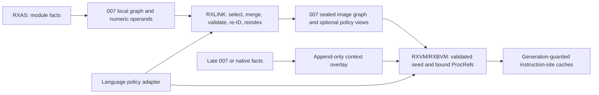

# RXBIN 007 semantic graph design

Status: T6 logical design retained; C3-style/R1 process-local views,
one-time VM callable/factory binding, generation-guarded site caches, and
transparent section compression pass the focused Release gate; graph-seed
compaction and late-overlay work remain

Date: 2026-07-16

Implementation review: the rejected milestone-1 code allocated and walked
relationships per query, duplicated four type fields on every VM value and
rescanned VM modules/procedures while resolving dynamic targets. The selected
first repair preserves the portable six-section seed but materializes dense
assignability/dispatch/factory/provider views and stable `RxGraphTypeRef`
descriptors inside `rxbin` after graph build or deserialization. Object values
now store one descriptor pointer. Isolated descriptor support/dispatch is
approximately control cost and `sizeof(value)` is 248 bytes. The VM now binds
every portable callable ID to `proc_runtime *` once per semantic generation,
materializes bound factory/provider rows, and owns generation-guarded
method/factory instruction-site caches. RXBIN 007 now compresses each complete
section when the measured stored form is smaller, while retaining the same
re-linkable six-section graph and canonical data. The graph seed is still
broader than the minimum runtime view. Measurements and repair options are in
`performance/NR-04A-RXBIN-007-IMPLEMENTATION-REVIEW.md`; the first repaired
evidence is in `performance/evidence/2026-07-16-nr-04a-c3-candidate/` and the
bound/cache gate is in
`performance/evidence/2026-07-16-nr-04a-bound-cache/`.

## 1. Decision and scope

RXBIN 007 is a deliberate format break. `rxas`, `rxlink`, `rxdas`, `rxvm`,
`rxbvm`, `rxc` binary imports, `rxseq`, packagers, tests, and other RXBIN
consumers move together. A 007 reader rejects 006, and there is no 006 fallback
or conversion path in the product. Repository and installed RXBIN artifacts
must be rebuilt.

The format adds a first-class semantic graph for fast type, member, callable,
factory, class, and interface traversal. The graph stores facts and indexes;
it does not define language rules for inheritance linearization, override
selection, default conflicts, visibility, assignability, or factory scoring.
Those decisions remain with the linker/VM language policy or a registered
language runtime.

The selected architecture is T6:

- an immutable, linker-built graph and optional resolved views for a packaged
  image;
- numeric graph operands and image-local identities on ordinary runtime paths;
- an append-only runtime overlay for late-loaded and native definitions;
- generation-guarded monomorphic/polymorphic instruction-site caches; and
- one query surface across the sealed seed and overlay.

Milestone 1 implemented the portable 007 container, sealed semantic graph,
link-time graph rebuild/re-ID, numeric graph operands, runtime type identities,
indexed relationship/member/factory queries, checked reader, and RXDAS graph
validation. The process-local resolved views, callable/factory binding and
sealed-image instruction-site caches are now implemented. The append-only
late-load overlay and compact portable policy-view/seed schemas remain T6
follow-on work; measurements in section 7 select their physical representation.

This design deliberately optimizes the whole lookup path. Minimizing the
number of changed components is not a selection objective.

## 2. Text-backed nodes, not text-only edges

Parameter and return types remain text-flexible, but runtime relationships do
not repeatedly compare that text.

Every distinct canonical type spelling has a type node. A node contains its
canonical UTF-8 text and a kind such as:

- built-in;
- class;
- interface;
- opaque/external; or
- language-defined type expression.

Signature parameter and return records refer to the type node by a dense
`RxGraphId`. Reference, optional, variadic, and similar parameter properties
remain flags on the parameter record rather than becoming separate type names.
The node makes the text recoverable for diagnostics, `typeof`, tooling, and a
language-policy callback while the ID makes traversal and comparison cheap.

Built-ins such as `.void`, `.object`, `.boolean`, `.int`, `.float`, `.decimal`,
`.string`, and `.binary` are ordinary preseeded type nodes with a built-in flag. They do
not require a separate runtime type path. A language runtime may seed
additional built-ins before graph finalization.

An unknown referenced type becomes an opaque node rather than a dangling text
reference. `rxlink` may merge that node with a class or interface declaration
of the same policy-canonical key. If it remains opaque, the graph still
preserves and indexes it; the active language policy decides whether that is
valid and what operations it permits.

IDs are never public or stable across files:

- RXAS assigns module-local dense IDs;
- RXLINK assigns new linked-image IDs and rewrites every graph and instruction
  reference;
- the VM may assign context/overlay IDs while binding a sealed image; and
- canonical text plus declaration origin is the portable identity.

Graph IDs and table indexes are fixed-width 32-bit values, with
`UINT32_MAX` reserved for `RX_GRAPH_NONE`. Section file offsets and byte sizes
are 64-bit. An image exceeding the graph-ID space is rejected rather than
silently widening the runtime hot representation.

## 3. RXBIN 007 container

RXBIN 007 replaces the native-layout 006 record stream with one fixed-width,
little-endian container. The same shape represents a standalone RXAS result
and a linked image; a standalone result simply has one module.

The header contains the magic/version, header size, feature flags, total file
size, section count, and section-directory offset. Each directory entry contains
a section kind, flags, alignment, file offset, stored byte size, and expanded
byte size. No serialized structure contains C `size_t`, native pointers,
compiler padding, or host-endian fields.

The initial section vocabulary is:

1. **module directory** — module names, descriptions, flags, globals, and
   ranges into module-owned instruction/procedure/exposure/metadata data;
2. **instructions** — packed canonical instruction streams with one range per
   module;
3. **constant data** — ordinary constants and procedure/exposure data;
4. **canonical metadata** — ordered metadata required by generic
   introspection, source/TRACE, RexxDoc, and tools;
5. **semantic graph** — normalized nodes, signatures, declared facts, portable
   procedure references, and graph-local text;
6. **semantic indexes** — materialized search, adjacency, dispatch, factory,
   and provider indexes.

Optional versioned policy views, such as resolved dispatch or assignability
tables, are a future extension. They are not a seventh base section and cannot
be emitted under the frozen six-section schema without a feature/schema change.

Source/TRACE and inline stripping operate on their canonical sections and do
not remove the semantic graph required by execution. RXAS and RXLINK apply the
same deterministic per-section LZSS storage transform after constructing the
complete 007 image; a section remains raw when compression is not smaller. The
reader expands compressed sections before materializing the checked in-memory
graph and native execution pool. Borrowed or zero-copy views require
measurement and a later implementation change; they are not claimed by the
current reader.

A linked image owns one semantic graph for all selected modules. It does not
repeat a per-module graph beside a shared pool. Module origin is retained on
declarations and portable procedure references so diagnostics and policy code
can recover provenance.

### 3.1 Frozen base container layout

All integers below are unsigned little-endian unless explicitly marked. File
offsets and byte sizes are `u64`; IDs and counts are `u32`; signed values are
two's-complement. Reserved fields and alignment padding must be zero when
written and are rejected when non-zero. Section starts are eight-byte aligned.

The 64-byte file header is:

| Offset | Width | Field | Required value |
|---:|---:|---|---|
| 0 | 8 | magic/version | ASCII `cReXx007` |
| 8 | 4 | header size | `64` |
| 12 | 4 | feature flags | only defined 007 bits |
| 16 | 8 | total file size | exact container byte count |
| 24 | 4 | section count | initially `6` |
| 28 | 4 | module count | at least `1` |
| 32 | 8 | section-directory offset | initially `64` |
| 40 | 24 | reserved | zero |

Defined file feature bits are:

- bit 0, `RXBIN007_FEATURE_FIXED_CALLS`: the instruction section may contain
  the fixed direct-bytecode call opcodes `CALL1` through `CALL4` (401-404).
  The writer derives this bit from the emitted instructions. A reader rejects
  one of those opcodes when the bit is absent and rejects every unknown feature
  bit, so the header is an enforced compatibility declaration rather than a
  hint. Zero-feature RXBIN 007 images remain valid and readable.
- bit 4, `RXBIN007_FEATURE_NATIVE_PROVIDERS`: the metadata section contains at
  least one `META_PROVIDER` record. The record relates a callable symbol to a
  stable RXPA provider ID and required/optional flags; its `META_FUNC` record
  remains the signature authority. A reader rejects provider metadata when the
  bit is absent.
- bit 5, `RXBIN007_FEATURE_INITIALIZERS`: the metadata section contains at
  least one `META_INITIALIZER` record. Each record contains typed references to
  its namespace-qualified symbol string and local procedure constant. The
  procedure must have a matching `.void`, zero-argument `META_FUNC` contract.
  Metadata order is initializer execution order. A reader rejects initializer
  metadata when the bit is absent and rejects an initializer record whose
  references do not have the required kinds.

Each 40-byte directory row contains `kind:u32`, `flags:u32`,
`alignment:u32`, `reserved:u32`, `file_offset:u64`, `stored_size:u64`, and
`expanded_size:u64`. Directory rows are sorted by kind and initially contain
exactly one each of `MODULES=1`, `INSTRUCTIONS=2`, `CONSTANTS=3`,
`METADATA=4`, `GRAPH_FACTS=5`, and `GRAPH_INDEXES=6`. A section may be empty
only where its schema permits it. Sections may not overlap the header,
directory, one another, or the end of file. A raw section has flags zero and
`stored_size == expanded_size`. A compressed section has
`RXBIN007_SECTION_LZSS`, `stored_size < expanded_size`, and contains the
bounded 4-KiB-window LZSS stream used by the shared RXBIN codec. Mixed raw and
compressed sections are canonical; the writer selects compression separately
for every section.

The module section begins `RXM7`, schema `1`, module count, and constant-pool
count, followed by one 88-byte record per module and then its UTF-8 name and
description bytes. A record contains, in order:

| Width | Field |
|---:|---|
| 8 | name offset within module section |
| 8 | name byte size including NUL |
| 8 | description offset within module section |
| 8 | description byte size including NUL |
| 8 | instruction offset within instruction section |
| 8 | packed instruction byte size |
| 8 | expanded `bin_code` word count |
| 4 | constant-pool index |
| 4 | module flags |
| 4 | signed globals count |
| 4 | procedure-head constant ID or `RX_GRAPH_NONE` |
| 4 | exposure-head constant ID or `RX_GRAPH_NONE` |
| 4 | metadata-head ID or `RX_GRAPH_NONE` |
| 8 | reserved zero |

The instruction section begins `RXQ7`, schema `1`, then the per-module ranges
named above. Instructions use the existing bounded variable-integer coding,
but constant-bearing operands contain pool-local constant IDs and graph-bearing
operands contain graph IDs. They never contain native byte offsets.

The constant and metadata sections begin `RXC7` and `RXD7` respectively,
followed by schema `1`, pool count, and record count. Each record has a 24-byte
envelope (`pool:u32`, `id:u32`, `kind:u32`, `flags:u32`, `payload_size:u64`),
a kind-specific payload, and zero padding to eight-byte alignment. IDs share
one namespace within a pool even though semantic metadata has its own section.
All links between pool records are IDs or `RX_GRAPH_NONE`. String-like payloads
carry byte and character counts followed by bytes without a native structure
or terminator; floating values carry IEEE-754 binary64 bits; procedure and
exposure payloads carry IDs, fixed-width counts/flags, instruction positions,
and sized UTF-8 names. Metadata begins with `prev:u32`, `next:u32`, and
`instruction_address:u64`, followed by fixed-width fields for its declared
kind; every string, procedure, register-description, constant, source-file, or
inline-payload reference is a pool-local ID.

Graph facts begin `RXG7`, graph schema `1`; materialized indexes begin `RXI7`,
index schema `1`. Facts own graph-local text, nodes, signatures, relationships,
declarations, callables, dispatch rows, and providers. Indexes own the sorted
hash directories, both adjacency directions, dispatch index, and provider
index. Both sections repeat their relevant counts and the reader requires exact
agreement before publishing a graph.

Existing library archives remain concatenations of complete standalone 007
containers. The reader accepts back-to-back containers and validates and owns
each independently. A linked image is different: it is one container with one
graph and one shared pool covering all selected modules.

### 3.2 Validation limits

The reader checks the declared extent before allocating a seekable file image
and checks counts and arithmetic before allocating derived tables. Compressed
sections must reduce size, may expand by at most the codec's 18-byte match
bound, consume their stored stream exactly, and reconstruct exactly their
declared expanded size. It rejects
overflow, identities outside the fixed-width space, required text over 16 MiB,
truncated/trailing records or sections, wrong record kinds, module ranges
outside their section, instruction ranges that do not consume exactly their
declared bytes/word count, and graph/index invariant failures. The frozen base
reader requires exactly six sections. A later schema may define at most 32,
with a lower configurable file/resource limit if measurement requires one.

Milestone fixtures cover one-module, concatenated archive, and linked
multi-module containers; exact base header/directory invariants; 006 rejection;
facts/index disagreement; wrong-kind metadata references; undersized declared
files; unknown compression flags, malformed compressed streams, inconsistent
stored/expanded sizes; and RXDAS graph diagnostic text. Additional fuzz/property coverage for
all out-of-range IDs, overlap/truncation combinations, and resource ceilings is
part of the post-milestone hardening queue. Hash load factor and optional
policy-view encoding remain measurement-selected details.

## 4. Semantic graph contents

The normalized graph has three layers.

### 4.1 Nodes and signatures

- **type nodes** hold canonical text, kind, flags, origin, and declaration
  payload;
- **member nodes** hold canonical method/factory selector identity and
  signature, independently of any one declaring contract;
- **callable nodes** hold canonical symbol/signature and a portable `ProcRef`;
- **provider records** associate an interface factory member with a class,
  factory callable, optional match callable, and declaration origin; and
- **signature records** hold a return type node and an ordered range of
  parameter records whose type references are also nodes.

A `MemberId` is the selector node ID, not merely a hash of its name. Its key
includes the canonical name and signature so the same selector can be shared
across declaring types and the representation admits future overloading without
changing the graph. Ownership, declaration kind, and origin live on declaration
facts. A `FactoryId` identifies an interface/factory-member bucket. A serialized
`ProcRef` is portable module/procedure identity; loader binding creates a
separate process-local pointer table.

### 4.2 Typed facts

The core relation vocabulary initially includes:

- class `implements` interface;
- class `inherits-class` class (representable, no current semantics selected);
- interface `extends-interface` interface (representable, no current semantics
  selected);
- type `declares-member` member;
- type `provides-member` member;
- member `implemented-by` callable; and
- class `provides-factory` interface factory member.

Edges retain declaration origin and ordinal. Exact identities are canonicalized
structurally; conflicting callable identities, duplicate serialized identities,
inconsistent relationship kinds, invalid provider/factory pairs, and class or
interface inheritance cycles are rejected. Language-level collision groups and
their resolution belong to a future policy adapter, never implicit
first/last-wins behavior.

### 4.3 Materialized indexes

A generic edge list is not the runtime fast path. Finalization materializes:

- canonical-key hash directories for dense type, member, and callable IDs;
- relation-specific outgoing and incoming compressed adjacency ranges;
- per-owner member ranges plus name/signature lookup;
- reverse interface-to-implementing-class ranges;
- interface/factory-to-provider buckets across classes;
- callable-symbol/signature-to-`ProcRef` ranges; and
- a direct dispatch index for facts already resolved by current cREXX metadata.

Outgoing and incoming indexes make both of these proportional to the answer,
not to the size of the image:

- "which interfaces does this class directly claim?"; and
- "which classes claim this interface?".

Member and provider indexes similarly support:

- declared/provided methods for a type;
- candidate implementations of a method for a class;
- whether a resolved policy view says a type supports a member; and
- every factory provider for an interface/factory across classes.

The distinction between a declared fact, a candidate set, and a policy-resolved
answer is explicit. The graph library never answers an ambiguous semantic
question by inventing a language rule.

## 5. Common binutils ownership

The shared implementation belongs in a compiled binutils library, not another
header-only serializer. Its repository-internal component boundary is:

- `binutils/include/rxbin.h` — declarative 007 container types and limits;
- `binutils/rxbin007.c` — checked section codec and validation, with
  `binutils/rxbin.c` retaining format-independent helpers;
- `binutils/include/rxgraph.h` — builder, immutable view, query, remap, and
  policy-adapter API; and
- `binutils/rxgraph.c` — graph construction, deduplication, indexes, merge, and
  checked read-only traversal.

The build exposes one `rxbin` library used by RXAS, RXLINK, RXVM,
RXBVM, RXDAS, RXSEQ, and the compiler binary importer. Existing shared helpers
such as signature parsing are compiled into this target rather than duplicated
across consumers. `platform` remains the OS-specific library; `rxbin` includes
the portable fixed-width integer definition but does not link `platform`.

The signature helper retains source parameter names for build-time tooling,
while contract comparison continues to use parameter types and flags. Argument
separators are commas at bracket depth zero; commas inside array dimensions,
such as `.string[2,3]`, are part of the type. Relative object spellings remain
valid selector identities. Tooling that needs a portable external type identity
must resolve them against the owning namespace and reject ambiguous matches;
`crexx-contract` performs that step in its private RXBIN adapter.

These headers and the `rxbin` archive are not an installed external SDK. The
supported external metadata surface is the deterministic
`crexx.operation-contract/1` artifact produced by `crexx-contract`; RXBIN graph
IDs, structs, and acquisition details remain private and may evolve behind that
adapter.

The policy-neutral query surface provides operations equivalent to:

- find type/member/callable identities by canonical key;
- obtain node text, kind, flags, signature, origin, and portable procedure
  reference;
- enumerate typed incoming/outgoing edges;
- enumerate members by owner/name/signature;
- enumerate implementing classes for an interface; and
- enumerate factory providers for an interface/factory.

A future optional `RxGraphPolicy` adapter can receive normalized facts,
canonicalize language-specific keys, compute closures, choose
member/default/override outcomes, and build a versioned resolved view. Core
RXBIN/RXGraph code owns structure and bounds safety only. A VM can then use the
cREXX adapter or hand the normalized view to another registered language
runtime.

## 6. Producer and consumer responsibilities

### RXAS

RXAS feeds the builder while processing semantic directives and signatures.
After normal backpatching it resolves local procedure references, finalizes and
validates the graph, and emits a one-module 007 container. Referenced external
types/members are represented by opaque nodes, so an RXAS module graph is
complete even before link selection.

Type-, member-, and factory-bearing instruction operands use module-local graph
IDs in 007. In particular, object stamping/type tests use a type node;
`srcmethodsel` uses a member node; and `srcfprocsel` uses a factory member node.
Human-readable RXAS and RXDAS syntax remains descriptor/text based.

### RXLINK

RXLINK reads only 007 inputs. Milestone 1 retains the proven metadata-driven
module-selection pass, then merges normalized graph facts by canonical identity,
preserves origin for diagnostics, assigns fresh image-local IDs, and rewrites
all graph-bearing instruction references.

Factory instruction remapping compares signature type spellings semantically,
not by raw source text. In particular, a source-short class type such as
`.lookup24` must resolve to the same declared factory member as its canonical
fully qualified spelling. When structurally equivalent buckets exist during
input normalization, operand resolution prefers the provider-backed bucket.
The real-image graph-operand audit reports providerless factory sites so linked
fixture tests can reject accidental orphan remaps without making providerless
buckets universally invalid for future late-binding scenarios.

It rebuilds every search and adjacency index for the selected image rather than
concatenating module indexes, validates the cREXX structural invariants, and
emits one sealed graph. The cREXX graph view admits only structurally
signature-eligible factory/match candidates; provider scoring and tie-break
policy remain in the VM. Moving link selection and further policy checks onto
the input graph is a measured follow-on optimization.

### RXVM and RXBVM

The loader validates section bounds, graph IDs, sorted/hash invariants, edge
ranges, typed pool references, and `ProcRef`s once, then materializes the sealed
graph's process-local type descriptors, transitive assignability bits, dense
numeric dispatch/factory views and direct provider ranges. Canonical metadata
remains available for generic introspection and compatibility fallbacks.

Object values carry one immutable `RxGraphTypeRef *`. The descriptor owns the
canonical name/length plus graph/ID identity, so exact identity is pointer
equality and support/dispatch reaches the precomputed graph view. VM-only
synthetic object types use static descriptors with no graph. Numeric
type/member/factory operands provide the sealed-image fast path.

The VM builds one dense callable-target array per materialized graph while
linking a semantic generation. That cold pass resolves portable callable IDs to
`proc_runtime *` and materializes bound provider rows containing factory and
optional `match` targets. Sealed-image method selection uses an inline
descriptor dispatch load followed by the dense bound-target load. Factory
selection reads the bound bucket directly and has a direct path for a single
provider with no user `match`.

Runtime modules own side tables only for instructions that use dynamic method
or factory selection. Method sites have a two-way type/target cache; factory
sites cache the bound bucket or direct target. Both carry the semantic
generation and clear on mismatch. Serialized bytecode remains immutable. Wider
small-polymorphic/megamorphic policies are future workload-driven refinements,
not prerequisites for the current direct sealed path.

The first sealed image may retain its dense IDs as the initial context-ID
range. A late image supplies a local-to-context remap; during its cold load the
VM resolves graph-bearing operands into a runtime instruction/operand image so
neither interpreter performs a remap on each execution. This keeps the
serialized image immutable and requires the 007 migration to give both `rxvm`
and `rxbvm` an appropriate runtime operand view.

### Late-loaded and native definitions

The T6 late-load design remaps late 007/native definitions into an append-only
overlay built by the same graph library. The current implementation preserves
the existing late/native compatibility path using canonical text when graph
identities do not share an image, then rebuilds complete process bindings and
increments the semantic generation after successful late linking. The
incremental overlay model below remains the next lifecycle implementation.

If a late declaration matches an existing opaque or declared canonical key,
its local node remaps to the existing context identity and new declaration
facts live in the overlay. The sealed node is not rewritten. Genuinely new keys
append context IDs.

An update is built and validated off to the side, then published coherently and
increments the semantic-universe generation once. Existing site caches fail the
generation check and refill. The first implementation may rebuild derived
closures/views for correctness; affected-row incremental rebuild is the
performance target. Removal, replacement, concurrent publication, and
generation wrap require explicit lifecycle rules before those capabilities are
enabled.

## 7. Measurements and implementation gates

T6 fixes the architecture, not every physical encoding. Short PoCs select the
fastest representation within it:

Milestone 1 was validated on 2026-07-16 with a complete Debug rebuild of all
generated RXBIN artifacts, focused graph/interface/runtime/wrapper coverage
(121/121), the complete RXLINK/RXDAS group (33/33), and all 1,846 Debug CTests.
A temporary-prefix install also proved that the installed `crexx -native`
surface finds `librxbin.a`, links a native executable, and runs it. These are
correctness and packaging gates, not performance results; no layout, cache, or
overlay choice is inferred from them.

The subsequent process-view/binding gate proves the sealed runtime target:
descriptor support/dispatch and direct factory/provider access are at
approximately control cost, final `SRCMETHODSEL` and `SRCFPROCSEL` attribution
is about 14 ns per instruction, and the focused final `rxvm` process is
70.54-76.05% faster than exact 006 evidence. Focused Debug coverage passes
82/82. The following section-compression slice reduces the retained interface
image from 126,972 to 37,458 bytes and retained RexxCPS from 869,908 to 273,858
bytes. Its same-cell interface and canonical RexxCPS Release results remain
within run noise of the bound/cache gate. Runtime performance and portable
size remain separate gates; compression closes the gross size defect while
compacting the graph seed remains optional follow-on work.

Size candidates should be iterated primarily through the separately buildable
`rxbin` library and `rxgraph_bench`: record serialized section bytes, retained
bytes/allocations, load/materialization time and the same control-cost hot
controls: sub-nanosecond descriptor support/dispatch/direct-target access and
approximately 1-ns bucket access. Each candidate must also assemble one real
RXAS image and link the fixed shared-image fixture, because canonical
constants/metadata and graph sections are codec/producer output rather than
graph heap.
Rebuilding the full compiler/VM is deferred until a candidate wins these
seconds-scale library/producer cells. The selected section compression changes
file/load cost without changing the materialized hot view; a compact graph seed
must prove that it reconstructs exactly that same view.

1. **007 codec/container:** file size, encode/link time, validation time,
   compression effect, aligned borrowability, and deterministic golden files.
2. **Graph layout:** construction time, retained/serialized bytes, positive and
   negative name lookup, incoming/outgoing traversal, member lookup, and
   provider enumeration for hash/adjacency alternatives.
3. **Resolved views:** bitset versus sorted/small-inline assignability and dense
   slots versus compact hashes for class/interface dispatch.
4. **Numeric operands and caches:** cold resolution plus monomorphic, bimorphic,
   small-polymorphic, and megamorphic sites in both VM modes.
5. **Late overlay:** update/publish cost, affected rows, invalidations, first
   post-load miss, and refilled steady state.
6. **End-to-end:** link/load-to-first-result, steady-state portfolio time,
   memory, image size, native/late-load behavior, tooling, and Debug/sanitizer
   correctness.

The comparator A/A-prime/C evidence remains useful, but none is a production
fallback for 006. Implementation proceeds in reversible measured slices; a
slower sub-encoding is replaced without reopening the T6 ownership model.

## 8. Deliberately unresolved language questions

RXBIN 007 can represent future class inheritance and interface inheritance,
but this design does not choose:

- single versus multiple class inheritance;
- interface inheritance rules;
- linearization or ancestor order;
- overriding, final/default, and conflict rules;
- visibility/access rules;
- structural versus nominal conformance; or
- new factory-provider selection semantics.

Those require separate language-design approval. The graph exposes the facts
and candidate sets needed to implement them quickly once selected.
