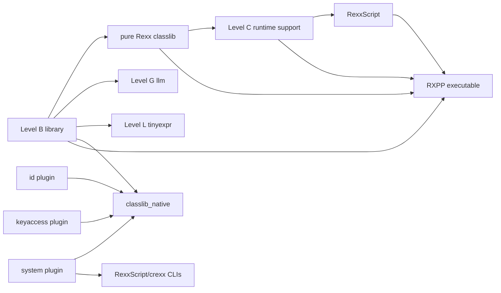

# Stage 5: Initial Quality Assessment

This is a first-pass code and evidence review, not a release certification. It
identifies where deeper testing, measurement, contract work, or re-engineering
is likely to be needed. No benchmark result is inferred from source shape and
no component receives a composite “quality score”.

## Assessment model

| Axis | Values used here |
|---|---|
| Test evidence | `T0` none found; `T1` build/single smoke; `T2` focused functional or opt/noopt; `T3` broad functional/cross-mode/cross-runtime; `T4` conformance plus coverage and repeatable performance baselines |
| Documentation | `D0` none found; `D1` source/readme; `D2` user or architecture guide; `D3` maintained contract/reference plus code-adjacent coverage control |
| Performance risk | `low`, `medium`, `high`, or `unknown`; this predicts the need to measure, not current speed |
| Confidence | `high` when source/build/test evidence agrees; `medium` for representative review; `low` for unbuilt/conditional components |
| Composition | source composition and runtime call path are stated separately where “pure Rexx” would otherwise hide a native dependency |

Risk increases for bootstrap-hot operations, repeated scans/copies, manual
memory or handle registries, blocking external I/O, mutable global state, broad
platform branches, and unmeasured duplicate implementations.

## Focused validation performed

A focused Debug CTest run selected representative Level B functions, classlib
collections, Level G providers, Level C runtime support, Level L tinyexpr,
RexxScript, RXPP/source-map/diagnostics, certified exits, decimal plugins, and
several default native plugins. It executed 115 tests; all 115 passed. Both
optimized and unoptimized modes were included where the suite provides them.

This result supports the evidence ratings below. It does not establish line or
branch coverage, cross-platform behavior, Level C standards compliance, hosted
service availability, or performance. The existing `rxfnsb/tests_performance`
programs are test assets but do not yet constitute a recorded Release 1
baseline.

A second non-overlapping toolchain-oriented selection executed 24 linker,
disassembler, `rxseq`, CREXXSAA-cache, and `crexx`-driver tests; all 24 passed.
The RXDB usage smoke was then run explicitly and passed. Across these selected
runs, **140 tests passed and zero failed**. This is still sampled functional
evidence rather than coverage or performance measurement.

## Dependency and blast-radius view

Consequences:

- Level B library regressions have the widest bytecode-library blast radius.
- Classlib changes affect Level C support, RexxScript, and RXPP packaging.
- `rxfnsc` is implemented in Level B but serves a separate Level C contract.
- `system` is nominally a plugin but its static target is a first-party CLI
  dependency; its quality requirements are higher than an ordinary example.
- `rxfnsg` is pure Rexx source but its useful call path is transitively hybrid
  through `rxhttp`, VM sockets, TLS, and hosted services.

## Language/compiler surfaces

| Surface | Composition | Tests | Docs | Performance risk | Initial assessment |
|---|---|---:|---:|---|---|
| typed Level B grammar and semantics | native compiler producing RXAS/bytecode | T3 | D3 | medium | Broad compiler/VM suites and references exist. This is the bootstrap contract, so even ordinary-looking syntax has high downstream quality importance. |
| Level G selector/surface | native compiler with one pure-Rexx library module | T2 | D2 | unknown | `options levelg` and the LLM library are proven; there is not yet a broad, independently differentiated G syntax/library conformance suite. |
| Level L selector/surface | native compiler with one pure-Rexx demonstration | T2 | D2 | unknown | `options levell` is real and tinyexpr proves the path, but the language-oriented library contract is still only a skeleton. |
| Classic/Level C parsing and DSLSH | dedicated native scanner/parser plus canonical lowering subset | T3 parser; T2 execution | D3 | high | Parser, diagnostics, highlighting, and fail-closed lowering have substantial evidence. Execution and BIF compliance remain much narrower than recognition. |
| RXPP syntax/tool | mixed package: Level B Rexx engine, C precomp plugin/launcher, macro Rexx files, optional parser shell | T3 | D3 | medium | Seven focused paths plus the 115-test validation give strong tooling evidence. Source transformation and provenance make correctness more important than raw throughput; large inputs still need baselines. |
| RXDB debugger | pure Level B Rexx debugger/UI, compiled and C-packed over the native VM library | T1 | D2 | high while tracing | The usage smoke passed, but no automated stepping/watch/module/trace test was found. Source self-identifies as a prototype and release notes call it experimental. Per-instruction metadata scans and terminal rendering make traced-program overhead intrinsically high and currently unmeasured. |

## Level B library assessment

All 129 selector families are covered by the rows below; public exports and
members inherit their source selector's assessment. Most files are pure Level B
Rexx source. The consolidated image is nevertheless a mixed implementation:
active RXAS, VM/system namespaces, inline assembler, and VM-backed socket/TLS
operations occur on selected paths.

| Selector family | Source / call-path composition | Tests | Docs | Performance risk | Code-review observations |
|---|---|---:|---:|---|---|
| scalar text functions excluding `regex` | pure Rexx; some import low-level system helpers | T3 | D2 | high as a bootstrap hot path | Broad opt/noopt functional coverage exists. Many functions perform repeated substring/length scans; they are prime later measurement targets because the compiler and libraries use them heavily. |
| pure-Rexx `regex` | pure Rexx with namespace-exposed match state | T2 | D2 | high | A sizeable backtracking/scanning engine repeatedly tries start positions and concatenates replacement output. Global exposed match state also constrains reentrancy. Functional tests pass, but adversarial complexity and Unicode semantics need dedicated tests/benchmarks. |
| numeric/date/time/random/format/mask functions | mostly pure Rexx; date/random/format paths use system/numeric primitives | T3 | D2 | medium | Strong functional breadth, but numeric-mode, date boundary, randomness, and formatting combinations are wider than named tests. Mask compilation/execution should be measured separately from scalar numeric BIFs. |
| binary/conversion/hash functions | pure Rexx using binary views and VM primitives | T3 | D2 | medium | Binary operators provide an efficient intended surface and focused tests exist. Conversion allocation and large-buffer behavior still need baselines. |
| typed array and stem helpers | pure Rexx using VM bulk array operations on key paths | T3 | D2 | medium | Preferred over the deprecated arrays plugin. Insert/delete/move have functional and compiler/VM coverage; sort and join have different complexity and should not inherit one performance claim. Diagnostic dump/format procedures are now example support. |
| file/output helpers | Rexx wrappers over VM/system file operations | T2 | D2 | medium; I/O-dominated | Character and file cases run serially where needed. Platform/error/large-file coverage is less visible than the ordinary success path. |
| `rxsocket` | pure Rexx API over VM native socket/TLS operations | T2 | D3 | medium; I/O-dominated | Loopback and selected TLS behavior are tested. Native protocol boundaries, timeouts, resource closure, and cross-platform failure paths are the main quality risks. |
| `rxhttp` | pure Rexx over `rxsocket` | T2 | D3 | high for large payloads | Clear object interface and focused helpers. Response/chunk accumulation uses repeated string concatenation and the client is connection-close oriented; correctness and memory behavior need large/chunked response tests. |
| word/quoted-word/parse/mask helpers | pure Rexx; `parse` uses compiler-exit-generated shapes | T2-T3 | D1-D2 | high | These are compiler/library-relevant scanners with repeated string walks and many subtle quoting/template cases. Test coverage is substantial for classic word functions but thinner across every `q*` helper and mask combination. |
| `rxjson` | pure Rexx using binary byte views | T2 | D3 | high for repeated lookup/building | The parser validates and locates values without a native dependency, and focused tests pass. Every query helper reparses the document; builders/unquoting repeatedly concatenate strings. The architecture guide already identifies a parsed/indexed handle as the next performance question. |
| runtime/control helpers (`_address`, signal, trace, load/value/symbol/version) | mixed call paths: Rexx, imported RXAS bridge, VM/runtime metadata | T2-T3 | D2-D3 | medium | ADDRESS/trace/signal are well integrated with focused compiler/VM tests. Internal-looking exports and the host protocol need contract curation; performance is secondary to correctness except where trace hooks affect hot paths. |

The library has 134 `.crexx` files but only 24 detected RexxDoc blocks. This is
not automatically a defect for one-function BIF files with external reference
pages, but it means source-level contract coverage is much weaker than classlib
and must be checked during re-engineering.

## Class library assessment

The main image is pure Level B Rexx. The three adapters in
`classlib_native.rxbin` are pure Rexx wrappers with native plugin call paths.
Classlib has a RexxDoc regression baseline and 329 detected RexxDoc blocks in
the top-level class sources,
which is materially stronger code-adjacent documentation evidence than the
other library families.

| Family | Composition | Tests | Docs | Performance risk | Initial assessment |
|---|---|---:|---:|---|---|
| interfaces, iterators, comparators, `Rexx` value presenter | pure Rexx classes/interfaces | T2-T3 | D3 | medium | Clean contract decomposition and maintained doc tags. Iterator snapshot/allocation behavior and comparison semantics should be measured in consumers. |
| array lists, linked lists, stacks | pure Rexx | T3 | D3 | medium | Dedicated opt/noopt functional suites pass. Array shifting and list/node allocation make workload shape important; there is no recorded comparative baseline in this catalogue. |
| hash maps/sets | pure Rexx using typed arrays and other classlib structures | T3 | D3 | medium-high | Dedicated mutation/iteration tests pass. Hash distribution, resize thresholds, key tracking, and allocation behavior need scale and adversarial-key benchmarks. |
| `StringTreeMap`, object tree maps, tree sets | pure Rexx AVL/parallel-array structures | T3 | D3 | high but already performance-aware | Source and docs show deliberate AVL/pool work and comparative tests. The reference notes that temporary variants were measured and removed. Release baselines and linked RXAS inspection are still needed for current compiler/runtime revisions. |
| `StringOldTreeMap` | pure Rexx legacy implementation | T1-T2 indirect | D2 | high | Source explicitly retains it only for comparative benchmarks. It should not inherit the production tree-map quality claim merely because it shares interfaces. |
| `Qfind` and `Scanlex` | pure Rexx search/lexer utilities | T2 | D1-D2 | high | Functional examples pass, but both are parser/search algorithms with broad input-shape risk and relatively limited public contract documentation. |
| `Id` adapter | Rexx wrapper + native `id` plugin | T2 registered | D2 | medium | Useful narrow adapter; quality depends on platform entropy/time/encoding behavior in seven native source units. |
| `KeyDB` adapter | Rexx wrapper + native `keyaccess` plugin | T2 registered | D2 | high | Transactions, cache, compaction, backup, and persistent-file integrity create a much larger contract than a smoke test demonstrates. |
| `Os` adapter | Rexx wrapper + narrow native `rxfs`/`rxplatform` providers | T3 focused provider/adapter and package coverage | D2-D3 | medium | Platform/privacy/error behavior remains cross-platform work, but the broad `system` transitive dependency and unrelated UI/global/developer entries are gone. |

## G, C, L, vector, and RexxScript libraries

| Component | Composition | Tests | Docs | Performance risk | Initial assessment |
|---|---|---:|---:|---|---|
| Level G LLM module | pure Level G Rexx source; transitive hybrid network/TLS path | T2 | D2 | medium; network-dominated | Provider and Ollama tests passed, and the shared interface reduces duplication. It is one integration-oriented domain, not evidence of a complete general-purpose G library. Error, streaming, rate-limit, credential, and provider-drift coverage remain material. |
| `rxfnsc` value/stem/pool/BIF support | pure Level B Rexx compiled with Classic numeric semantics; implements separate Level C runtime contracts | T2 | D2 | high | `RexxValue` caches multiple representations and the pool/stem code composes classlib collections. Focused opt/noopt tests pass, but only a narrow BIF subset executes and value/pool operations will sit on most Level C hot paths. |
| RexxScript runtime and CLI | pure Level B Rexx engine; CLI is native-packaged and statically uses system integration | T3 for implemented subset | D2 | high | Runtime, compatibility facade, direct/linked and CLI tests pass. The evaluator manually tokenises and scans strings/arrays; it is intentionally a separate interpreter surface and must not be reported as Level C conformance. |
| Level L tinyexpr | pure Level L Rexx using packed binary tokens and binary views | T3 for its narrow contract | D1-D2 | low-medium | Focused parser/evaluator and binary-surface tests pass. The implementation makes purposeful use of language-oriented binary features, but covers only a tiny expression grammar. |
| `veclib` | pure Level B Rexx | T0-T1 | D0-D1 | unknown | It builds outside the installed image and exposes internal-looking `__*` routines. No dedicated test or user contract was found in this pass. |

## Primary toolchain, runtime, host, and profiling components

| Component family | Composition | Tests | Docs | Perf risk | Initial assessment |
|---|---|---:|---:|---|---|
| `rxc` | native compiler with generated scanners/parsers and Level B exit bytecode | T3 | D3 | high | Broad syntax, diagnostics, optimisation, and cross-stage coverage exists. Compile-time and generated-code performance need separate baselines; Level C maturity is tracked independently from the mature typed path. |
| `rxas`, `rxlink`, `rxdas`, `rxcpack` | pure native toolchain stages | T2-T3 | D3 for assembler/linker/VM image contracts | medium-high | Core binary-format chain has broad regression evidence, including disassembly round trips and link tests. Robust malformed-input, large-image, and throughput baselines remain release-quality questions. |
| `crexx` driver | pure Level B source, C-packed and hybrid through narrow `rxfs` plus native tool invocation | T3 focused lifecycle/install/native-package evidence | D2-D3 | medium | Provider requirements are read from linked metadata and the driver directly imports only `rxfs`; quoting, path, failure propagation, and cross-platform tests remain important. |
| product `rxvm`, concrete `rxbvm`/`rxtvm`, packed `rxvme`/`rxbvme` | pure native VM cores; packed variants include Level B bytecode | T3 | D3 | high | Extensive product-path tests plus explicit contracts for both dispatch forms provide strong functional evidence. Dispatch, allocation, strings, calls, decimal, sockets, profiling hooks, and library packing all require measured release baselines. |
| compiler-selected `rxvml`, switch `rxbvml` | pure native embeddable runtime libraries | T3 through VM and native packaging | D3 | high | Same core risks as executables plus public host ownership/error contracts. Static delivery is intentionally part of native packaging. |
| CREXXSAA library and CLI | pure native host API and cache tool | T2-T3 | D2-D3 | medium-high | Cache-focused selected tests passed; host API has substantial regression evidence. Concurrency, lifecycle, ABI compatibility, and failure recovery are higher-value than micro-optimising the CLI. |
| RXPA and `rxpashim` | native ABI/build infrastructure | T2-T3 indirect | D2 | high | Every retained plugin depends on registration, lookup, and linking behavior. ABI/versioning, duplicate names, ownership conventions, and static/dynamic parity need explicit change control. |
| VM profiling and `rxseq` | compile-time-gated native instrumentation plus offline analyser | T2 | D2-D3 | high when enabled; designed near-zero when off | Instrumentation-contract and file-format tests exist, and selected `rxseq` tests passed. Release acceptance needs proof that disabled hooks remain negligible and that enabled measurement overhead is characterised. |
| instrumented VM test executables | generated native test variants | T2 | D2 | not a product path | Useful contract harnesses, but they are testing artifacts rather than user runtimes and should not inherit ordinary VM delivery status. |

## Native package assessment

Each package row covers all of its `RXPA-` leaves. “Mixed package” means native
provider plus Rexx/RXPP adapters or tests; the callable implementation itself is
native.

| Package | Composition | Tests | Docs | Perf risk | Initial quality observation | Confidence |
|---|---|---:|---:|---|---|---|
| arrays | mixed, C callable path | T2; passed focused run | D2 replacement guidance | high | Explicitly deprecated; duplicates preferred VM-backed array BIFs and includes several whole-array algorithms. | high |
| cipher | mixed, C MD5 | T2 registered | D0 | medium | Narrow implementation and smoke surface; MD5 is a legacy digest, not a general modern cryptography package. No independent vector/conformance evidence was found. | medium |
| console | mixed, platform C | T1 conditional | D1 | high | Large platform-specific surface; duplicate `setcolor` registration and terminal-state side effects need platform tests. | medium |
| fileio | mixed, platform C | T1 Windows | D1 | medium | Duplicates typed/VM file operations; narrow success smoke does not cover permissions, large files, and platform errors. | low-medium |
| fpool | incomplete local package | T0 | D0 | unknown | Local CMake names `fpool.c` and a test, but Stage 2 found neither C nor Rexx source and the root does not select it. | high |
| getpi | mixed, C callable path | T2; passed focused run | D0 | high | Demonstrator code performs fixed 10-million or 1-million iteration calculations and otherwise returns `3.14`; inappropriate as a general numeric contract. | high |
| gui | mixed, C/GTK | T1 conditional | D1 | high | Very broad stateful widget/process/file surface behind one plugin; requires GTK/platform lifecycle and error-path testing. | medium |
| float | pure native scalar libm provider | T3; full 37-procedure contract, compatibility, dual-VM opt/no-opt, concurrency, sanitizer, install/native package and accepted performance verdict | D3 | low-to-medium by function/platform | Coherent binary-float family; canonical `rxfloat` and direct scalar `rxmath` compatibility names share implementations. | high |
| stats | pure native compensated reductions | T3; success/error/offset, dual-VM opt/no-opt, concurrency, sanitizer, install/native package and accepted performance verdict | D3 | transitional boxed call path; packed replacement pending | Stable semantic oracle for five statistics procedures; the boxed `.float[]` boundary is explicitly not the final bulk contract. | high |
| hash | pure native SHA-256 plus named 32-bit hashes/checksum | T3; vectors, dual-VM concurrency, native and scratch-package tests | D3 | low; SHA-256 production path measured against the accepted native control | Binary-safe declarative dynamic/static delivery. Incremental/file streaming remains a separate contract. | high |
| id | pure native six-algorithm provider | T3 focused contract, dual-VM, concurrency and package evidence | D2-D3 | medium | Canonical public names and platform CSPRNG use repair the draft adapter; cross-platform entropy/clock qualification remains RCC-8 work. | medium-high |
| fs | pure native filesystem provider | T3 focused contract, dual-VM, concurrency and package evidence | D3 | I/O-dominated | Narrow provider replaces the driver's broad `system` dependency; permissions, long paths and platform filesystems remain RCC-8 work. | high |
| platform | pure native host/timing provider | T3 focused contract, dual-VM, concurrency and package evidence | D3 | low runtime; portability/privacy contract risk | Narrow five-leaf provider; UI, global and developer functions are deliberately absent. | high |
| keyaccess | mixed, C persistence engine | T2 registered | D1-D2 | high | Manual files, cache, transactions, backup, compaction, and heap ownership make integrity/fault-injection tests essential. | high |
| llist | mixed, C handle registry | T2 registered | D1 | high | Manual nodes, navigation state, pointer registry, and explicit cleanup expand leak/use-after-free risk; overlaps pure-Rexx collections. | high |
| map | mixed, sizeable C arena/hash implementation | T2; passed focused run | D1 | high | More developed than a trivial demo, with reserve/compact/stats operations, but manual arenas, cloning, flags, and handle lifetime need stress/fuzz evidence. | high |
| matrix | mixed, C numeric package | T1 Windows | D1 | high | Broad linear-algebra/statistics/plot contract with only a platform smoke; numerical tolerances, singular cases, and ownership need focused suites. | medium |
| odbc | mixed, C plus ODBC manager | T1 conditional | D1 | high | Broad connection, prepared statement, transaction, metadata, and batch surface; database matrix and lifetime/error tests are not visible in default CI. | medium |
| pick | mixed, C/GTK | T1 local, unselected | D1 | high | UI-dialog subset overlaps `gui`; normal builds do not register it, so drift risk is high. | low-medium |
| pipe | mixed, native process/pipe | T1 local, unselected | D0 | high | Stateful process I/O and cancellation require race, timeout, partial-read, and cross-platform tests. | low |
| process | mixed, native process manager | T1 local, unselected | D1 | high | Large asynchronous process contract, registry and I/O state; root selection is commented and platform behavior is not proven here. | medium |
| recv390 | mixed, native format reader | T2 registered | D0 | high | Large legacy-format parser uses fixed buffers/string formatting; needs corpus, malformed-input, and bounds testing. | high |
| regex | mixed, C plus external regex library | T1 local, unselected | D1 | high | Separate semantics and dependency from pure-Rexx `regex`; normal builds do not prove it and contract equivalence is undefined. | medium |
| rxml | mixed, native XML | T1 Windows | D1 | high | Parser/builder and mutable attribute surface need malformed-input, encoding, escaping, and lifetime tests. | medium |
| rxtcp | mixed, native sockets | T2 registered | D0 | high | Manual allocation/reallocation and legacy TCP contract duplicate the VM-backed socket direction; loopback smoke is insufficient for error/concurrency behavior. | high |
| socket | mixed, native OpenSSL sockets | T2 local, opt-in | D2 deprecation guidance | high | Root marks it deprecated in favor of VM sockets/`rxsocket`; TLS/native lifetime and dependency maintenance remain costly. | high |
| stack | mixed, native mutable list | T2 registered | D1 | high | Global/handle-like mutable collection duplicates typed arrays and classlib stacks; lifecycle and concurrency semantics need stress coverage. | high |
| strings | mixed, native C strings | T2; passed focused run | D1 | high | Extensive use of mutable `strtok`, repeated `strlen`, byte strings, and concatenation creates reentrancy, mutation, Unicode, and bounds concerns. | high |
| testrx | source residue only | T0 | D1 | unknown | No CMake or callable source; not an assessable runtime package. | high |
| treemap | mixed, large native tree/stem registry | T2 registered | D1 | high | Manual registries, allocation, iterators, and two data structures overlap the pure-Rexx classlib. Stress, leak, and invalid-handle evidence is needed. | high |

### RXPP engine, native primitives, and shipped macro libraries

| Component | Composition | Tests | Docs | Perf risk | Initial assessment |
|---|---|---:|---:|---|---|
| RXPP engine | hybrid: Level B Rexx transformation logic plus native `precomp`, VM, classlib, Level C support, and RexxScript images | T3 | D3 | medium-high | Strong source-map/diagnostic/tool-path evidence. The engine is scan-and-rewrite oriented with mutable exposed arrays and recursive expansion; nested macros and large files need scale and fixed-point limits. |
| `precomp` | pure native implementation, internal RXPA surface of 20 primitives | T2-T3 through RXPP | D3 architecture | high | Quote/nesting-aware scans and splice/token operations are correctness- and performance-critical. The interface is documented as an RXPP compatibility boundary, but its leaves are not general user BIFs. |
| `maclib` | pure RXPP macro definitions that generate Rexx | T1 sample | D2 | expansion low; generated-code risk varies | Only `SQUARE` is exercised by the focused smoke. `startswith(suffix,string)` refers to undefined `prefix`, proving at least one broken shipped definition. Multi-statement and control macros also need expansion and compiled-runtime fixtures. |
| `macsys` | pure RXPP macros; some emit inline RXAS or system calls | T0-T1 indirect | D1-D2 | medium-high | No leaf-by-leaf suite was found. `execio` accepts `DISKX` but tests undefined `mode`, and `clear`'s comment names a different calling spelling. Inline-assembler macros require the bootstrap-level review standard, not ordinary convenience-macro confidence. |
| `mathlib` | pure typed Rexx procedures included into generated source | T0 | D1 | low-medium | Source review finds semantic defects under default `numeric_common`: `lcm` uses remainder where division is required, `isPrime` bounds its loop by `n % 2`, and `modinv` uses remainder for the quotient. It is not release-quality as a standard math library. |
| `syslib` | empty Rexx placeholder | T0 | D0 | unknown | Installed despite containing no procedures or macros; there is no functional contract to assess. |
| `rxppt.crexx` | pure Level B Rexx residual workbench | T0 | D1 | unknown | Not selected by CMake and contains machine-specific development paths. It is implementation history, not the maintained preprocessor. |

### VM decimal plugins

| Package | Composition | Tests | Docs | Perf risk | Initial assessment |
|---|---|---:|---:|---|---|
| `mc_decimal` | pure native package using decNumber; static/manual/dynamic forms | T3; full suite passed | D2 runtime docs | high because every decimal operation can be hot | Strongest native-plugin evidence in this pass and the normal VM implementation. Repeatable arithmetic performance and standards/vector coverage should be part of the Release 1 baseline. |
| `db_decimal` | pure native alternative; dynamic/manual forms | T2; focused/archive evidence | D1-D2 | high | Useful alternative/packaging proof, but not shown equivalent to `mc_decimal` across the full contract. |

### Native DES source

`PKG-RXFNSB-NATIVE-DES` is pure native, unselected by the parent library, has a
small local test surface, and implements a legacy cipher. It is assessed `T1`,
`D0-D1`, high security/product risk, and high confidence that it is not part of
the active Level B library image.

## Compiler-exit assessment

All exits are pure Level B Rexx. Fifteen compile into the default mixed-purpose
bytecode bundle; `pprint` builds independently as an optimized example.

| Exit family | Tests | Docs | Perf risk | Initial assessment |
|---|---:|---:|---|---|
| `address`, `parse`, `signal`, `trace` | T3 | D3 through language/runtime references | medium | Certified language exits have the deepest focused evidence, including numerous signal/trace cases and opt/noopt execution. They are quality-critical compiler infrastructure. |
| RexxScript exit | T3 | D2 | medium-high | Multiple runtime paths are tested; it inherits the separate evaluator's parsing/performance limits. |
| `dump`, `query` | T2 | D0-D1 | low-medium | Useful compiler/introspection utilities with focused execution tests; public contract documentation is thin. |
| standalone `pprint` example | optimized golden smoke | local example README | low | Demonstrates a compiler exit plus companion runtime module; it is not in the default exit bundle or a supported language contract. |
| `sort`, `sortx`, `substr`, `add` | T2 | D0-D1 | medium | Each has opt/noopt runtime evidence but duplicates library capabilities and has no established reason to share one release role. |
| `execio`, `fsay`, `msay` | T2 | D1 for message exits | medium; I/O-dominated | Focused execution evidence exists; host/file semantics and portability need explicit contracts. |
| `dummy` | T2 | D0 | low | Adequate as an exit mechanism demonstration, not as a product feature. |
| token/plan infrastructure | T2 indirect | D1 source | medium | Required by the bundle and test-support build; internal contract rather than user library. |

## Residual sources, examples, demos, and PoCs

| Family | Composition | Evidence | Assessment |
|---|---|---|---|
| old `lib/rxmath` | mixed repository source: Rexx, native, RXAS | T0; D0-D1 | No active build boundary, so correctness/performance cannot be inferred. Some routines may be useful reference material; the tree as a package is low-confidence. |
| residual `rxfnsb/rxas` | pure RXAS | T0 for residual files; active bridge/elapsed tested indirectly | Deprecated spellings and inactive alternatives should not be benchmarked or “improved” until disposition is decided. |
| demos/examples | mainly pure Rexx/RXPP; one RXAS demo | T0-T1 as product contracts | Appropriate learning/integration evidence, but successful compilation is not a compatibility or quality promise. Dependencies and expected output should be documented if retained. |
| Level C PoCs | native/compiler experimental source | T0-T1 | Architecture evidence only; not part of the supported parser/runtime contract. |

## Use of cREXX language features

| Family | Observed feature use | Assessment |
|---|---|---|
| Level B library | typed procedures, namespace exposure, typed arrays, `arg expose`, binary views, inline/imported RXAS, compiler exits | Broad use of the bootstrap language. Some older modules expose implementation state or retain generated/preprocessor-shaped code, so idiom quality is uneven. |
| classlib | classes, interfaces, factories, typed attributes, iterators, object arrays, RexxDoc tags, inline preservation | Best sustained exercise of the typed object model and source documentation. It is a major compiler/VM quality workload. |
| Level G | `options levelg`, interfaces/classes/factories over Level B JSON/HTTP | Proves derived-level compilation but currently differentiates itself mainly by library purpose, not a broad G-specific syntax set. |
| Level C support | Level B classes with `numeric_classic`, cached multi-representation values, stems/pools, dispatcher | Correctly separates implementation language from Classic contract; incomplete BIF dispatch is explicit. |
| Level L | `options levell`, packed binary token records, direct binary reads/writes, precedence parser | Strong small demonstration of language-engineering primitives; breadth is intentionally narrow. |
| RexxScript | Level B classes, arrays, string parsing, Level C value/pool support | Shows substantial self-hosted interpreter capability, but manual parsing makes correctness and performance scale with source complexity. |
| RXPA packages | native C registrations plus generated/precompiled Rexx adapters/tests | Good architecture exercise; package conventions, ownership, Unicode/byte semantics, and lifecycle quality vary widely. |
| RXPP and macro libraries | recursive macro rewriting, source maps, `##USE`, generated typed Rexx, and selected inline RXAS | RXPP itself is a substantial bootstrap-language workload, but the shipped convenience libraries have much lower test and contract quality than the engine. |

## Initial high-priority quality/performance questions

These are review findings for later work, not implementation instructions in
this catalogue task:

1. establish a repeatable Level B bootstrap workload and measure scalar text,
   word/parse, arrays, classlib maps, JSON, and linked call paths;
2. define per-contract Unicode versus byte semantics before comparing native
   strings/regex with the typed library;
3. add scale/adversarial tests for pure-Rexx regex, JSON repeated lookup,
   hash/tree collections, and RexxScript/Level C value-pool paths;
4. separate network/I/O latency from CPU/allocation benchmarks for HTTP,
   sockets, system, and persistence components;
5. run sanitizer/fault-injection/concurrency review on retained native handle,
   persistence, process, and collection packages;
6. turn existing classlib comparison work and `rxfnsb/tests_performance` assets
   into recorded cross-platform Release 1 baselines;
7. do not optimize residual or duplicate implementations until Stage 6 product
   disposition is approved.
