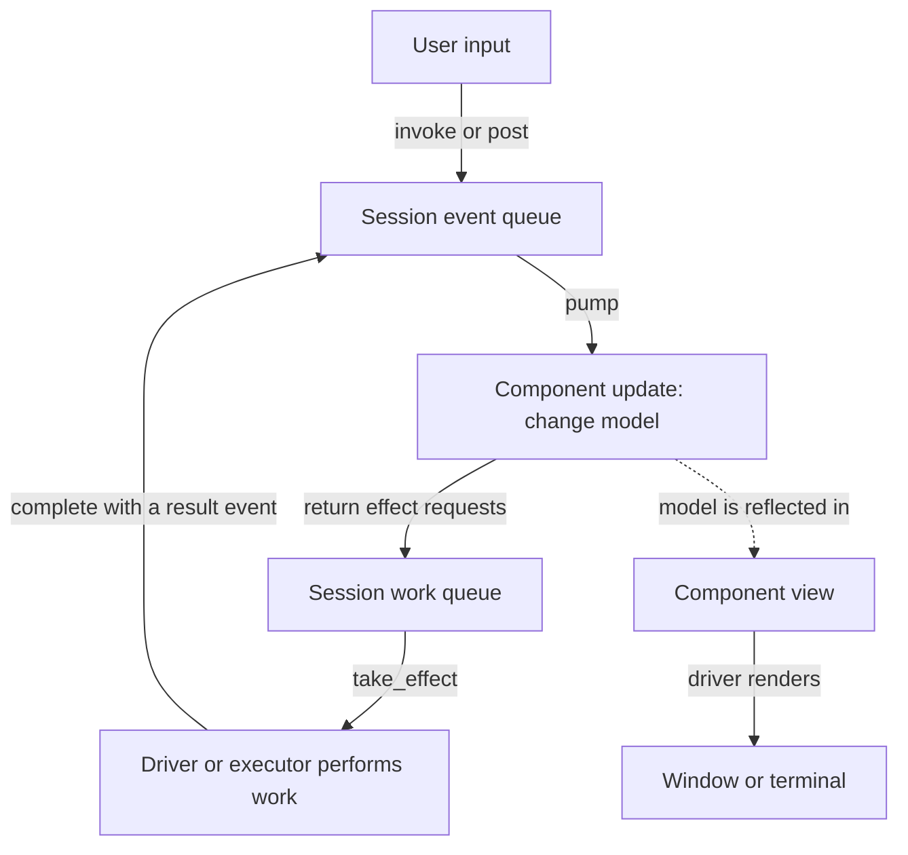

# Understanding the cREXX UI framework and contract v0

The cREXX UI framework lets you write an application's behaviour in Level G and
present it through different user interfaces. You describe the information to
show, the actions a user can take, and how those actions change application
state. A **driver** connects those descriptions to a particular interface, such
as a terminal or a GTK window.

The working example is Text Inspector: the same feature opens a text file,
counts its contents and displays the results through three drivers—line-oriented
terminal, ANSI full-screen terminal and GTK. This is an experimental framework
with a small reference implementation. Browser and mobile requirements inform
the design, but those drivers do not exist yet. The current views support a
small set of controls; the framework is not yet a complete widget toolkit.

The **contract** is the agreement that lets application code and drivers work
together. It defines the messages they exchange, who handles each message, how
requested work returns a result, and how a session ends. Much of that agreement
is enforced by the library itself.

This guide starts with the application writer's view of the system, then
explains how to implement components and drivers. The detailed message and
queue rules follow those explanations.

- [Understand the parts and follow one interaction](#how-the-parts-work-together).
- [Write an application using an existing driver](#writing-an-application).
- [Implement a component and its view](#writing-a-component).
- [Implement a driver or an executor](#writing-a-driver-or-executor).
- [Look up message, payload and queue rules](#contract-reference).
- [Find the source files and validation commands](#source-map-and-validation).

## How the parts work together

A **component** represents a cohesive application feature. Text Inspector has
one component responsible for the selected file, its counts and its status
message. A larger application might have a document component and a separate
debugger component. A component is usually larger than an individual button.

Each component keeps three things together:

- Its **model** is the state it remembers: for example, the displayed filename,
  counts and whether it is waiting for confirmation.
- Its **update(event)** method handles something that has happened or been
  requested. It changes the model and returns any requests for external work.
- Its **view()** method describes what should be displayed from the current
  model: labels, buttons and their placement.

An **event** is a message delivered to `update()`. It can express user intent,
such as “Open was requested”, or report a result, such as “the file was read”.
An **effect** is a request returned by `update()` for work outside the component,
such as showing a file chooser or reading a file. The result of that work
arrives as another event. This lets the component express its workflow without
depending on a particular file dialog, terminal API or event loop.

A **session** brings the components together for one running instance of the
application. It keeps their state and pending messages until that run ends.
The driver advances the session as input and results become available.

The surrounding framework divides the remaining responsibilities as follows:

| Part | Responsibility | Text Inspector example |
| --- | --- | --- |
| Application composition | Creates the session and registers its components, message definitions and commands. | Connects the `root` component to Open, Clear and Quit. |
| Session (`uisession`) | Owns the registered component values, checks and queues messages, calls one update at a time, and tracks requested work. | Routes Open to `root` and matches a file-read result to its request. |
| Driver (`uidriver`) | Runs the user interface: input, rendering, event loop and cleanup. | Turns a GTK button click or terminal shortcut into the same Open command. |
| Executor | Performs a particular external operation and reports its outcome. | Shows the chooser or reads the selected resource. |

“Executor” names a responsibility; there is no required executor base class.
A driver can perform an operation itself or delegate it to a helper. The three
reference drivers share `uilocal_resources` for file grants and text reading.
Here, **host** means the driver together with the platform services it uses.

The flow through these parts is:



The driver decides when to process the queues and when to ask for a view. The
session does not create an operating-system event loop, and changing the model
does not paint the screen by itself.

### Follow one interaction: Open a file

Consider what happens when the user chooses Open in Text Inspector:

1. **The driver recognises the action.** A button and a keyboard shortcut both
   identify the command `document.open`. A command is a named user action that
   different controls can invoke.
2. **The session resolves the command.** Its registration says that
   `document.open` sends `document.open.requested` to component `root`. The
   session checks that the command is enabled and queues the event. The
   component has not been called yet.
3. **The component requests a chooser.** When the driver calls `pump()`, the
   session delivers the event to the component's `update()`. The component sets
   its status to “Choose a text file” and returns a `ui.resource.choose` effect.
4. **The driver shows the chooser.** It takes the effect from the session and
   retains the request while the user chooses. The component does not need to
   know whether this is a native dialog, a full-screen selector or a line prompt.
5. **The choice returns to the component.** The driver reports
   `ui.resource.selected` through `complete()`. The session checks which request
   it answers, then queues the result for the same component. On the next
   update, the component requests `io.text.read` for the selected resource.
6. **The executor reads the file.** It returns `io.text.read.completed` through
   the same completion route. The component receives the text records and
   calculates the counts. Counting policy belongs to this application feature.
7. **The driver displays the result.** It asks the session for the component's
   current view and renders the new filename, counts and status.

If the user cancels the chooser, the component receives `ui.effect.cancelled`.
If reading fails, it receives `ui.effect.failed` with a code and message.
These are outcomes the application can handle; they are not disguised as an
empty filename or a successful read of no records.

The chooser result contains a **resource grant**: a token the provider recognises
as permission to access the selected resource. The component passes that token
to the read effect. It can display the resource's name, but the executor uses
its own grant registry to find the file. Display text is never treated as
permission to open a path.

## Writing an application

Start from [Text Inspector's authored source](../../../examples/ui/text-inspector/text_inspector.rxpp)
and its [build and run instructions](../../../examples/ui/text-inspector/README.md).
It shows the complete application, including the model, handlers, view and
session factory. You can use an existing driver without writing its event loop
or native callbacks.

### Assemble the application

The application writer supplies the feature components and a **composition
function**. Composition means the setup code that connects those parts; in the
example it is `make_text_inspector_session(id, caps)`.

That function creates a session using the supplied lifetime identity and host
capabilities. It adds the feature under the target name `root`, registers the
application's event definitions, registers its commands, and returns the
configured session. Check the registration results: duplicate names, unknown
targets and invalid definitions are setup errors.

The launcher selects a driver, obtains its `capabilities()`, calls the session
factory and passes the session to `driver.run(session)`. In the example,
`UI_LAUNCHER` generates that small amount of setup code. The line, ANSI and GTK
launchers use the same application factory.

### Connect controls to application actions

There are several kinds of identity in this small example. Keeping them
distinct helps when reading the source or adding another control:

| Example identity | What it identifies |
| --- | --- |
| `root` | The component that receives the message and owns the feature state. |
| `open` | A node in the logical view: the Open button. |
| `document.open` | The command invoked by that button or a shortcut. |
| `document.open.requested` | The event delivered to the component when the command is invoked. |
| `ui.resource.choose` | The external operation the component requests in response. |

Command registration records the command ID, label, target component, intent
event, shortcut hint and enabled state. A view button carries the command ID.
The session resolves it centrally, so every invocation of a disabled command
is rejected, whichever control initiated it. The command registry can also
support menus in a future driver; the reference views currently expose buttons
and shortcuts.

Commands in v0 send events with an empty payload: Open takes no parameters at
this stage. To send a value, such as edited text or an item selection, the host
constructs an event with named payload fields and calls `post(event)`. That
event needs a registered definition describing the allowed fields and types.
The **payload** is simply the data carried by that event.

### Choose behaviour that the host can support

A **capability** declares a service supplied by a host, such as `ui.dialog` or
`io.text.read`. Use the selected driver's advertised capabilities when composing
the application. For example, Text Inspector passes `caps.has("ui.dialog")` to
its component: Clear asks for confirmation when the service is available and
clears immediately otherwise.

For optional services, choose a fallback or make the action unavailable. A
required service can instead be checked during setup. If a component requests
an effect whose capability is absent, the session generates a correlated
`ui.effect.failed` event with code `unsupported_capability`.

Capability names are only part of the support picture. All three reference
choosers implement single-file Open; they do not implement Save or multiple
selection. A host must report an unsupported operation or purpose explicitly.
The [standard catalogue](catalogue.json) includes many more operations than
these drivers currently provide.

### Decide how the application closes

`ui.close.requested` gives the application a chance to decide what to do. The
component may decline, request confirmation, or save before closing. Text
Inspector is read-only and accepts by returning the effect `ui.close`.

The driver then ends the user interface and reports `ui.closed`. This final
event tells the component that closure has happened. The later call to
`session.close()` releases the session's internal ownership; it is a separate
teardown operation and does not ask the application for permission.

## Writing a component

Implement `uicomponent` with `update(.uimessage)` returning `.uieffects` and
`view()` returning `.uiview`. Keep related state and transitions together in
the component. For Text Inspector, Open, read results, Clear confirmation and
the displayed counts are one workflow, so they belong to one feature class.

### Update the model and request work

`update()` receives one validated event for this component. It can inspect the
event name and payload, change its model and return zero, one or several effects.
Always return an `uieffects` collection, including an empty collection when no
external work is needed.

Keep file access, dialogs and other platform operations outside both `update()`
and `view()`. Returning effects makes that work visible to the host and lets a
test inspect what the component requested without opening a window or a file.

This fragment from Text Inspector handles Open inside `update()`; the complete
method also creates `result = .uieffects()` and returns it after handling the
event:

```rexx
if name = "document.open.requested" then do
  _status = "Choose a text file"
  request = .uipayload()
  call request.put_text("title", "Open a text file")
  call request.put_text("purpose", "open")
  call result.add(.uimessage("ui.resource.choose", request, event.target(), "effect"))
end
```

This code describes the chooser's purpose and title. Returning the request lets
`update()` finish before the driver opens it. When the chooser completes, another
call to `update()` handles its result. Keep any state needed between those calls
in the model; the example uses `_confirming` to remember a pending Clear dialog.

Construct effect requests with the component's target and leave request ID,
session ID and sequence at their defaults. The session assigns those fields
when it accepts the returned collection. A component's effects must target that
same component, so their outcomes return to the feature that requested them.

### Describe the view from the model

`view()` returns a description of the current presentation. It contains values
such as text, node IDs, command IDs and logical placement. It does not contain
live GTK widgets, terminal handles or callbacks. The driver may use successive
descriptions to update an existing display or rebuild it.

The current `uiview_impl` is a flat logical grid. Its node kinds are `label`,
`line`, `button` and `input`; the editable `input` is used by ANSI dialogs and
is not supported by every driver. Placement uses `root` to start the layout,
then `below` or `right` relative to an earlier node's stable ID. These resolve
to logical rows and columns, which each driver presents in its own way.

For example, Text Inspector places its Open button below the status label:

```rexx
##UI_NODE "button|open|document.open|o|below|status",open_text
```

The fields mean: a button, with node ID `open`, invoking `document.open`, with
shortcut `o`, placed below node `status`; `open_text` supplies its label. Stable
node IDs connect successive descriptions and provide layout anchors. Keep them
stable when only displayed values change.

`##LOADMACRO ui` makes `UI_NODE`, `UI_COMMAND` and `UI_LAUNCHER` available through
RXPP. They generate view construction, checked command registration and launcher
setup respectively. The model and event-handling decisions remain ordinary
handwritten cREXX. Edit the authored `.rxpp` files, not their generated
build-tree `.crexx` output. A future visual builder can generate the same
declarations while preserving the feature methods.

### Work within the current composition model

The session owns its registered component values and updates each target
separately. It supports several components, but the reference drivers currently
display the `root` view. Combining several component views into a larger visible
interface is still a design extension.

There is no automatic event bubbling, broadcast or component-to-component
message bus. If two features need to cooperate, define that coordination in an
explicit application owner. Platform code should not decide application workflow.

You can test a component's state changes without a driver by supplying events
and inspecting its returned effects and view. Also test it through a session:
direct method calls do not exercise message validation, routing, capabilities
or request matching. The [extension guide](../EXTENDING.md) gives checklists
for adding features, widgets and effects.

## Writing a driver or executor

A driver implements `uidriver.run(session)` and supplies a namespace-level
`capabilities()` function. Its job is to connect the session to a real user
interface while preserving the application decisions described above.

### Drive the session from the platform loop

Use the [line driver](../ui_tui.crexx) for the smallest complete implementation,
the [ANSI driver](../ui_ansi.crexx) for a full-screen terminal, or the
[GTK driver](../ui_gtk.crexx) for native signals and dialogs. Each follows this
lifecycle:

1. Acquire the window or terminal resources and post `ui.ready` to the component
   being presented. The reference hosts use `root`.
2. Translate user input into `invoke(command_id)` or `post(event)`. These calls
   validate and queue input; their return values describe admission to the
   queue, not the result of a component handler.
3. Call `pump(budget)` to process a bounded number of queued events. The session
   calls the targeted components and validates their returned effect collections.
4. Use `pending()` and `take_effect()` to obtain requested work. Execute it or
   retain it while awaiting a response. Submit outcomes through `complete()`.
5. Process queued results and request the current view with `session.view(target)`
   when it is time to render. If a service budget expires while work remains,
   arrange another service turn; do not block waiting for unrelated input.
6. Repeat as the platform reports input, results, resize or other wake-ups.
7. When the component requests `ui.close`, stop and release outstanding physical
   operations and destroy or restore the surface. Complete that effect with
   `ui.closed`, pump the final event, then call `session.close()`.

Handle setup, input, callback and contract failures by cleaning up and returning
a nonzero result from `run()`. Only report successful closure after the surface
has actually ended. A window-manager close action starts with
`ui.close.requested`, so the component has the same opportunity to decline as
it does for a Quit command.

### Retain delayed operations without re-entering the component

A chooser or confirmation dialog is a **deferred effect**: the executor keeps
the request until the user responds. Deferred means that completion comes later;
it does not require a worker thread. Immediate and delayed results use exactly
the same `complete()` route.

The reference hosts implement this in different ways. Line input blocks between
service turns, and the next line supplies a dialog response. ANSI retains dialog
state while continuing to handle terminal input and resize. GTK copies native
signal data into a mailbox and services it on idle; dialog responses do not
start a nested blocking dialog loop. File reads in all three hosts remain
synchronous, so this example does not demonstrate background file I/O.

Only the owning execution context may call session methods. Native callbacks
must arrange for that owner to handle their data; foreign threads must transfer
owned data rather than call a component or session directly. Neither `uisession`
nor borrowed RXPA handles are thread-safe mailboxes. GTK's borrowed callback
values remain within its outer native `run()` call. No new VM callback or
threading mechanism is supplied by this contract.

### Match every result to its request

`take_effect()` changes a pending request to running and returns it once. Retain
the returned request, including its `target`, `request_id` and `session_id`.
An outcome copies all three fields and starts with sequence zero. This is
**correlation**: the session can check which active request the result answers.

For finite work, `complete()` accepts the declared success event, common failure
or cancellation, or a progress event. A **terminal outcome** means the work has
ended: success, failure or cancellation. Only the first valid terminal outcome
is accepted. Progress leaves the request active. A subscription such as
`ui.stream.subscribe` can also produce repeated `ui.stream.item` events until
it ends. Subscription and progress handling are exercised by session tests;
the reference file executor does not stream data.

The common failure event, `ui.effect.failed`, carries a stable `code` and a
display `message`. `ui.effect.cancelled` carries a `reason`. These payloads let
the component handle unsuccessful work through the same event-processing path.

Unknown or stale request IDs, mismatched targets or sessions, wrong outcome
names and duplicate terminal results are rejected. Even a correctly shaped
event must refer to the right active request. The component sees an accepted
outcome on a later `pump()` call, never as a recursive call from the executor.

### Cancel and release work explicitly

`session.cancel(request_id)` performs **logical cancellation**: if accepted, it
queues one `ui.effect.cancelled` event and makes subsequent results for that
request stale. It does not stop a timer, close a dialog or interrupt an operating
system operation. The host must separately stop physical work and release its
resources. Check the cancellation result, just as you check completion.

In v0, `cancel()` is an owner API. There is no component-emitted cancellation
effect or notification that hands a newly assigned request ID back to `update()`.
A feature that needs to initiate this control requires a further agreed
contract; do not hide application-specific cancellation policy in a driver.

`session.close()` drops queued work and the session's owned components and
commands, then rejects further activity. It does not deliver cancellation
notifications after teardown. Stop callbacks and release physical resources
before calling it.

## Contract reference

### Standard names, application names and capabilities

[catalogue.json](catalogue.json) is the authoritative source for standard
message names, payload definitions, capabilities and effect outcomes.
`ui_contract.crexx` implements their validation and session rules.

The catalogue reserves `ui.*`, `widget.*` and `io.*` for standard names.
Applications register names in their own namespace, such as
`document.open.requested`. Names are case-sensitive. Application registrations
use lowercase dotted names whose segments start with a letter; the remaining
characters may be lowercase letters, digits or underscores.

An event definition, or **schema**, states which named payload fields are
required or optional and their types. Register it before using the event;
unregistered names are rejected. An application effect additionally requires
an executor capability and a registered success event. Register that result
event with role `completion`, so it can enter only through request matching,
not ordinary `post()` input. Registering an effect does not create an executor.

Commands have their own registry, separate from message definitions. An incoming
`ui.command.invoked` event is resolved to the registered command and its target;
it is not broadcast to components.

The catalogue covers the following areas. **This table describes vocabulary,
not driver implementation coverage.**

| Area | Messages and operations it describes |
| --- | --- |
| Required core | Ready and close lifecycle, command invocation, and generic effect completion, failure, cancellation and progress. |
| Input and focus | Semantic keys and modifiers, text input, composition, paste, focus changes and focus requests. |
| Widgets and collections | Activation, values, checked state, selection, item activation, expansion, form submission and validation. |
| Layout and navigation | Viewport dimensions with explicit units, scrolling, revealing an item and navigation. |
| Resources and services | Resource choice, text read/write, confirmation, clipboard and timers. |
| Rich interaction | Pointer input, context menus, gestures, drop, text selection and accessibility announcements. |
| Lifecycle and preferences | Visibility, suspension/resumption, theme, locale, reduced motion and high contrast. |
| Remote and mobile support points | Session connection/resumption, capability changes, permissions, sharing and subscriptions. |

The `core` profile supplies the required starting set: `ui.lifecycle`,
`ui.commands` and `ui.effects`. A driver adds its implemented services.
`terminal.planned` and `web.planned` are coverage checklists, not declarations
of working services. Although the catalogue names capability-change events,
a v0 session's advertised capability set is fixed at construction.

### Message envelope and payload

Every message has an **envelope** describing its routing and identity, and a
**payload** containing the event or effect's data. All eight envelope fields
are required in JSON:

| Field | Meaning |
| --- | --- |
| `version` | Contract version: integer `0`. |
| `direction` | `event` or `effect`, matching the registered definition. |
| `name` | Registered message name. |
| `target` | Receiving component ID, never a native widget handle or view node ID. |
| `payload` | Object containing the declared, typed fields and no extra fields. |
| `request_id` | Token matching an effect to its outcomes; empty for independent input. |
| `session_id` | Identity of the owning session lifetime. |
| `sequence` | Order assigned by the session; zero before admission. |

Local cREXX callers normally use `uimessage(name, body, target)` for an event
and add `"effect"` as the fourth argument for an effect. The constructor supplies
the remaining default metadata. `uipayload` provides `put_text`, `put_integer`,
`put_flag`, `put_texts` and `put_resource`, so callers need not concatenate JSON.

The session assigns identity and sequence fields to admitted input and requested
effects. Completions preserve request ownership as described above and receive
a new sequence on acceptance. Order is local to one session; effects may finish
in a different order from their requests. Session identities must not be reused
across lifetimes where late results could arrive. The reference launcher's
`app-local` identity is intended for its single local run, not a reconnecting host.

Payload fields support `string`, `integer`, `boolean`, `strings` (a text array)
and `resource`. Missing optional fields are allowed; `null` is not equivalent
to absence. Strings are not coerced to numbers or booleans. Integers must be
exact and within JavaScript's safe integer range, with narrower bounds where
declared. Integral JSON numbers such as `24.0` and `8e1` are accepted.

Text lengths count Unicode scalar values, not UTF-8 bytes, JavaScript UTF-16
units, grapheme clusters or terminal cells. A visible character may occupy more
than one scalar or cell. Text-selection offsets use the same scalar units and
are zero-based with an exclusive end. Terminal display width and cursor movement
need their own driver policy.

Default limits are 16,384 scalars per text field or text-array item, 4,096 array
items, and 262,144 scalars in the serialized payload. Field definitions may
tighten the applicable bounds. The generated JSON Schema expresses field bounds;
the aggregate serialized-size limit is an additional host validation rule.

A resource descriptor contains `id`, `scope` (`local`, `session` or `remote`),
`display_name`, `readable` and `writable`. Providers must resolve the opaque ID
and enforce its scope and access rights. A well-formed descriptor alone grants
no access. The local executor implements session-scoped grants and checks its
own registry; a future upload or remote-object provider would need its own
authority checks.

These local queues do not implement transport retries, acknowledgements,
authentication, ordinary-input replay protection or reconnection synchronization.
A remote adapter must also bound bytes and nesting before parsing and authorize
command and resource access. The generated schema is a format check, not a
secure network endpoint or bulk file-transfer protocol.

### Queue limits, return values and faults

By default a session allows 128 queued events and 64 outstanding effect
requests. Outstanding includes pending and running work; completed slots are
reused, so 64 is not a lifetime limit.

Check the result of each admission call. For `post()` and `complete()`:

| Result | Meaning and response |
| --- | --- |
| `0` | Accepted into the queue. The component will handle it during `pump()`. |
| `-1` | Invalid input or outcome, including stale, duplicate or mismatched completions. Diagnose the message or request; retrying it unchanged will not repair it. |
| `-2` | The event queue is full, or the session is closed or faulted. Check the session state before deciding whether a retry is possible. |

If a completion is refused **because the queue is full**, its request remains
active. Retain the outcome and retry after the owner processes queued events,
or report the failure and cleanly terminate the host. Never silently discard
it. A closed or faulted session cannot recover by draining the queue.
`cancel()` uses the same `0`/`-1`/`-2` convention for accepted, invalid and
full/closed/faulted cancellation. `invoke()` also uses `-2` for a disabled
command. Registration and command-management methods have their own negative
diagnostics; consult their method documentation.

`pump()` returns the number of handled events, or `-1` if it cannot process
work. A nonempty `fault()` reports a fatal configuration or component error.
For example, an invalid effect collection, or one exceeding available work
capacity, faults the session. The session validates the whole collection before
publishing any effect from it, but it cannot roll back model changes already
made by `update()`. Report that programming error and tear down the host; it
is different from temporary queue pressure on incoming user input.

## Source map and validation

Follow these files when you need implementation detail:

| File | What to look for |
| --- | --- |
| [Text Inspector](../../../examples/ui/text-inspector/text_inspector.rxpp) | Application composition, model, update, view and RXPP declarations. |
| [ui_contract.crexx](../ui_contract.crexx) | Component/driver interfaces, typed messages, commands, validation and session methods. |
| [ui.crexx](../ui.crexx) | Logical view interface and builder. |
| [Line](../ui_tui.crexx), [ANSI](../ui_ansi.crexx), [GTK](../ui_gtk.crexx) | Input translation, loop, rendering, dialogs and shutdown. |
| [Local resources](../ui_local_resources.crexx) | Provider-owned file grants and correlated text-read outcomes. |
| [Extension guide](../EXTENDING.md) | Feature, widget, effect and driver implementation and test checklists. |
| [Terminal guide](../TERMINAL.md) | Console provider, dialogs, rendering limits and platform qualifications. |

The shared local reader returns recoverable `ui.effect.failed` outcomes for
missing files, invalid grants and data exceeding record or message limits. It
does not return partial counts as success. A long line may allocate before
size validation; streaming and cancellation during physical file I/O remain
future work.

### Generated reference files

[Generate.cmake](Generate.cmake) reads the catalogue and produces these files
under `BUILD/lib/ui/contracts/`, where `BUILD` is your configured CMake build
directory:

- `ui_catalog.crexx`: Level G functions for looking up definitions and profiles.
- `ui-contract.ts`: TypeScript envelope/payload types and message builders.
- `ui-contract.schema.json`: JSON Schema for standard message envelopes.
- `CATALOGUE.md`: the full readable list of names, fields and meanings.

The generated TypeScript, schema and readable catalogue are installed alongside
the source catalogue; the compiled Level G catalogue is installed as
`ui_catalog.rxbin`. Generation uses CMake and needs neither Node nor Python.
TypeScript builders help authors construct messages, but do not validate
incoming data or supply a browser driver.

### Validation commands and retained evidence

From the repository root, prepare the focused artifacts in a configured Debug
tree before running their tests:

```sh
cmake --build cmake-build-debug --target rxconsole_test_artifacts ui_functional_tests example_text_inspector_artifacts --parallel 10
ctest --test-dir cmake-build-debug -R '^rxconsole_|^ui_|^text_inspector_' --output-on-failure
```

Use a GTK-enabled build tree with an available display to include the GTK tests.
The `ui_contract_v0_noopt` and `ui_contract_v0_opt` tests exercise the compiler,
assembler and VM, with linked execution in optimized mode. They cover catalogue
entries, malformed fields, routing, commands, request matching, cancellation and
queue pressure. [conformance.jsonl](conformance.jsonl) supplies shared JSON cases
for the Level G validator and future client implementations. A message passing
format validation can still be inadmissible to a particular live session.

The optional client check uses the TypeScript compiler and an independent JSON
Schema validator. Replace `BUILD` below with your configured build directory,
and keep these development dependencies outside the product build:

```sh
ui_js_deps=$(mktemp -d)
npm install --prefix "$ui_js_deps" --no-audit --no-fund --no-package-lock typescript@5.9.3 ajv@8.17.1
node lib/ui/contracts/CheckClient.cjs BUILD/lib/ui/contracts "$ui_js_deps/node_modules"
```

These dependencies are for the explicit client check, not installed runtime
requirements. CMake generation checks and Level G conformance tests are part of
normal QA without JavaScript tooling. Use `qa-comprehensive` for broader prepared
normal QA when qualifying implementation changes.

The [7 September reference-host qualification record](QUALIFICATION-2026-09-07-REFERENCE.md)
contains the local commands, results and tested input fingerprint for the
shared session model and three hosts. It records macOS evidence; it does not
establish Linux/Windows, hosted-CI or sanitizer qualification. Sanitizer testing
remains the separately agreed later gate.

### What still needs design or implementation

The reference implementation proves a small application workflow across three
hosts. The broader catalogue does not by itself supply richer controls or
layout. Containers, spans, responsive layout, rich properties, validation
metadata and composition of multiple visible component views remain extensions.
Unknown layout anchors or relations currently fall back below the previous
node; stricter validation is also future work.

Dynamic GTK control topology, general Unicode terminal-cell handling,
asynchronous file I/O, accessibility implementation, and browser/mobile hosts
remain subsequent work. Use the existing application and contract as a starting
point for those extensions, with explicit view semantics, host support and
conformance tests for each addition.
